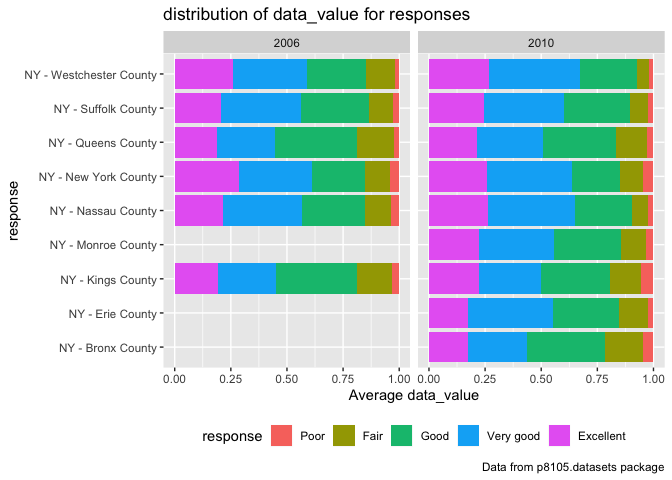
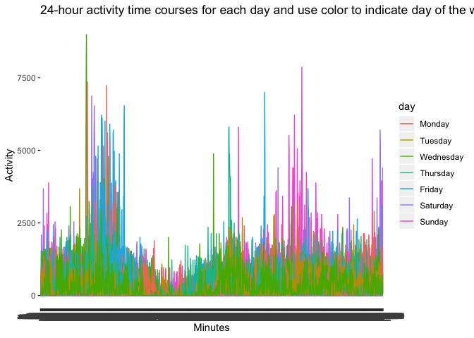

p8105\_hw3\_jy2965
================
Jun Yin
10/11/2019

## problem 1

``` r
data("instacart")
instacart = janitor::clean_names(instacart)
head(instacart)
```

    ## # A tibble: 6 x 15
    ##   order_id product_id add_to_cart_ord… reordered user_id eval_set
    ##      <int>      <int>            <int>     <int>   <int> <chr>   
    ## 1        1      49302                1         1  112108 train   
    ## 2        1      11109                2         1  112108 train   
    ## 3        1      10246                3         0  112108 train   
    ## 4        1      49683                4         0  112108 train   
    ## 5        1      43633                5         1  112108 train   
    ## 6        1      13176                6         0  112108 train   
    ## # … with 9 more variables: order_number <int>, order_dow <int>,
    ## #   order_hour_of_day <int>, days_since_prior_order <int>,
    ## #   product_name <chr>, aisle_id <int>, department_id <int>, aisle <chr>,
    ## #   department <chr>

``` r
skimr::skim(instacart)
```

    ## Skim summary statistics
    ##  n obs: 1384617 
    ##  n variables: 15 
    ## 
    ## ── Variable type:character ───────────────────────────────────────────────
    ##      variable missing complete       n min max empty n_unique
    ##         aisle       0  1384617 1384617   3  29     0      134
    ##    department       0  1384617 1384617   4  15     0       21
    ##      eval_set       0  1384617 1384617   5   5     0        1
    ##  product_name       0  1384617 1384617   3 159     0    39123
    ## 
    ## ── Variable type:integer ─────────────────────────────────────────────────
    ##                variable missing complete       n       mean        sd p0
    ##       add_to_cart_order       0  1384617 1384617       8.76      7.42  1
    ##                aisle_id       0  1384617 1384617      71.3      38.1   1
    ##  days_since_prior_order       0  1384617 1384617      17.07     10.43  0
    ##           department_id       0  1384617 1384617       9.84      6.29  1
    ##               order_dow       0  1384617 1384617       2.7       2.17  0
    ##       order_hour_of_day       0  1384617 1384617      13.58      4.24  0
    ##                order_id       0  1384617 1384617 1706297.62 989732.65  1
    ##            order_number       0  1384617 1384617      17.09     16.61  4
    ##              product_id       0  1384617 1384617   25556.24  14121.27  1
    ##               reordered       0  1384617 1384617       0.6       0.49  0
    ##                 user_id       0  1384617 1384617   1e+05     59487.15  1
    ##     p25     p50     p75    p100     hist
    ##       3       7      12      80 ▇▃▁▁▁▁▁▁
    ##      31      83     107     134 ▃▇▃▃▇▅▅▆
    ##       7      15      30      30 ▂▅▃▃▁▂▁▇
    ##       4       8      16      21 ▃▇▂▁▂▆▁▃
    ##       1       3       5       6 ▇▅▃▃▁▃▅▅
    ##      10      14      17      23 ▁▁▃▇▇▇▅▂
    ##  843370 1701880 2568023 3421070 ▇▇▇▇▇▇▇▇
    ##       6      11      21     100 ▇▂▁▁▁▁▁▁
    ##   13380   25298   37940   49688 ▆▆▇▇▇▆▇▇
    ##       0       1       1       1 ▆▁▁▁▁▁▁▇
    ##   51732   1e+05  154959  206209 ▇▇▇▇▇▇▇▇

``` r
head(instacart, n=1)
```

    ## # A tibble: 1 x 15
    ##   order_id product_id add_to_cart_ord… reordered user_id eval_set
    ##      <int>      <int>            <int>     <int>   <int> <chr>   
    ## 1        1      49302                1         1  112108 train   
    ## # … with 9 more variables: order_number <int>, order_dow <int>,
    ## #   order_hour_of_day <int>, days_since_prior_order <int>,
    ## #   product_name <chr>, aisle_id <int>, department_id <int>, aisle <chr>,
    ## #   department <chr>

This “instacart” dataset documents the shoppoing history of different
client. From the table above, we know that there are total 1384617
observations and 15 variables. Among these 15 variables, 4 of them are
character variables (“aisle”, “department”, “eval\_set”,
“product\_name”), and the others are all numeric variables.

There are 15 variables in this dataset:

order\_id: order identifier product\_id: product identifier
add\_to\_cart\_order: order in which each product was added to cart
reordered: 1 if this prodcut has been ordered by this user in the past,
0 otherwise user\_id: customer identifier eval\_set: which evaluation
set this order belongs in (Note that the data for use in this class is
exclusively from the “train” eval\_set) order\_number: the order
sequence number for this user (1=first, n=nth) order\_dow: the day of
the week on which the order was placed order\_hour\_of\_day: the hour of
the day on which the order was placed days\_since\_prior\_order: days
since the last order, capped at 30, NA if order\_number=1 product\_name:
name of the product aisle\_id: aisle identifier department\_id:
department identifier aisle: the name of the aisle department: the name
of the department

For example, the first line in the dataset, user with user\_id 112108
placed an order(order\_id: 1), buying Bulgarian Yogurt at 10am on
Thursday. And the order is this user’s fourth order.

## Answer questions

*How many aisles are there, and which aisles are the most items ordered
from?*

``` r
n_distinct(instacart$aisle)
```

    ## [1] 134

``` r
instacart %>% 
  group_by(aisle) %>% 
  summarize(n_aisle = n()) %>% 
  arrange(desc(n_aisle))
```

    ## # A tibble: 134 x 2
    ##    aisle                         n_aisle
    ##    <chr>                           <int>
    ##  1 fresh vegetables               150609
    ##  2 fresh fruits                   150473
    ##  3 packaged vegetables fruits      78493
    ##  4 yogurt                          55240
    ##  5 packaged cheese                 41699
    ##  6 water seltzer sparkling water   36617
    ##  7 milk                            32644
    ##  8 chips pretzels                  31269
    ##  9 soy lactosefree                 26240
    ## 10 bread                           23635
    ## # … with 124 more rows

There are 134 distinct aisles, and “fresh vegetables” aisle is the most
items ordered from.

*Make a plot that shows the number of items ordered in each aisle,
limiting this to aisles with more than 10000 items ordered. Arrange
aisles sensibly, and organize your plot so others can read it.*

``` r
#whole list of aisles
  instacart %>% 
  group_by(aisle) %>% 
  summarize(n_aisle = n()) %>% 
  arrange(desc(n_aisle)) %>% 
  mutate(aisle = forcats::fct_reorder(aisle, n_aisle, .desc = FALSE)) %>% 
  ggplot(aes(x = aisle, y = n_aisle)) +
  geom_bar(stat = "identity") +
  coord_flip() +
  labs(
    title = "the Number of Items Ordered in Each Aisle",
    x = "Aisle",
    y = "Number of Items",
    caption = "Data from p8105.datasets package") 
```

<!-- -->

``` r
#list of aisles > 10000
  instacart %>% 
  group_by(aisle) %>% 
  summarize(n_aisle = n()) %>% 
  arrange(desc(n_aisle)) %>% 
  mutate(aisle = forcats::fct_reorder(aisle, n_aisle, .desc = FALSE)) %>% 
  filter(n_aisle>=10000) %>% 
      ggplot(aes(x = aisle, y = n_aisle)) +
  geom_bar(stat = "identity") +
  coord_flip() +
  labs(
    title = "the Number of Items Ordered in Each Aisle",
    x = "Aisle",
    y = "Number of Items",
    caption = "Data from p8105.datasets package") 
```

<!-- -->

Form the figure above, we know that the number of items in “fresh
vegetables” and “fresh fruits” are much higher then any other asiles

*Make a table showing the three most popular items in each of the aisles
“baking ingredients”, “dog food care”, and “packaged vegetables fruits”.
Include the number of times each item is ordered in your table.*

``` r
instacart %>% 
  group_by(product_name, aisle) %>% 
  filter(aisle %in% c("baking ingredients", "dog food care", "packaged vegetables fruits")) %>% 
  summarize(n_items = n()) %>% 
  group_by(aisle) %>% 
  filter(n_items == max(n_items)) %>% 
  knitr::kable()
```

| product\_name                                 | aisle                      | n\_items |
| :-------------------------------------------- | :------------------------- | -------: |
| Light Brown Sugar                             | baking ingredients         |      499 |
| Organic Baby Spinach                          | packaged vegetables fruits |     9784 |
| Snack Sticks Chicken & Rice Recipe Dog Treats | dog food care              |       30 |

The most popular item in aisle “baking ingredients” is “Light Brown
Sugar”, the most popular item in aisle “dog food care” is “Snack Sticks
Chicken & Rice Recipe Dog Treats”, and the most popular item in aisle
“packaged vegetables fruits” is “Organic Baby Spinach”.

*Make a table showing the mean hour of the day at which Pink Lady Apples
and Coffee Ice Cream are ordered on each day of the week; format this
table for human readers (i.e. produce a 2 x 7
table).*

``` r
instacart$order_dow = recode(instacart$order_dow, "0" = "Sunday", "6" = "Saturday", "5" = "Friday", "4" = "Thursday", "3" = "Wednesday", "2" = "Tuesday", "1" = "Monday") %>% 
  factor(levels = c("Monday", "Tuesday", "Wednesday", "Thursday", "Friday", "Saturday", "Sunday"))
instacart %>% 
  group_by(product_name,order_dow) %>% 
  filter(product_name %in% c("Pink Lady Apples", "Coffee Ice Cream")) %>%
  summarize(mean_hour = mean(order_hour_of_day)) %>% 
  spread(key = order_dow, value = mean_hour) %>% 
  knitr::kable()
```

| product\_name    |   Monday |  Tuesday | Wednesday | Thursday |   Friday | Saturday |   Sunday |
| :--------------- | -------: | -------: | --------: | -------: | -------: | -------: | -------: |
| Coffee Ice Cream | 14.31579 | 15.38095 |  15.31818 | 15.21739 | 12.26316 | 13.83333 | 13.77419 |
| Pink Lady Apples | 11.36000 | 11.70213 |  14.25000 | 11.55172 | 12.78431 | 11.93750 | 13.44118 |

People tends to buy Coffee Ice Cream around 1pm to 3pm, but on Friday
people may buy the cream a little bit earlier, around 12:00 at noon. And
people usually buy Pink Lady Apples around noon from 11am to 2pm.

## problem 2

*format the data to use appropriate variable names* *focus on the
“Overall Health” topic* *include only responses from “Excellent” to
“Poor”* *organize responses as a factor taking levels ordered from
“Poor” to “Excellent”*

``` r
data("brfss_smart2010")
brfss = janitor::clean_names(brfss_smart2010) %>% 
rename(state = locationabbr, county = locationdesc) %>% 
filter(topic == "Overall Health") %>% 
filter(response %in% c("Excellent", "Very good","Good", "Fair", "Poor")) %>% 
  mutate(response = factor(response, levels = c("Poor", "Fair","Good", "Very good", "Excellent")))
```

*Using this dataset, do or answer the following (commenting on the
results of each):*

*In 2002, which states were observed at 7 or more locations? What about
in 2010?*

``` r
#year in 2002
brfss %>% 
  filter(year == "2002") %>% 
  group_by(state) %>% 
  summarise(n_location = n_distinct(county)) %>% 
  filter(n_location >= 7) %>% 
  knitr::kable()
```

| state | n\_location |
| :---- | ----------: |
| CT    |           7 |
| FL    |           7 |
| MA    |           8 |
| NC    |           7 |
| NJ    |           8 |
| PA    |          10 |

``` r
#year in 2010
brfss %>% 
  filter(year == "2010") %>% 
  group_by(state) %>% 
  summarise(n_location = n_distinct(county)) %>% 
  filter(n_location >= 7) %>% 
  knitr::kable()
```

| state | n\_location |
| :---- | ----------: |
| CA    |          12 |
| CO    |           7 |
| FL    |          41 |
| MA    |           9 |
| MD    |          12 |
| NC    |          12 |
| NE    |          10 |
| NJ    |          19 |
| NY    |           9 |
| OH    |           8 |
| PA    |           7 |
| SC    |           7 |
| TX    |          16 |
| WA    |          10 |

In 2002, there are 6 states being observed at 7 or more location. Here
is the list of 6 states: CT, FL, MA, NC, NJ,PA; As for 2010, there are
14 states being observed at 7 or more location.

*Construct a dataset that is limited to Excellent responses, and
contains, year, state, and a variable that averages the data\_value
across locations within a state. Make a “spaghetti” plot of this average
value over time within a state (that is, make a plot showing a line for
each state across years – the geom\_line geometry and group aesthetic
will help).*

``` r
brfss %>% 
  filter(response %in% "Excellent") %>% 
  group_by(year,state) %>% 
  summarise(avg_datavalue = mean(data_value)) %>% 
  select(year, state, avg_datavalue) %>% 
ggplot(aes(x = year, y = avg_datavalue, color = state)) +
  geom_line() +
  labs(
        title = "Spaghetti-Plot average value over time within a state",
        y = "average value",
        x = "Year",
        caption = "Data from p8105.datasets package") +
  theme(legend.position = "bottom",
        legend.key.width = unit(.25, 'cm')) +
  guides(color = guide_legend(ncol = 15))
```

    ## Warning: Removed 3 rows containing missing values (geom_path).

<!-- -->

The figure above shows the average value over time within a state. We
can see the concussion in each state.

*Make a two-panel plot showing, for the years 2006, and 2010,
distribution of data\_value for responses (“Poor” to “Excellent”) among
locations in NY State.*

``` r
brfss %>% 
  filter(year %in% c("2006", "2010", state == "NY")) %>%
  group_by(year,county,response) %>% 
  summarise(avg_datavalue = mean(data_value)) %>% 
  ggplot(aes(x = response, y = avg_datavalue)) +
  geom_boxplot()+
  facet_grid(.~year) +
  labs(
        title = "distribution of data_value for responses",
        y = "Average data_value",
        x = "response",
        caption = "Data from p8105.datasets package") +
  theme(legend.position = "bottom")
```

    ## Warning: Removed 9 rows containing non-finite values (stat_boxplot).

<!-- -->

Form the figure above, we could see the same trend of mean of
data\_value between 2006 and 2010. In response is poor group, the data
value has lowest mean. The highest mean of data value appers in “very
good” response group.

\#\#problem 3

*Load, tidy, and otherwise wrangle the data. Your final dataset should
include all originally observed variables and values; have useful
variable names; include a weekday vs weekend variable; and encode data
with reasonable variable classes. Describe the resulting dataset*

``` r
acceler = read_csv(file = "./accel_data.csv") %>% 
  janitor::clean_names() %>% 
  mutate(week_vs_weekend = day %in% c("Saturday","Sunday"), week_vs_weekend = as.numeric(week_vs_weekend)) %>% 
  select(week, day_id, day, week_vs_weekend, everything())
```

    ## Parsed with column specification:
    ## cols(
    ##   .default = col_double(),
    ##   day = col_character()
    ## )

    ## See spec(...) for full column specifications.

``` r
skimr::skim(acceler)
```

    ## Skim summary statistics
    ##  n obs: 35 
    ##  n variables: 1444 
    ## 
    ## ── Variable type:character ───────────────────────────────────────────────
    ##  variable missing complete  n min max empty n_unique
    ##       day       0       35 35   6   9     0        7
    ## 
    ## ── Variable type:numeric ─────────────────────────────────────────────────
    ##         variable missing complete  n   mean      sd p0   p25    p50
    ##       activity_1       0       35 35  66.5   137.05  1   1     1   
    ##      activity_10       0       35 35  71.77  147.88  1   1     1   
    ##     activity_100       0       35 35  22.09   74.9   1   1     1   
    ##    activity_1000       0       35 35 316.19  375.27  1   1   188   
    ##    activity_1001       0       35 35 334.99  447.39  1  16.5 213   
    ##    activity_1002       0       35 35 350.84  363.58  1  11.5 251   
    ##    activity_1003       0       35 35 305.08  341.02  1  32   150   
    ##    activity_1004       0       35 35 379.62  375.4   1 111   251   
    ##    activity_1005       0       35 35 312.19  365.71  1  11   200   
    ##    activity_1006       0       35 35 322.74  293.93  1  53.5 272.27
    ##    activity_1007       0       35 35 355.06  324.04  1   1   320   
    ##    activity_1008       0       35 35 372.15  345.76  1  37.5 331.29
    ##    activity_1009       0       35 35 515.65  699.85  1  43   349   
    ##     activity_101       0       35 35  19      40.35  1   1     1   
    ##    activity_1010       0       35 35 428.36  516.15  1   6   305   
    ##    activity_1011       0       35 35 470.8   510.72  1   6   387.76
    ##    activity_1012       0       35 35 471.83  528.55  1  22   349   
    ##    activity_1013       0       35 35 362.34  316.62  1  27   379   
    ##    activity_1014       0       35 35 364.15  324.5   1  32   349   
    ##    activity_1015       0       35 35 440.06  338.53  1 132   408   
    ##    activity_1016       0       35 35 471.77  466.94  1  21.5 322.13
    ##    activity_1017       0       35 35 403.59  392.76  1  85   276   
    ##    activity_1018       0       35 35 423.81  426.59  1  48   335   
    ##    activity_1019       0       35 35 422.8   443.34  1  85   274.91
    ##     activity_102       0       35 35  61.82  156.02  1   1     1   
    ##    activity_1020       0       35 35 348.91  361.52  1  53.5 217.38
    ##    activity_1021       0       35 35 366.53  414.77  1  74.5 238   
    ##    activity_1022       0       35 35 496.55  644.8   1  16.5 290.18
    ##    activity_1023       0       35 35 401.01  437.77  1  27   313.09
    ##    activity_1024       0       35 35 498.5   527.4   1  74.5 345.51
    ##    activity_1025       0       35 35 510.64  620.85  1  16.5 305   
    ##    activity_1026       0       35 35 348.75  366.73  1  48   238   
    ##    activity_1027       0       35 35 335.38  340.89  1  37.5 263   
    ##    activity_1028       0       35 35 393.92  426.49  1  48   320   
    ##    activity_1029       0       35 35 492.84  676.35  1  69   379   
    ##     activity_103       0       35 35  48.57  112.56  1   1     1   
    ##    activity_1030       0       35 35 399.47  404.23  1  79.5 325.53
    ##    activity_1031       0       35 35 400.14  342.75  1 117.5 349   
    ##    activity_1032       0       35 35 433.44  397.35  1 147   330.93
    ##    activity_1033       0       35 35 332.84  388.41  1  85   226   
    ##    activity_1034       0       35 35 361.01  348.47  1  79.5 314.18
    ##    activity_1035       0       35 35 274.74  314.81  1  53   150   
    ##    activity_1036       0       35 35 286.64  299.01  1  16.5 188   
    ##    activity_1037       0       35 35 324.02  390.24  1   1   213   
    ##    activity_1038       0       35 35 293.17  328.15  1  27   163   
    ##    activity_1039       0       35 35 332.92  422.14  1   6   213   
    ##     activity_104       0       35 35  44.37  131.83  1   1     1   
    ##    activity_1040       0       35 35 373.61  420.1   1  43   276   
    ##    activity_1041       0       35 35 371.66  400.64  1  43   238   
    ##    activity_1042       0       35 35 318.48  349.92  1  53.5 200   
    ##    activity_1043       0       35 35 442.71  420.81  1  58.5 320   
    ##    activity_1044       0       35 35 459.09  465.13  1  95.5 379   
    ##    activity_1045       0       35 35 341.79  385.96  1  22   276   
    ##    activity_1046       0       35 35 361.4   417.56  1   1   200   
    ##    activity_1047       0       35 35 573.03  593.56  1  95.5 328.96
    ##    activity_1048       0       35 35 475.79  507.07  1  42.5 293.4 
    ##    activity_1049       0       35 35 384.39  338.68  1  74   291   
    ##     activity_105       0       35 35  23.15   60.65  1   1     1   
    ##    activity_1050       0       35 35 391.88  448.55  1  11   213   
    ##    activity_1051       0       35 35 333.14  355.61  1   1   200   
    ##    activity_1052       0       35 35 343.25  368.91  1   1   263   
    ##    activity_1053       0       35 35 383.73  565.58  1  27   213   
    ##    activity_1054       0       35 35 313.05  430.43  1   1   116   
    ##    activity_1055       0       35 35 329.32  488.01  1  11.5 137   
    ##    activity_1056       0       35 35 397.09  394.12  1  11   301.47
    ##    activity_1057       0       35 35 354.73  331.11  1  95   291.93
    ##    activity_1058       0       35 35 289.36  304.79  1  22   188   
    ##    activity_1059       0       35 35 401.7   405     1  11.5 326.02
    ##     activity_106       0       35 35  42.12  138.56  1   1     1   
    ##    activity_1060       0       35 35 358.18  409.53  1   1   238   
    ##    activity_1061       0       35 35 314.98  334.93  1  43   213   
    ##    activity_1062       0       35 35 313.02  411.14  1  42.5 163   
    ##    activity_1063       0       35 35 285.67  344.83  1   6   127   
    ##    activity_1064       0       35 35 234.86  279.74  1  22   150   
    ##    activity_1065       0       35 35 300.97  329.75  1  43   251   
    ##    activity_1066       0       35 35 259.31  303.45  1   6   137   
    ##    activity_1067       0       35 35 293.2   316.57  1  16.5 200   
    ##    activity_1068       0       35 35 338.64  315.94  1  32.5 335   
    ##    activity_1069       0       35 35 291.64  340.8   1  22   213   
    ##     activity_107       0       35 35  10.98   27.75  1   1     1   
    ##    activity_1070       0       35 35 297.92  304.59  1   1   291   
    ##    activity_1071       0       35 35 333.59  302.81  1  37.5 313.73
    ##    activity_1072       0       35 35 404.41  433.54  1  58.5 320   
    ##    activity_1073       0       35 35 345.45  411.98  1  64   200   
    ##    activity_1074       0       35 35 273.39  264.05  1  42.5 238   
    ##    activity_1075       0       35 35 248.63  322.98  1  22   106   
    ##    activity_1076       0       35 35 313.29  336.33  1  16.5 226   
    ##    activity_1077       0       35 35 261.32  278.44  1  11   238   
    ##    activity_1078       0       35 35 423.08  487.04  1   6   305   
    ##    activity_1079       0       35 35 291.77  324.11  1  11   163   
    ##     activity_108       0       35 35  27.29   81.98  1   1     1   
    ##    activity_1080       0       35 35 213.91  229.77  1  22   116   
    ##    activity_1081       0       35 35 297.84  350.4   1  43   200   
    ##    activity_1082       0       35 35 338.22  318     1  53.5 251.91
    ##    activity_1083       0       35 35 344.88  382.99  1  11.5 276   
    ##    activity_1084       0       35 35 268.33  284.91  1   1   226   
    ##    activity_1085       0       35 35 323.02  353.8   1  85   251   
    ##    activity_1086       0       35 35 285.71  272.41  1  16.5 238   
    ##    activity_1087       0       35 35 285.1   289.82  1  27   276   
    ##    activity_1088       0       35 35 252.54  310.16  1  11   150   
    ##    activity_1089       0       35 35 316.84  324.58  1  16.5 305   
    ##     activity_109       0       35 35  31.94   96.02  1   1     1   
    ##    activity_1090       0       35 35 317.78  335.48  1  69   263   
    ##    activity_1091       0       35 35 298.57  343.73  1  48   175   
    ##    activity_1092       0       35 35 325.24  303.96  1  58.5 305   
    ##    activity_1093       0       35 35 331     307.51  1  90   276   
    ##    activity_1094       0       35 35 425.52  483.25  1  22   276   
    ##    activity_1095       0       35 35 394     403.29  1  84.5 349   
    ##    activity_1096       0       35 35 401.7   439.41  1  32.5 261.82
    ##    activity_1097       0       35 35 415.69  458.63  1  63.5 251   
    ##    activity_1098       0       35 35 378.75  410.56  1  79.5 226   
    ##    activity_1099       0       35 35 389.5   452.05  1  53.5 238   
    ##      activity_11       0       35 35  84.39  234.14  1   1     1   
    ##     activity_110       0       35 35  37.64  139.61  1   1     1   
    ##    activity_1100       0       35 35 431.55  398.35  1 150   357.62
    ##    activity_1101       0       35 35 407.56  481.32  1  69   213   
    ##    activity_1102       0       35 35 335.18  355.35  1  37.5 263   
    ##    activity_1103       0       35 35 320.56  356.56  1 111   200   
    ##    activity_1104       0       35 35 347.51  412.33  1  53   228.44
    ##    activity_1105       0       35 35 441.5   601.12  1  32.5 260.62
    ##    activity_1106       0       35 35 350.2   385.22  1  69   305   
    ##    activity_1107       0       35 35 442.02  445.09  1  95   280.27
    ##    activity_1108       0       35 35 495.56  502.42  1 138.5 408   
    ##    activity_1109       0       35 35 474.83  429.36  1 156.5 378.71
    ##     activity_111       0       35 35  11.59   21.93  1   1     1   
    ##    activity_1110       0       35 35 497.16  647.73  1  84.5 320   
    ##    activity_1111       0       35 35 413.72  361.33  1 127   349   
    ##    activity_1112       0       35 35 478.61  463.17  1  74   349   
    ##    activity_1113       0       35 35 295.28  273.34  1  53.5 276   
    ##    activity_1114       0       35 35 376     351.3   1  42.5 291   
    ##    activity_1115       0       35 35 329.48  323.72  1  27   263   
    ##    activity_1116       0       35 35 354.06  327.07  1  42.5 349   
    ##    activity_1117       0       35 35 409.27  406.58  1  84.5 316.29
    ##    activity_1118       0       35 35 366.54  354.18  1  42.5 276   
    ##    activity_1119       0       35 35 346.18  341.23  1  48   281.36
    ##     activity_112       0       35 35  18.69   33.98  1   1     1   
    ##    activity_1120       0       35 35 412.49  414.41  1  32   335   
    ##    activity_1121       0       35 35 401.73  428.71  1  95   238   
    ##    activity_1122       0       35 35 368.8   354.79  1  95   300.58
    ##    activity_1123       0       35 35 408.29  459.59  1  48   263   
    ##    activity_1124       0       35 35 403.82  559.33  1  11   251   
    ##    activity_1125       0       35 35 374.58  438.25  1  11   200   
    ##    activity_1126       0       35 35 423.19  421.07  1  37.5 376.04
    ##    activity_1127       0       35 35 369.45  386.72  1  16.5 251   
    ##    activity_1128       0       35 35 476.91  484.57  1  79.5 408   
    ##    activity_1129       0       35 35 424.29  426     1  21.5 320.64
    ##     activity_113       0       35 35  28.26   62.26  1   1     1   
    ##    activity_1130       0       35 35 412.18  361.22  1 143.5 305   
    ##    activity_1131       0       35 35 446.35  406.95  1 126.5 347.51
    ##    activity_1132       0       35 35 504.05  437.59  1 116.5 379   
    ##    activity_1133       0       35 35 377.76  309.79  1  64   364   
    ##    activity_1134       0       35 35 494.53  550.95  1  32   294.96
    ##    activity_1135       0       35 35 370.5   337.28  1  43   320   
    ##    activity_1136       0       35 35 357.35  363.23  1  53.5 259.96
    ##    activity_1137       0       35 35 451.39  509.35  1  11.5 349   
    ##    activity_1138       0       35 35 416.67  406.3   1  42.5 349   
    ##    activity_1139       0       35 35 330.87  334.52  1  37.5 251   
    ##     activity_114       0       35 35  24.93  108.29  1   1     1   
    ##    activity_1140       0       35 35 329.38  374.45  1  48   291   
    ##    activity_1141       0       35 35 316.83  383.11  1  74   251   
    ##    activity_1142       0       35 35 363.2   321.01  1  79.5 291   
    ##    activity_1143       0       35 35 342.02  349.36  1  74.5 276   
    ##    activity_1144       0       35 35 325.46  415.8   1  85   213   
    ##    activity_1145       0       35 35 362.06  425.09  1  32   293.31
    ##    activity_1146       0       35 35 387.84  630.63  1  85   251   
    ##    activity_1147       0       35 35 498.23  582.27  1 100.5 323.96
    ##    activity_1148       0       35 35 401.2   412.77  1  95.5 332.69
    ##    activity_1149       0       35 35 312.81  268.58  1  79.5 304.42
    ##     activity_115       0       35 35  65.42  204.06  1   1     1   
    ##    activity_1150       0       35 35 368.33  432.24  1  53.5 251   
    ##    activity_1151       0       35 35 358.01  333.75  1 111   291   
    ##    activity_1152       0       35 35 340.32  381.32  1  16.5 226   
    ##    activity_1153       0       35 35 310.87  311.7   1  95.5 263   
    ##    activity_1154       0       35 35 328.25  279.9   1 143.5 276.76
    ##    activity_1155       0       35 35 355.96  367.39  1 100.5 293.64
    ##    activity_1156       0       35 35 296.78  301.38  1  69   226   
    ##    activity_1157       0       35 35 302.47  335.73  1  43   200   
    ##    activity_1158       0       35 35 342.42  419.13  1  48   238   
    ##    activity_1159       0       35 35 256.98  248.01  1  32   255.11
    ##     activity_116       0       35 35  40.03  121.98  1   1     1   
    ##    activity_1160       0       35 35 271.09  232.59  1  58.5 213   
    ##    activity_1161       0       35 35 355.45  371.9   1  53   320   
    ##    activity_1162       0       35 35 353.27  412.93  1  27   276   
    ##    activity_1163       0       35 35 354.92  395.22  1  53.5 251   
    ##    activity_1164       0       35 35 331.36  387.41  1  27   200   
    ##    activity_1165       0       35 35 368.48  420.84  1  58.5 251   
    ##    activity_1166       0       35 35 263.32  274.43  1  27   226   
    ##    activity_1167       0       35 35 295.41  381.48  1  11   137   
    ##    activity_1168       0       35 35 280.17  349.35  1   1   150   
    ##    activity_1169       0       35 35 333.17  442.44  1   6   213   
    ##     activity_117       0       35 35  38.31  161.88  1   1     1   
    ##    activity_1170       0       35 35 408.09  807.19  1   1   200   
    ##    activity_1171       0       35 35 507.03 1327.25  1  11.5 163   
    ##    activity_1172       0       35 35 548.07 1513.2   1  11.5 188   
    ##    activity_1173       0       35 35 504.41 1016.11  1  27   150   
    ##    activity_1174       0       35 35 461.98 1031.88  1  21.5 150   
    ##    activity_1175       0       35 35 335.43  368.96  1  16.5 251   
    ##    activity_1176       0       35 35 544.27 1233.23  1  42.5 320   
    ##    activity_1177       0       35 35 408.98  663.77  1 100.5 238   
    ##    activity_1178       0       35 35 316.37  463.26  1  27   213   
    ##    activity_1179       0       35 35 390.67  473.03  1  21.5 238   
    ##     activity_118       0       35 35  27.16   65.85  1   1     1   
    ##    activity_1180       0       35 35 390.68  500.85  1   1   238   
    ##    activity_1181       0       35 35 297.36  304.13  1  27   213   
    ##    activity_1182       0       35 35 370.55  575.61  1  11   276   
    ##    activity_1183       0       35 35 436.46  590.45  1  79.5 320   
    ##    activity_1184       0       35 35 370.79  472.33  1  27   251   
    ##    activity_1185       0       35 35 321.58  369.38  1  22   175   
    ##    activity_1186       0       35 35 323.57  417.5   1  64   226   
    ##    activity_1187       0       35 35 363.01  396.34  1  74   238   
    ##    activity_1188       0       35 35 403.32  505.14  1  27   262.2 
    ##    activity_1189       0       35 35 461.94  600.35  1  37.5 236.84
    ##     activity_119       0       35 35  32.95   80.47  1   1     1   
    ##    activity_1190       0       35 35 342.34  515.64  1  37.5 163   
    ##    activity_1191       0       35 35 398.06  510.55  1  32   251   
    ##    activity_1192       0       35 35 506.94 1188.98  1  48   276   
    ##    activity_1193       0       35 35 481.83  757.03  1  48   252.47
    ##    activity_1194       0       35 35 426.32  577.44  1  53   233.04
    ##    activity_1195       0       35 35 504.31  747.74  1  58.5 323.4 
    ##    activity_1196       0       35 35 626.38  877.71  1 163.5 349   
    ##    activity_1197       0       35 35 541.73  690.26  1 111   276   
    ##    activity_1198       0       35 35 475.44  538.75  1  74.5 276   
    ##    activity_1199       0       35 35 513.73  788.43  1  42.5 379   
    ##      activity_12       0       35 35  75.64  208.66  1   1     1   
    ##     activity_120       0       35 35  20.93   59.07  1   1     1   
    ##    activity_1200       0       35 35 553.26  949.05  1  27   263   
    ##    activity_1201       0       35 35 657.94 1173.31  1  69   276   
    ##    activity_1202       0       35 35 475.85  978.36  1  21.5 226   
    ##    activity_1203       0       35 35 480.84  486.14  1  69   323.84
    ##    activity_1204       0       35 35 554.54  651.87  1  53   291   
    ##    activity_1205       0       35 35 434.56  458.55  1  32   291   
    ##    activity_1206       0       35 35 529     682.61  1  48   305   
    ##    activity_1207       0       35 35 614.97  881.61  1  48   349   
    ##    activity_1208       0       35 35 521.44  591.97  1 121.5 335   
    ##    activity_1209       0       35 35 368.81  432.28  1  58.5 175   
    ##     activity_121       0       35 35  13.14   29.07  1   1     1   
    ##    activity_1210       0       35 35 379.47  509.69  1  48   213   
    ##    activity_1211       0       35 35 290.85  355.79  1  48   175   
    ##    activity_1212       0       35 35 524.28  936.62  1  21.5 163   
    ##    activity_1213       0       35 35 569.2   878.98  1  22   276   
    ##    activity_1214       0       35 35 602.65  957.43  1  11   345.16
    ##    activity_1215       0       35 35 436.73  559.41  1  16.5 305   
    ##    activity_1216       0       35 35 460.27  932.45  1  69   163   
    ##    activity_1217       0       35 35 414.53  575.61  1  53   251   
    ##    activity_1218       0       35 35 431.97  592.94  1  69   291   
    ##    activity_1219       0       35 35 432.17  619.97  1   6    85   
    ##     activity_122       0       35 35  14.29   39.76  1   1     1   
    ##    activity_1220       0       35 35 366.62  430.64  1   1   276   
    ##    activity_1221       0       35 35 358.83  455.39  1  16.5 175   
    ##    activity_1222       0       35 35 555.54  700.43  1 116.5 335   
    ##    activity_1223       0       35 35 375.49  384.1   1  69   213   
    ##    activity_1224       0       35 35 386.71  686.77  1   6   127   
    ##    activity_1225       0       35 35 376.24  496.99  1   1   150   
    ##    activity_1226       0       35 35 299.05  411     1   6    64   
    ##    activity_1227       0       35 35 383.27  569.17  1   1   175   
    ##    activity_1228       0       35 35 463.98  813.59  1  48   175   
    ##    activity_1229       0       35 35 463.96 1146.63  1   6   163   
    ##     activity_123       0       35 35  36.77  108.64  1   1     1   
    ##    activity_1230       0       35 35 506.74 1056.64  1  22   238   
    ##    activity_1231       0       35 35 617.95 1146.18  1  11   188   
    ##    activity_1232       0       35 35 521.16  933.56  1   6   300.76
    ##    activity_1233       0       35 35 496.82  851.1   1   1   163   
    ##    activity_1234       0       35 35 499.92  692.04  1   1   226.49
    ##    activity_1235       0       35 35 642.59  895.16  1  16.5 303.07
    ##    activity_1236       0       35 35 735.61 1252.54  1   6   272.11
    ##    activity_1237       0       35 35 573.25  858.18  1   1   263   
    ##    activity_1238       0       35 35 523.46  758.81  1   6   213   
    ##    activity_1239       0       35 35 630.39  916.1   1  11   287.89
    ##     activity_124       0       35 35  29.16  102.52  1   1     1   
    ##    activity_1240       0       35 35 469.77  497.51  1  53.5 317.42
    ##    activity_1241       0       35 35 584.16  775.68  1  11.5 349   
    ##    activity_1242       0       35 35 646.1  1122.71  1  16.5 320   
    ##    activity_1243       0       35 35 439     570.01  1  11   238   
    ##    activity_1244       0       35 35 355.59  469.37  1   1   188   
    ##    activity_1245       0       35 35 432.98  543.64  1   1   251.29
    ##    activity_1246       0       35 35 434.13  505.82  1  22   251   
    ##    activity_1247       0       35 35 477.71  577.71  1  37.5 386.6 
    ##    activity_1248       0       35 35 503.94  618.39  1  53.5 320   
    ##    activity_1249       0       35 35 512.8  1239.49  1   1   224.27
    ##     activity_125       0       35 35  11.44   29.85  1   1     1   
    ##    activity_1250       0       35 35 475.08  923.95  1  21.5 213   
    ##    activity_1251       0       35 35 576.9  1013.9   1   6   291   
    ##    activity_1252       0       35 35 577.2   795.7   1  43   349   
    ##    activity_1253       0       35 35 486.35  651.77  1   6   349   
    ##    activity_1254       0       35 35 532.27  799.06  1  22   263   
    ##    activity_1255       0       35 35 540.35  727.86  1  42.5 364   
    ##    activity_1256       0       35 35 691.12  947.77  1 129   458   
    ##    activity_1257       0       35 35 604.41  791.38  1  22   310.27
    ##    activity_1258       0       35 35 538.41  685.73  1  21.5 320   
    ##    activity_1259       0       35 35 431.75  578.98  1  16.5 188   
    ##     activity_126       0       35 35  23.42   49.72  1   1     1   
    ##    activity_1260       0       35 35 597.1  1303.94  1  11   175   
    ##    activity_1261       0       35 35 478.01 1010.76  1  22    95   
    ##    activity_1262       0       35 35 424.04  680.47  1   1   200   
    ##    activity_1263       0       35 35 386.51  498.05  1  11.5 291   
    ##    activity_1264       0       35 35 438.87  620.49  1   6   175   
    ##    activity_1265       0       35 35 338.17  543.31  1  21.5 163   
    ##    activity_1266       0       35 35 385.59  551.26  1   6   137   
    ##    activity_1267       0       35 35 395.98  740     1  16.5 116   
    ##    activity_1268       0       35 35 513.61  780.64  1  22   282.87
    ##    activity_1269       0       35 35 512     704.32  1  48   251   
    ##     activity_127       0       35 35  16.67   41.3   1   1     1   
    ##    activity_1270       0       35 35 381.67  457.14  1   6   238   
    ##    activity_1271       0       35 35 403.88  585.45  1   6   213   
    ##    activity_1272       0       35 35 349.46  460.08  1   1   276.78
    ##    activity_1273       0       35 35 573.98 1096.22  1  32   213   
    ##    activity_1274       0       35 35 593.99 1019.06  1   6   364   
    ##    activity_1275       0       35 35 397.83  566.15  1   1   251   
    ##    activity_1276       0       35 35 370.6   504.69  1   1   163   
    ##    activity_1277       0       35 35 367.77  535.65  1   1   213   
    ##    activity_1278       0       35 35 483.94  921.42  1   6   213   
    ##    activity_1279       0       35 35 484.91  774.6   1   6   175   
    ##     activity_128       0       35 35  33.9   109.56  1   1     1   
    ##    activity_1280       0       35 35 358.11  561.42  1  37.5 150   
    ##    activity_1281       0       35 35 536.25  812     1   6   236.98
    ##    activity_1282       0       35 35 517.65  811.32  1   6   251   
    ##    activity_1283       0       35 35 378.02  754.56  1   1   163   
    ##    activity_1284       0       35 35 441.58  651.62  1   6   185.44
    ##    activity_1285       0       35 35 357.97  426.4   1   6   196.8 
    ##    activity_1286       0       35 35 356.49  451.91  1   1   116   
    ##    activity_1287       0       35 35 424.78  625.65  1   6   175   
    ##    activity_1288       0       35 35 446.06  595.07  1  16.5 175   
    ##    activity_1289       0       35 35 473.48  802.48  1   6   184.71
    ##     activity_129       0       35 35  12.09   34.97  1   1     1   
    ##    activity_1290       0       35 35 532.11  805.58  1   6   144.82
    ##    activity_1291       0       35 35 416.57  634.56  1   1   137   
    ##    activity_1292       0       35 35 528.42  833.13  1   1   200   
    ##    activity_1293       0       35 35 474.66  624.85  1   1   276   
    ##    activity_1294       0       35 35 442.12  749.57  1   1   127   
    ##    activity_1295       0       35 35 373.76  620.65  1   1    64   
    ##    activity_1296       0       35 35 378.55  686.29  1   1    74   
    ##    activity_1297       0       35 35 478.39  940.63  1  21.5  85   
    ##    activity_1298       0       35 35 513.11  714.96  1   1   247.47
    ##    activity_1299       0       35 35 440.18  658.52  1   1   200   
    ##      activity_13       0       35 35  49.18  154.08  1   1     1   
    ##     activity_130       0       35 35  52.41  171.15  1   1     1   
    ##    activity_1300       0       35 35 356.54  465.91  1   1   202.96
    ##    activity_1301       0       35 35 243.38  283.92  1   1   175   
    ##    activity_1302       0       35 35 286.37  340.67  1   1   203.62
    ##    activity_1303       0       35 35 311.8   395.17  1  32.5 188   
    ##    activity_1304       0       35 35 260.07  272.76  1   1   226.91
    ##    activity_1305       0       35 35 326.74  324.03  1  69   228.29
    ##    activity_1306       0       35 35 382.33  532.76  1   1   263   
    ##    activity_1307       0       35 35 327.03  379.02  1   1   203.36
    ##    activity_1308       0       35 35 351.99  398.69  1  22   200   
    ##    activity_1309       0       35 35 328.52  393.31  1  11   231.71
    ##     activity_131       0       35 35  13.08   25.81  1   1     1   
    ##    activity_1310       0       35 35 304.84  318.44  1  16.5 226   
    ##    activity_1311       0       35 35 377.71  373.75  1   6   307.8 
    ##    activity_1312       0       35 35 430     702.11  1   1   150   
    ##    activity_1313       0       35 35 269.63  394.01  1   1   143.44
    ##    activity_1314       0       35 35 423.52 1031.13  1   1   210.8 
    ##    activity_1315       0       35 35 429.27 1102.12  1   1   197.24
    ##    activity_1316       0       35 35 251.14  279.4   1   1   200   
    ##    activity_1317       0       35 35 303.03  392.33  1   1   175   
    ##    activity_1318       0       35 35 321.45  398.62  1   1   188   
    ##    activity_1319       0       35 35 254.04  269.35  1   1   175   
    ##     activity_132       0       35 35  45.6   167.13  1   1     1   
    ##    activity_1320       0       35 35 264.9   290.02  1   1   163   
    ##    activity_1321       0       35 35 287.82  322.79  1   1   127   
    ##    activity_1322       0       35 35 208.12  246.09  1   1    95   
    ##    activity_1323       0       35 35 274.91  323.7   1  22   150   
    ##    activity_1324       0       35 35 283.21  380.79  1   6   138.76
    ##    activity_1325       0       35 35 263.85  357.02  1   1   106   
    ##    activity_1326       0       35 35 302.82  405.35  1   1   188   
    ##    activity_1327       0       35 35 321.9   365.42  1   1   202.84
    ##    activity_1328       0       35 35 274.61  327.58  1   1   174.67
    ##    activity_1329       0       35 35 273.98  359.37  1   1   150   
    ##     activity_133       0       35 35  43.15  158.81  1   1     1   
    ##    activity_1330       0       35 35 291.39  385.4   1   1   137   
    ##    activity_1331       0       35 35 266.84  333.02  1   1   188.27
    ##    activity_1332       0       35 35 360.88  483.49  1   1   164.78
    ##    activity_1333       0       35 35 258.15  371.94  1   1   127   
    ##    activity_1334       0       35 35 200.18  267.6   1   1   163   
    ##    activity_1335       0       35 35 168.1   267.42  1   1    53   
    ##    activity_1336       0       35 35 185.32  255.55  1   1   136.36
    ##    activity_1337       0       35 35 141.03  230.88  1   1    22   
    ##    activity_1338       0       35 35 267.36  413.46  1   1    64   
    ##    activity_1339       0       35 35 224.86  350.43  1   1   116   
    ##     activity_134       0       35 35  37.02   68.39  1   1     1   
    ##    activity_1340       0       35 35 216.78  353.73  1   1    64   
    ##    activity_1341       0       35 35 225.6   326.57  1   1   106   
    ##    activity_1342       0       35 35 196.04  329.96  1   1    53   
    ##    activity_1343       0       35 35 187.39  274.95  1   1    74   
    ##    activity_1344       0       35 35 260.18  357.86  1   1   116   
    ##    activity_1345       0       35 35 195.26  276.45  1   1    53   
    ##    activity_1346       0       35 35 188.62  298.64  1   1    32   
    ##    activity_1347       0       35 35 219.81  383.87  1   1    43   
    ##    activity_1348       0       35 35 170.36  249.36  1   1    43   
    ##    activity_1349       0       35 35 188.62  263.81  1   1    95   
    ##     activity_135       0       35 35  34.09  102.23  1   1     1   
    ##    activity_1350       0       35 35 214.95  321.26  1   1   127   
    ##    activity_1351       0       35 35 248.34  392.52  1   1    85   
    ##    activity_1352       0       35 35 208.52  281.84  1   1    95   
    ##    activity_1353       0       35 35 192.46  316.67  1   1    43   
    ##    activity_1354       0       35 35 111.8   175.45  1   1    22   
    ##    activity_1355       0       35 35 212.61  328.65  1   1    92.53
    ##    activity_1356       0       35 35 187.61  256.73  1   1    85   
    ##    activity_1357       0       35 35 242     335.91  1   1   116   
    ##    activity_1358       0       35 35 213.94  343.55  1   1     1   
    ##    activity_1359       0       35 35 220.94  339.41  1   1    53   
    ##     activity_136       0       35 35  18.84   74.79  1   1     1   
    ##    activity_1360       0       35 35 197.85  319.5   1   1    22   
    ##    activity_1361       0       35 35 191.41  300.39  1   1    53   
    ##    activity_1362       0       35 35 202.44  342.45  1   1    53   
    ##    activity_1363       0       35 35 174.79  360.85  1   1    11   
    ##    activity_1364       0       35 35 181.42  310.06  1   1    32   
    ##    activity_1365       0       35 35 102.3   162.29  1   1    11   
    ##    activity_1366       0       35 35  93.4   148.92  1   1    11   
    ##    activity_1367       0       35 35 149.55  244.81  1   1    32   
    ##    activity_1368       0       35 35  93.96  195.8   1   1     1   
    ##    activity_1369       0       35 35 148.57  234.38  1   1     1   
    ##     activity_137       0       35 35  51.56  176.11  1   1     1   
    ##    activity_1370       0       35 35 159.23  202.81  1   1    64   
    ##    activity_1371       0       35 35 147.3   204.94  1   1    53   
    ##    activity_1372       0       35 35 133.12  275.32  1   1     1   
    ##    activity_1373       0       35 35 224.48  343.42  1   1     1   
    ##    activity_1374       0       35 35 186.58  250.79  1   1    64   
    ##    activity_1375       0       35 35 233.9   458.71  1   1     1   
    ##    activity_1376       0       35 35 171.42  320.17  1   1    43   
    ##    activity_1377       0       35 35 117.14  218.94  1   1     1   
    ##    activity_1378       0       35 35 112.88  226.97  1   1     1   
    ##    activity_1379       0       35 35 137.19  363.32  1   1     1   
    ##     activity_138       0       35 35  53.24  145.86  1   1     1   
    ##    activity_1380       0       35 35 111.94  191.48  1   1     1   
    ##    activity_1381       0       35 35 125.5   299     1   1     1   
    ##    activity_1382       0       35 35 166.34  357.17  1   1     1   
    ##    activity_1383       0       35 35 175.96  321.9   1   1     1   
    ##    activity_1384       0       35 35 153.75  305.12  1   1     1   
    ##    activity_1385       0       35 35 171.47  257.36  1   1    49.91
    ##    activity_1386       0       35 35 120.16  176.83  1   1    32   
    ##    activity_1387       0       35 35 135.68  309.4   1   1     1   
    ##    activity_1388       0       35 35 102.49  206.84  1   1     1   
    ##    activity_1389       0       35 35 175.69  327.66  1   1     1   
    ##     activity_139       0       35 35  50.54  184.76  1   1     1   
    ##    activity_1390       0       35 35 167.84  391.02  1   1     1   
    ##    activity_1391       0       35 35 156.31  301.53  1   1     1   
    ##    activity_1392       0       35 35 207.33  354.68  1   1     1   
    ##    activity_1393       0       35 35 166.83  299.59  1   1    11   
    ##    activity_1394       0       35 35 136.32  251.1   1   1    11   
    ##    activity_1395       0       35 35 168.87  290.33  1   1    32   
    ##    activity_1396       0       35 35 141.16  226.03  1   1    32   
    ##    activity_1397       0       35 35 203.58  398.17  1   1     1   
    ##    activity_1398       0       35 35 169.23  313.81  1   1     1   
    ##    activity_1399       0       35 35 187.63  363.09  1   1     1   
    ##      activity_14       0       35 35  30.83   76.4   1   1     1   
    ##     activity_140       0       35 35  39.5   117.04  1   1     1   
    ##    activity_1400       0       35 35 157.44  270.46  1   1    11   
    ##    activity_1401       0       35 35 139.68  231.94  1   1    43   
    ##    activity_1402       0       35 35 135.17  204.36  1   1    22   
    ##    activity_1403       0       35 35 145.83  286.39  1   1    11   
    ##    activity_1404       0       35 35 148.88  262.08  1   1    11   
    ##    activity_1405       0       35 35  89.59  202.51  1   1     1   
    ##    activity_1406       0       35 35 104.01  246.23  1   1     1   
    ##    activity_1407       0       35 35  81.23  187.64  1   1     1   
    ##    activity_1408       0       35 35  63.65  166.73  1   1     1   
    ##    activity_1409       0       35 35  45.66   82.67  1   1     1   
    ##     activity_141       0       35 35  54.27  113.37  1   1     1   
    ##    activity_1410       0       35 35  79.33  204.48  1   1     1   
    ##    activity_1411       0       35 35  76.43  191.7   1   1     1   
    ##    activity_1412       0       35 35  66.94  116.37  1   1     1   
    ##    activity_1413       0       35 35  97.57  224.34  1   1     1   
    ##    activity_1414       0       35 35  97.26  224.81  1   1     1   
    ##    activity_1415       0       35 35  68.94  152.6   1   1     1   
    ##    activity_1416       0       35 35  54.66  137.36  1   1     1   
    ##    activity_1417       0       35 35  89.21  146.11  1   1     1   
    ##    activity_1418       0       35 35 145.79  313.51  1   1     1   
    ##    activity_1419       0       35 35  84.59  205.45  1   1     1   
    ##     activity_142       0       35 35  59.57  196.82  1   1     1   
    ##    activity_1420       0       35 35 105.98  250.89  1   1     1   
    ##    activity_1421       0       35 35  97.84  249.95  1   1     1   
    ##    activity_1422       0       35 35  67.37  207.38  1   1     1   
    ##    activity_1423       0       35 35  94.86  254.5   1   1     1   
    ##    activity_1424       0       35 35  96     276.8   1   1     1   
    ##    activity_1425       0       35 35  96.35  233.6   1   1     1   
    ##    activity_1426       0       35 35 114.1   338.08  1   1     1   
    ##    activity_1427       0       35 35  86.31  213.62  1   1     1   
    ##    activity_1428       0       35 35  86.82  257.32  1   1     1   
    ##    activity_1429       0       35 35 110.81  345.03  1   1     1   
    ##     activity_143       0       35 35  34.58  106.87  1   1     1   
    ##    activity_1430       0       35 35  69.46  186.6   1   1     1   
    ##    activity_1431       0       35 35  72.21  165.32  1   1     1   
    ##    activity_1432       0       35 35  49.39  153.72  1   1     1   
    ##    activity_1433       0       35 35  55.28  133.85  1   1     1   
    ##    activity_1434       0       35 35  54.58   98.5   1   1     1   
    ##    activity_1435       0       35 35  59.98  111.86  1   1    11   
    ##    activity_1436       0       35 35  51.56  120.16  1   1     1   
    ##    activity_1437       0       35 35  62.86  151.75  1   1     1   
    ##    activity_1438       0       35 35  43.56  100.65  1   1     1   
    ##    activity_1439       0       35 35  56.12  122.73  1   1     1   
    ##     activity_144       0       35 35  19.47   71.74  1   1     1   
    ##    activity_1440       0       35 35  72.92  181.3   1   1     1   
    ##     activity_145       0       35 35  25.14   66.1   1   1     1   
    ##     activity_146       0       35 35  21.25   83.18  1   1     1   
    ##     activity_147       0       35 35  51.47  117.73  1   1     1   
    ##     activity_148       0       35 35  47.8   115.22  1   1     1   
    ##     activity_149       0       35 35  30.96   98.36  1   1     1   
    ##      activity_15       0       35 35  45.65  143.57  1   1     1   
    ##     activity_150       0       35 35  40.2   102.59  1   1     1   
    ##     activity_151       0       35 35  24.21   87.07  1   1     1   
    ##     activity_152       0       35 35  33.31  146.13  1   1     1   
    ##     activity_153       0       35 35   5.26   11.25  1   1     1   
    ##     activity_154       0       35 35  29.26   79.31  1   1     1   
    ##     activity_155       0       35 35  30.64   50.92  1   1     1   
    ##     activity_156       0       35 35  19.53   41.23  1   1     1   
    ##     activity_157       0       35 35  22.05   61.01  1   1     1   
    ##     activity_158       0       35 35  23.21   46.2   1   1     1   
    ##     activity_159       0       35 35  27.75   70.97  1   1     1   
    ##      activity_16       0       35 35  56.9   187.59  1   1     1   
    ##     activity_160       0       35 35  42.56  112.63  1   1     1   
    ##     activity_161       0       35 35  56.69  188.67  1   1     1   
    ##     activity_162       0       35 35  29.83  118.37  1   1     1   
    ##     activity_163       0       35 35  15.84   41.45  1   1     1   
    ##     activity_164       0       35 35  11.36   22.72  1   1     1   
    ##     activity_165       0       35 35  31.61   76.32  1   1     1   
    ##     activity_166       0       35 35  53.04  146.65  1   1     1   
    ##     activity_167       0       35 35  52.43  163.84  1   1     1   
    ##     activity_168       0       35 35  56.85  155.83  1   1     1   
    ##     activity_169       0       35 35  24.61   54.41  1   1     1   
    ##      activity_17       0       35 35  28.41   61.33  1   1     1   
    ##     activity_170       0       35 35  19.21   50.93  1   1     1   
    ##     activity_171       0       35 35  36.69   99.63  1   1     1   
    ##     activity_172       0       35 35  23.95   51.77  1   1     1   
    ##     activity_173       0       35 35  13.11   30.54  1   1     1   
    ##     activity_174       0       35 35  23.85   52.23  1   1     1   
    ##     activity_175       0       35 35  39.78  139.65  1   1     1   
    ##     activity_176       0       35 35  54.87  170.31  1   1     1   
    ##     activity_177       0       35 35  56.57  175.71  1   1     1   
    ##     activity_178       0       35 35  15.11   27.3   1   1     1   
    ##     activity_179       0       35 35  17.7    35.39  1   1     1   
    ##      activity_18       0       35 35  21.17   32.45  1   1     1   
    ##     activity_180       0       35 35  23.54   55.14  1   1     1   
    ##     activity_181       0       35 35  25.09   74.08  1   1     1   
    ##     activity_182       0       35 35  29.41   94.05  1   1     1   
    ##     activity_183       0       35 35  35.77   71.76  1   1     1   
    ##     activity_184       0       35 35  32.66   83.89  1   1     1   
    ##     activity_185       0       35 35  36.87   99.56  1   1     1   
    ##     activity_186       0       35 35  19.27   40.13  1   1     1   
    ##     activity_187       0       35 35  83.62  336.87  1   1     1   
    ##     activity_188       0       35 35  21.6    46.06  1   1     1   
    ##     activity_189       0       35 35  26.79  113.7   1   1     1   
    ##      activity_19       0       35 35  20.35   46.21  1   1     1   
    ##     activity_190       0       35 35  16.29   51.23  1   1     1   
    ##     activity_191       0       35 35  47.85  170.69  1   1     1   
    ##     activity_192       0       35 35  20.42   75.08  1   1     1   
    ##     activity_193       0       35 35  20.92   34.81  1   1     1   
    ##     activity_194       0       35 35  24.59   71.61  1   1     1   
    ##     activity_195       0       35 35  22.42   43.83  1   1     1   
    ##     activity_196       0       35 35  38.33   91.57  1   1     1   
    ##     activity_197       0       35 35  24.37   45.9   1   1     1   
    ##     activity_198       0       35 35  30.45   76.1   1   1     1   
    ##     activity_199       0       35 35  13.84   30.92  1   1     1   
    ##       activity_2       0       35 35  96.05  234.19  1   1     1   
    ##      activity_20       0       35 35  29.11   65.6   1   1     1   
    ##     activity_200       0       35 35  11.06   22.75  1   1     1   
    ##     activity_201       0       35 35  22.29   58.02  1   1     1   
    ##     activity_202       0       35 35   8.07   16.2   1   1     1   
    ##     activity_203       0       35 35  11.37   26.6   1   1     1   
    ##     activity_204       0       35 35  25.26   67.61  1   1     1   
    ##     activity_205       0       35 35  30.34  105.27  1   1     1   
    ##     activity_206       0       35 35  25.47   77.39  1   1     1   
    ##     activity_207       0       35 35  39.33  135.59  1   1     1   
    ##     activity_208       0       35 35  46.65  143.37  1   1     1   
    ##     activity_209       0       35 35  10.31   22.74  1   1     1   
    ##      activity_21       0       35 35   4.13    7.8   1   1     1   
    ##     activity_210       0       35 35   7.93   18.48  1   1     1   
    ##     activity_211       0       35 35  11.29   26.78  1   1     1   
    ##     activity_212       0       35 35  18.62   77.25  1   1     1   
    ##     activity_213       0       35 35  18.24   43.34  1   1     1   
    ##     activity_214       0       35 35  22.03   53.34  1   1     1   
    ##     activity_215       0       35 35  32.5   128.63  1   1     1   
    ##     activity_216       0       35 35  27.72   68.74  1   1     1   
    ##     activity_217       0       35 35  37.98  109.97  1   1     1   
    ##     activity_218       0       35 35  32.38  128.89  1   1     1   
    ##     activity_219       0       35 35  36.39  138.58  1   1     1   
    ##      activity_22       0       35 35  16.51   32.72  1   1     1   
    ##     activity_220       0       35 35  32.57  110.51  1   1     1   
    ##     activity_221       0       35 35  15.08   28.2   1   1     1   
    ##     activity_222       0       35 35  16.79   45.32  1   1     1   
    ##     activity_223       0       35 35   6.94   15.09  1   1     1   
    ##     activity_224       0       35 35  23.26   47.89  1   1     1   
    ##     activity_225       0       35 35  12.52   28.37  1   1     1   
    ##     activity_226       0       35 35  20.03   38.9   1   1     1   
    ##     activity_227       0       35 35  62     183.97  1   1     1   
    ##     activity_228       0       35 35  74.74  202.85  1   1     1   
    ##     activity_229       0       35 35  80.31  235.62  1   1     1   
    ##      activity_23       0       35 35  31.46  108.73  1   1     1   
    ##     activity_230       0       35 35  76.35  224.9   1   1     1   
    ##     activity_231       0       35 35  69.76  190.12  1   1     1   
    ##     activity_232       0       35 35  55.99  158.72  1   1     1   
    ##     activity_233       0       35 35  71.95  231.3   1   1     1   
    ##     activity_234       0       35 35  33.45  115.12  1   1     1   
    ##     activity_235       0       35 35  50.8   133.13  1   1     1   
    ##     activity_236       0       35 35  26.25   96     1   1     1   
    ##     activity_237       0       35 35  43.35  122.52  1   1     1   
    ##     activity_238       0       35 35  64.35  179.2   1   1     1   
    ##     activity_239       0       35 35  47.87  173.98  1   1     1   
    ##      activity_24       0       35 35  20.88   77.77  1   1     1   
    ##     activity_240       0       35 35  34.38   71.71  1   1     1   
    ##     activity_241       0       35 35  53.46  112.34  1   1     1   
    ##     activity_242       0       35 35  35.39   82.11  1   1     1   
    ##     activity_243       0       35 35  36.62  104.52  1   1     1   
    ##     activity_244       0       35 35  34.98  102.09  1   1     1   
    ##     activity_245       0       35 35  29.45   76.68  1   1     1   
    ##     activity_246       0       35 35  26.56   62.79  1   1     1   
    ##     activity_247       0       35 35  20.73   53.3   1   1     1   
    ##     activity_248       0       35 35  32.8    84.69  1   1     1   
    ##     activity_249       0       35 35  56.89  163.87  1   1     1   
    ##      activity_25       0       35 35  75.31  296.89  1   1     1   
    ##     activity_250       0       35 35  62.67  166.79  1   1     1   
    ##     activity_251       0       35 35  83.96  187.27  1   1     1   
    ##     activity_252       0       35 35  56.54  132.31  1   1     1   
    ##     activity_253       0       35 35  47.54  106.27  1   1     1   
    ##     activity_254       0       35 35  50.28  123.13  1   1     1   
    ##     activity_255       0       35 35  51.44  110.96  1   1     1   
    ##     activity_256       0       35 35  67.75  130.4   1   1     1   
    ##     activity_257       0       35 35  71.08  155.99  1   1     1   
    ##     activity_258       0       35 35  69.76  155.77  1   1     1   
    ##     activity_259       0       35 35  41.99  127.84  1   1     1   
    ##      activity_26       0       35 35  73.03  292.73  1   1     1   
    ##     activity_260       0       35 35  56.18  141.43  1   1     1   
    ##     activity_261       0       35 35  66.39  186.04  1   1     1   
    ##     activity_262       0       35 35  17.64   40.08  1   1     1   
    ##     activity_263       0       35 35  33.95   81.2   1   1     1   
    ##     activity_264       0       35 35  39.04  147.68  1   1     1   
    ##     activity_265       0       35 35  29.74   58.73  1   1     1   
    ##     activity_266       0       35 35  19.13   40.19  1   1     1   
    ##     activity_267       0       35 35  46.24  103.28  1   1     1   
    ##     activity_268       0       35 35  67.24  149.32  1   1     1   
    ##     activity_269       0       35 35  46.7    87.66  1   1     1   
    ##      activity_27       0       35 35  56.6   217.19  1   1     1   
    ##     activity_270       0       35 35  57.37  133.15  1   1     1   
    ##     activity_271       0       35 35  78.67  209.09  1   1     1   
    ##     activity_272       0       35 35  35.08   66.65  1   1     1   
    ##     activity_273       0       35 35  40.09  118.01  1   1     1   
    ##     activity_274       0       35 35  63.65  138.92  1   1     1   
    ##     activity_275       0       35 35  57.27   97.52  1   1     1   
    ##     activity_276       0       35 35  72.34  169.82  1   1     1   
    ##     activity_277       0       35 35  56.52  133.02  1   1     1   
    ##     activity_278       0       35 35  43.92  120.55  1   1     1   
    ##     activity_279       0       35 35  58.67  136.12  1   1     1   
    ##      activity_28       0       35 35  49.8   207.62  1   1     1   
    ##     activity_280       0       35 35  55.04  128.41  1   1     1   
    ##     activity_281       0       35 35  55.09  134.65  1   1     1   
    ##     activity_282       0       35 35  35.07   79.79  1   1     1   
    ##     activity_283       0       35 35  39.13   66.38  1   1     1   
    ##     activity_284       0       35 35  96.89  183.4   1   1     1   
    ##     activity_285       0       35 35  64.24  129.64  1   1     1   
    ##     activity_286       0       35 35  49.07  118.36  1   1     1   
    ##     activity_287       0       35 35 104.35  236.44  1   1     1   
    ##     activity_288       0       35 35  40.06   80.04  1   1     1   
    ##     activity_289       0       35 35  80.07  152.32  1   1     1   
    ##      activity_29       0       35 35  18.18   49.46  1   1     1   
    ##     activity_290       0       35 35  80.61  209.11  1   1     1   
    ##     activity_291       0       35 35  73.47  141.8   1   1     1   
    ##     activity_292       0       35 35  76.19  234.83  1   1     1   
    ##     activity_293       0       35 35 102.55  218.02  1   1     1   
    ##     activity_294       0       35 35  57.8   156.13  1   1     1   
    ##     activity_295       0       35 35  86.33  187.44  1   1     1   
    ##     activity_296       0       35 35  70.88  173.78  1   1     1   
    ##     activity_297       0       35 35  68.21  164.8   1   1     1   
    ##     activity_298       0       35 35  83.41  198.86  1   1     1   
    ##     activity_299       0       35 35 123.79  282.31  1   1     1   
    ##       activity_3       0       35 35 112.5   289.33  1   1     1   
    ##      activity_30       0       35 35   7.92   15.7   1   1     1   
    ##     activity_300       0       35 35  30.46   84.93  1   1     1   
    ##     activity_301       0       35 35  84.2   152.35  1   1     1   
    ##     activity_302       0       35 35 102.2   243.57  1   1     1   
    ##     activity_303       0       35 35  87.89  209.06  1   1     1   
    ##     activity_304       0       35 35 109.88  330.67  1   1     1   
    ##     activity_305       0       35 35  90.69  177.5   1   1     1   
    ##     activity_306       0       35 35 114.43  289.77  1   1     1   
    ##     activity_307       0       35 35 128.31  297.31  1   1     1   
    ##     activity_308       0       35 35  80.44  157.09  1   1     1   
    ##     activity_309       0       35 35  93.35  241.46  1   1     1   
    ##      activity_31       0       35 35  47.22  147.41  1   1     1   
    ##     activity_310       0       35 35  71.31  229.19  1   1     1   
    ##     activity_311       0       35 35  68.97  166.65  1   1     1   
    ##     activity_312       0       35 35  99.59  226.19  1   1     1   
    ##     activity_313       0       35 35  81.96  204.51  1   1     1   
    ##     activity_314       0       35 35  95.09  226.19  1   1     1   
    ##     activity_315       0       35 35 113.6   244.6   1   1     1   
    ##     activity_316       0       35 35 125.73  202.93  1   1     1   
    ##     activity_317       0       35 35 125.6   240.9   1   1     1   
    ##     activity_318       0       35 35 142.25  306.89  1   1     1   
    ##     activity_319       0       35 35  97.16  206.15  1   1     1   
    ##      activity_32       0       35 35  46.49  140.29  1   1     1   
    ##     activity_320       0       35 35 157.29  283.38  1   1     1   
    ##     activity_321       0       35 35 122.48  232.36  1   1     1   
    ##     activity_322       0       35 35 132.54  277.56  1   1     1   
    ##     activity_323       0       35 35 133.08  215.59  1   1     1   
    ##     activity_324       0       35 35 116.28  227.21  1   1     1   
    ##     activity_325       0       35 35 124.45  243.46  1   1     1   
    ##     activity_326       0       35 35 134.73  257.27  1   1     1   
    ##     activity_327       0       35 35 119.68  206.15  1   1     1   
    ##     activity_328       0       35 35 120.07  257.48  1   1     1   
    ##     activity_329       0       35 35 157.21  256.84  1   1    11   
    ##      activity_33       0       35 35  28.21  128     1   1     1   
    ##     activity_330       0       35 35 126.56  248.46  1   1     1   
    ##     activity_331       0       35 35 107.7   177.73  1   1     1   
    ##     activity_332       0       35 35  88.56  191.07  1   1     1   
    ##     activity_333       0       35 35 126.6   272.73  1   1     1   
    ##     activity_334       0       35 35 133.16  235.59  1   1     1   
    ##     activity_335       0       35 35 143.79  310.04  1   1     1   
    ##     activity_336       0       35 35 161.06  421.09  1   1     1   
    ##     activity_337       0       35 35  91.4   217.73  1   1     1   
    ##     activity_338       0       35 35 140.89  277.54  1   1     1   
    ##     activity_339       0       35 35 124.4   244     1   1     1   
    ##      activity_34       0       35 35  69.35  213.47  1   1     1   
    ##     activity_340       0       35 35  79.39  187.02  1   1     1   
    ##     activity_341       0       35 35  69.3   156.98  1   1     1   
    ##     activity_342       0       35 35 129.54  252.58  1   1     1   
    ##     activity_343       0       35 35  93.81  189.77  1   1    11   
    ##     activity_344       0       35 35  73.55  182.01  1   1     1   
    ##     activity_345       0       35 35 139.86  255.71  1   1     1   
    ##     activity_346       0       35 35 150.02  290.85  1   1     1   
    ##     activity_347       0       35 35 137.36  280.27  1   1     1   
    ##     activity_348       0       35 35 156.7   391.56  1   1     1   
    ##     activity_349       0       35 35 120.72  293.73  1   1     1   
    ##      activity_35       0       35 35  36.35   75.36  1   1     1   
    ##     activity_350       0       35 35 121.12  222.13  1   1     1   
    ##     activity_351       0       35 35 129.5   242.51  1   1     1   
    ##     activity_352       0       35 35  96.11  217.46  1   1     1   
    ##     activity_353       0       35 35 103.88  259.81  1   1     1   
    ##     activity_354       0       35 35 130.74  315.4   1   1     1   
    ##     activity_355       0       35 35 138.44  280.42  1   1     1   
    ##     activity_356       0       35 35 139.29  258.15  1   1     1   
    ##     activity_357       0       35 35 232.04  825.29  1   1     1   
    ##     activity_358       0       35 35 147.55  409.29  1   1     1   
    ##     activity_359       0       35 35 120.42  255.69  1   1     1   
    ##      activity_36       0       35 35  24.17   66.94  1   1     1   
    ##     activity_360       0       35 35 143.52  323.73  1   1     1   
    ##     activity_361       0       35 35 120.36  249.72  1   1     1   
    ##     activity_362       0       35 35 118     246.28  1   1     1   
    ##     activity_363       0       35 35 146.28  336.63  1   1    11   
    ##     activity_364       0       35 35 135.93  288.14  1   1     1   
    ##     activity_365       0       35 35 118.19  276.75  1   1     1   
    ##     activity_366       0       35 35  97.26  208.41  1   1     1   
    ##     activity_367       0       35 35 126.44  255.87  1   1     1   
    ##     activity_368       0       35 35 135.75  369.3   1   1     1   
    ##     activity_369       0       35 35 108.1   198.27  1   1     1   
    ##      activity_37       0       35 35  25.79   84.96  1   1     1   
    ##     activity_370       0       35 35 166.77  388.63  1   1     1   
    ##     activity_371       0       35 35 146.63  302.74  1   1    11   
    ##     activity_372       0       35 35 185.72  333     1   1    11   
    ##     activity_373       0       35 35 139.77  317.38  1   1     1   
    ##     activity_374       0       35 35 141.96  282.57  1   1     1   
    ##     activity_375       0       35 35 164.79  329.29  1   1     1   
    ##     activity_376       0       35 35 217.63  380.44  1   1     1   
    ##     activity_377       0       35 35 167.54  272.27  1   1    32   
    ##     activity_378       0       35 35 104.59  184.21  1   1    11   
    ##     activity_379       0       35 35 190.28  399.18  1   1    32   
    ##      activity_38       0       35 35  55.98  142.52  1   1     1   
    ##     activity_380       0       35 35 161.86  299.21  1   1    43   
    ##     activity_381       0       35 35 175.41  334.67  1   1     1   
    ##     activity_382       0       35 35 182.4   339.69  1   1    22   
    ##     activity_383       0       35 35 192.26  338.69  1   1    11   
    ##     activity_384       0       35 35 220.66  328.14  1   1    95   
    ##     activity_385       0       35 35 211.55  398.18  1   1     1   
    ##     activity_386       0       35 35 240.86  404.26  1   1    11   
    ##     activity_387       0       35 35 181.32  254.82  1   1    74   
    ##     activity_388       0       35 35 147.86  239.57  1   1     1   
    ##     activity_389       0       35 35 225.33  317.64  1   1    22   
    ##      activity_39       0       35 35  59.7   183.82  1   1     1   
    ##     activity_390       0       35 35 222.23  337.1   1   1    43   
    ##     activity_391       0       35 35 169.63  234.17  1   1    43   
    ##     activity_392       0       35 35 150.21  228.2   1   1     1   
    ##     activity_393       0       35 35 205.72  288.09  1   1    53   
    ##     activity_394       0       35 35 164.9   247.42  1   1    22   
    ##     activity_395       0       35 35 189.91  305.29  1   1    22   
    ##     activity_396       0       35 35 267.08  536.79  1   1    11   
    ##     activity_397       0       35 35 234.56  440.44  1   1    22   
    ##     activity_398       0       35 35 205.39  358.82  1   1    32   
    ##     activity_399       0       35 35 199.85  351.58  1   1     1   
    ##       activity_4       0       35 35  69.2   189.15  1   1     1   
    ##      activity_40       0       35 35  69.3   228.38  1   1     1   
    ##     activity_400       0       35 35 236.71  352.08  1   1    53   
    ##     activity_401       0       35 35 254.09  351     1   1   111.22
    ##     activity_402       0       35 35 271.85  389.8   1   1    64   
    ##     activity_403       0       35 35 308.12  442.73  1   1   122.84
    ##     activity_404       0       35 35 269.09  398.55  1   1    90.44
    ##     activity_405       0       35 35 302.14  420.04  1   1   116   
    ##     activity_406       0       35 35 303.47  500.05  1   1    32   
    ##     activity_407       0       35 35 281.26  430.52  1   1    53   
    ##     activity_408       0       35 35 307.52  404.32  1   1   116   
    ##     activity_409       0       35 35 346.76  444.91  1   1   172.4 
    ##      activity_41       0       35 35  42.36  114.43  1   1     1   
    ##     activity_410       0       35 35 293     368.85  1   1   133.2 
    ##     activity_411       0       35 35 285.66  443.87  1   1   116   
    ##     activity_412       0       35 35 260.98  358.92  1   1   163   
    ##     activity_413       0       35 35 340.21  528.14  1   1   135.6 
    ##     activity_414       0       35 35 400.18  986.5   1   1    85.73
    ##     activity_415       0       35 35 418.61  996.83  1   1    99.6 
    ##     activity_416       0       35 35 454.11  890.25  1   1   163   
    ##     activity_417       0       35 35 414.46  905.61  1   1    53   
    ##     activity_418       0       35 35 445.38  870.5   1   1    95   
    ##     activity_419       0       35 35 435.94  747.27  1   1   117.73
    ##      activity_42       0       35 35  29.29   77.16  1   1     1   
    ##     activity_420       0       35 35 464.79  837.83  1   1   148   
    ##     activity_421       0       35 35 394.26  589.8   1   1   165.24
    ##     activity_422       0       35 35 317.1   418.87  1   1   127   
    ##     activity_423       0       35 35 291.02  330.23  1   1   175   
    ##     activity_424       0       35 35 308.35  342.64  1   1   163   
    ##     activity_425       0       35 35 343.62  519.12  1   1   128.89
    ##     activity_426       0       35 35 463.53  603.34  1   1   163.51
    ##     activity_427       0       35 35 390.89  510.86  1   1   226   
    ##     activity_428       0       35 35 386.87  569.06  1   1    85   
    ##     activity_429       0       35 35 355.39  455.04  1   1   150.44
    ##      activity_43       0       35 35  48.41  105.89  1   1     1   
    ##     activity_430       0       35 35 309.81  396.71  1   1   121.91
    ##     activity_431       0       35 35 373.3   452.99  1   1   226.13
    ##     activity_432       0       35 35 330.27  480.18  1   1   116.42
    ##     activity_433       0       35 35 459.7   532.13  1   1   200   
    ##     activity_434       0       35 35 459.83  568.4   1   1   226   
    ##     activity_435       0       35 35 430.15  537.14  1   1   265.22
    ##     activity_436       0       35 35 325.11  424.12  1   1   175   
    ##     activity_437       0       35 35 329.35  432.71  1   1   151.76
    ##     activity_438       0       35 35 371.43  582.08  1   1   137   
    ##     activity_439       0       35 35 360.89  478.47  1   1   172.89
    ##      activity_44       0       35 35  32.24  142.35  1   1     1   
    ##     activity_440       0       35 35 308.6   346.23  1   1   175   
    ##     activity_441       0       35 35 328.9   434.4   1   1   150   
    ##     activity_442       0       35 35 347.84  469.09  1   1    85   
    ##     activity_443       0       35 35 275.57  373.57  1   1   106   
    ##     activity_444       0       35 35 343.44  497.34  1   1   155.93
    ##     activity_445       0       35 35 419.33  528.86  1   1   188   
    ##     activity_446       0       35 35 327.32  450.21  1   1   137   
    ##     activity_447       0       35 35 251.37  404.56  1   1    53   
    ##     activity_448       0       35 35 364.28  518.06  1   1   143.62
    ##     activity_449       0       35 35 313.51  470.9   1   1   116.18
    ##      activity_45       0       35 35  23.3    63.24  1   1     1   
    ##     activity_450       0       35 35 382.46  614.2   1   1   139.29
    ##     activity_451       0       35 35 460.4  1015.4   1   1    85   
    ##     activity_452       0       35 35 474.88  682.03  1   1   218.96
    ##     activity_453       0       35 35 332.24  401.93  1   1   137   
    ##     activity_454       0       35 35 337.23  475.96  1   1   137   
    ##     activity_455       0       35 35 356.05  574.28  1   1    74   
    ##     activity_456       0       35 35 250.65  384.63  1   1    32   
    ##     activity_457       0       35 35 218.75  308.84  1   1    64   
    ##     activity_458       0       35 35 276.22  427.11  1   1   120.09
    ##     activity_459       0       35 35 302.42  464.53  1   1    22   
    ##      activity_46       0       35 35  19.13   43.95  1   1     1   
    ##     activity_460       0       35 35 212.85  334.59  1   1    32   
    ##     activity_461       0       35 35 257.5   341.37  1   1    95   
    ##     activity_462       0       35 35 292.98  341.46  1   1   116   
    ##     activity_463       0       35 35 248.46  354.73  1   1    43   
    ##     activity_464       0       35 35 343.94  456.61  1   1    95   
    ##     activity_465       0       35 35 323.33  355.05  1   1   226   
    ##     activity_466       0       35 35 362.93  515.15  1   1   241.33
    ##     activity_467       0       35 35 335.34  397.48  1   1   192.76
    ##     activity_468       0       35 35 305.78  376.53  1   1   163.27
    ##     activity_469       0       35 35 347.19  444.59  1   1   188   
    ##      activity_47       0       35 35  67.02  196.22  1   1     1   
    ##     activity_470       0       35 35 274.64  392.66  1   1    74   
    ##     activity_471       0       35 35 344.05  374.1   1   1   201.51
    ##     activity_472       0       35 35 346.25  388.47  1   1   205.02
    ##     activity_473       0       35 35 339.44  496.21  1   1   176.87
    ##     activity_474       0       35 35 257.31  303.12  1   1   188.64
    ##     activity_475       0       35 35 279.02  343.03  1   1   207.18
    ##     activity_476       0       35 35 276.63  394.57  1   1   175   
    ##     activity_477       0       35 35 355.82  451.98  1   1   188.22
    ##     activity_478       0       35 35 244.98  308.35  1   1    64   
    ##     activity_479       0       35 35 289.46  336.19  1   1   207.89
    ##      activity_48       0       35 35  31.87   54.46  1   1     1   
    ##     activity_480       0       35 35 283.52  339.16  1   1   187.91
    ##     activity_481       0       35 35 250.83  261.6   1   1   213   
    ##     activity_482       0       35 35 241.83  363.22  1   1   106   
    ##     activity_483       0       35 35 284.54  391.78  1   1   127   
    ##     activity_484       0       35 35 258.65  297.69  1   1   188   
    ##     activity_485       0       35 35 258.35  254.82  1   1   174.13
    ##     activity_486       0       35 35 260.2   301.61  1   1   188   
    ##     activity_487       0       35 35 265.72  376.81  1   1   150   
    ##     activity_488       0       35 35 213.34  262.24  1   1   137   
    ##     activity_489       0       35 35 285.15  386     1   1    95   
    ##      activity_49       0       35 35  35.98  107.77  1   1     1   
    ##     activity_490       0       35 35 242.47  391.62  1   1    53   
    ##     activity_491       0       35 35 252.56  363.14  1   1    53   
    ##     activity_492       0       35 35 209.51  251.56  1   1   106   
    ##     activity_493       0       35 35 194.85  282.53  1   1    43   
    ##     activity_494       0       35 35 194.49  262.93  1   1   106   
    ##     activity_495       0       35 35 210.83  313.61  1   1    64   
    ##     activity_496       0       35 35 224.4   296.38  1   1   116   
    ##     activity_497       0       35 35 199.23  241.46  1   1   150   
    ##     activity_498       0       35 35 200.05  315.25  1   1    32   
    ##     activity_499       0       35 35 168.44  247.52  1   1    64   
    ##       activity_5       0       35 35  65.92  165.61  1   1     1   
    ##      activity_50       0       35 35  24.2    63     1   1     1   
    ##     activity_500       0       35 35 163.14  240.42  1   1    43   
    ##     activity_501       0       35 35 226.7   393.99  1   1     1   
    ##     activity_502       0       35 35 245.08  304.78  1   1   175   
    ##     activity_503       0       35 35 196.6   293.62  1   1    43   
    ##     activity_504       0       35 35 216.12  365.96  1   1    95   
    ##     activity_505       0       35 35 129.8   201.24  1   1    32   
    ##     activity_506       0       35 35 207.79  307.07  1   1    32   
    ##     activity_507       0       35 35 313.26  372.63  1   1   200.71
    ##     activity_508       0       35 35 264.77  361.31  1   1    53   
    ##     activity_509       0       35 35 189.18  234.9   1   1   137   
    ##      activity_51       0       35 35  14.43   28.54  1   1     1   
    ##     activity_510       0       35 35 137.78  212.13  1   1     1   
    ##     activity_511       0       35 35 174.57  251.97  1   1    32   
    ##     activity_512       0       35 35 166.28  281.83  1   1    53   
    ##     activity_513       0       35 35 245.28  345.25  1   1    85   
    ##     activity_514       0       35 35 159.2   256.64  1   1    43   
    ##     activity_515       0       35 35 216.43  286.79  1   1    85   
    ##     activity_516       0       35 35 257.37  426.39  1   1   137   
    ##     activity_517       0       35 35 222.54  335.27  1   1    95   
    ##     activity_518       0       35 35 208.86  352.76  1   1    32   
    ##     activity_519       0       35 35 301.5   433.92  1   1   127   
    ##      activity_52       0       35 35  26.14   92.2   1   1     1   
    ##     activity_520       0       35 35 250.13  400.35  1   1    53   
    ##     activity_521       0       35 35 294.95  387.51  1   1   200   
    ##     activity_522       0       35 35 325.43  348.39  1   1   297.96
    ##     activity_523       0       35 35 289.03  352.08  1   1   193.21
    ##     activity_524       0       35 35 313.49  387.32  1   1   188   
    ##     activity_525       0       35 35 288.25  375.04  1   1   163   
    ##     activity_526       0       35 35 280.82  275.39  1   6   305   
    ##     activity_527       0       35 35 307.54  353.96  1   1   175   
    ##     activity_528       0       35 35 321.59  432.53  1   1   150   
    ##     activity_529       0       35 35 327.42  304     1   1   282.07
    ##      activity_53       0       35 35  59.88  207.91  1   1     1   
    ##     activity_530       0       35 35 383.81  435.78  1   1   291   
    ##     activity_531       0       35 35 267.96  297.67  1  32.5 188   
    ##     activity_532       0       35 35 287.72  332.01  1   1   188   
    ##     activity_533       0       35 35 343.78  431.77  1   1   163   
    ##     activity_534       0       35 35 384.32  475.47  1  11.5 175   
    ##     activity_535       0       35 35 344.21  417.8   1   1   213   
    ##     activity_536       0       35 35 352.48  385.48  1  37.5 291   
    ##     activity_537       0       35 35 397.68  536.65  1   1   175   
    ##     activity_538       0       35 35 366.45  400.07  1   1   252.69
    ##     activity_539       0       35 35 348.51  401.24  1   1   262   
    ##      activity_54       0       35 35  44.75  215.88  1   1     1   
    ##     activity_540       0       35 35 382.68  497.36  1  11   175   
    ##     activity_541       0       35 35 368.65  432.53  1  58.5 251   
    ##     activity_542       0       35 35 292.93  357.22  1   1   137   
    ##     activity_543       0       35 35 258.11  322.33  1   1   188   
    ##     activity_544       0       35 35 291.73  349.96  1   1   175   
    ##     activity_545       0       35 35 293.9   399.86  1   1    85   
    ##     activity_546       0       35 35 383.22  497.39  1   1   188   
    ##     activity_547       0       35 35 455.62  523.65  1   6   305   
    ##     activity_548       0       35 35 447.06  620.67  1   1   287.27
    ##     activity_549       0       35 35 459.74  647.96  1   1   188   
    ##      activity_55       0       35 35  28.62  130.98  1   1     1   
    ##     activity_550       0       35 35 514.77 1195.01  1   1   226   
    ##     activity_551       0       35 35 497.88  902.88  1   6   251   
    ##     activity_552       0       35 35 363.92  362.96  1   1   275.09
    ##     activity_553       0       35 35 355.82  341.54  1  37.5 263   
    ##     activity_554       0       35 35 392.44  409.43  1   6   301.18
    ##     activity_555       0       35 35 355.27  372.58  1  27   266.18
    ##     activity_556       0       35 35 273.32  327.38  1   6   200   
    ##     activity_557       0       35 35 297.13  351.99  1   6   213   
    ##     activity_558       0       35 35 295.84  426.4   1  11   127   
    ##     activity_559       0       35 35 309.34  411.83  1   1   175   
    ##      activity_56       0       35 35  12.13   27.53  1   1     1   
    ##     activity_560       0       35 35 324.86  501.04  1   1    95   
    ##     activity_561       0       35 35 425.32  553.3   1  21.5 263   
    ##     activity_562       0       35 35 362.05  425.31  1  37.5 289.73
    ##     activity_563       0       35 35 388.19  396.95  1  43   263   
    ##     activity_564       0       35 35 378.45  459.22  1   6   265.27
    ##     activity_565       0       35 35 337.5   444.68  1  11   188   
    ##     activity_566       0       35 35 254.77  302.43  1   1   137   
    ##     activity_567       0       35 35 357.78  437     1  32.5 213   
    ##     activity_568       0       35 35 351.77  442.93  1  16.5 150   
    ##     activity_569       0       35 35 332.66  396.66  1  32.5  74   
    ##      activity_57       0       35 35  14.43   29.56  1   1     1   
    ##     activity_570       0       35 35 270.32  318.64  1  16.5 150   
    ##     activity_571       0       35 35 224.36  236.67  1   1   150   
    ##     activity_572       0       35 35 257.94  302.61  1  11   137   
    ##     activity_573       0       35 35 245.74  311.41  1  27   213   
    ##     activity_574       0       35 35 278.89  321.8   1  11   137   
    ##     activity_575       0       35 35 383.46  427.42  1  11.5 251   
    ##     activity_576       0       35 35 411.29  468.6   1  42.5 271.44
    ##     activity_577       0       35 35 417.71  474.49  1  43   250.64
    ##     activity_578       0       35 35 413.4   440.74  1  11   291   
    ##     activity_579       0       35 35 377.08  433.73  1  16.5 263   
    ##      activity_58       0       35 35  10.94   18.23  1   1     1   
    ##     activity_580       0       35 35 472.79  508.56  1  16.5 320   
    ##     activity_581       0       35 35 380.23  423.36  1  63.5 238   
    ##     activity_582       0       35 35 404.35  346.24  1  90   312.42
    ##     activity_583       0       35 35 309.45  362.4   1  32   163   
    ##     activity_584       0       35 35 426.78  461.89  1  22   334.07
    ##     activity_585       0       35 35 580.05  580.14  1 137   408   
    ##     activity_586       0       35 35 428.64  447.38  1  84.5 291   
    ##     activity_587       0       35 35 310.95  347.3   1  11   251   
    ##     activity_588       0       35 35 305.93  483.99  1  32   150   
    ##     activity_589       0       35 35 348.66  405.79  1  48   213   
    ##      activity_59       0       35 35  22.36   69.99  1   1     1   
    ##     activity_590       0       35 35 249.08  258.86  1  37.5 188   
    ##     activity_591       0       35 35 307.38  367.23  1  11   238.67
    ##     activity_592       0       35 35 362.7   356.07  1  16.5 305   
    ##     activity_593       0       35 35 439.22  676.54  1  48   263   
    ##     activity_594       0       35 35 413.69  561.1   1  58.5 251   
    ##     activity_595       0       35 35 423.38  652.64  1  11.5 251   
    ##     activity_596       0       35 35 306.52  296.89  1  53   213   
    ##     activity_597       0       35 35 320.57  340.42  1  43   251   
    ##     activity_598       0       35 35 340.74  406.68  1  53   188   
    ##     activity_599       0       35 35 358.76  366.15  1  48   279.18
    ##       activity_6       0       35 35  75.31  228.63  1   1     1   
    ##      activity_60       0       35 35  21.57   59.83  1   1     1   
    ##     activity_600       0       35 35 496.58  779.8   1  95.5 305   
    ##     activity_601       0       35 35 343.46  415.76  1 111   188   
    ##     activity_602       0       35 35 367.48  410.19  1  95   251   
    ##     activity_603       0       35 35 249.36  279.29  1  27   200   
    ##     activity_604       0       35 35 288.18  315.57  1  48   188   
    ##     activity_605       0       35 35 283.71  307.43  1  22   238   
    ##     activity_606       0       35 35 302.6   399.07  1  32   175   
    ##     activity_607       0       35 35 303.38  312.43  1  37.5 200   
    ##     activity_608       0       35 35 311.87  322.28  1  69   281.04
    ##     activity_609       0       35 35 361.12  360.63  1  90   263   
    ##      activity_61       0       35 35  19.3    51.24  1   1     1   
    ##     activity_610       0       35 35 346.08  372.69  1  90   251   
    ##     activity_611       0       35 35 261.64  250.52  1  53   200   
    ##     activity_612       0       35 35 330.49  325.84  1  58.5 238   
    ##     activity_613       0       35 35 294.23  381.16  1  37.5 127   
    ##     activity_614       0       35 35 394.15  494.23  1  90   238   
    ##     activity_615       0       35 35 300.56  387.59  1  21.5 213   
    ##     activity_616       0       35 35 412.94  376     1 111   320   
    ##     activity_617       0       35 35 425.15  395.14  1  85   353.16
    ##     activity_618       0       35 35 512.3   672.99  1  85   330.51
    ##     activity_619       0       35 35 499.42  588.09  1  74.5 305   
    ##      activity_62       0       35 35  33.03   93.82  1   1     1   
    ##     activity_620       0       35 35 319.62  318.99  1  53   226   
    ##     activity_621       0       35 35 255.44  298.15  1  11   188   
    ##     activity_622       0       35 35 371.04  408.86  1  42.5 200   
    ##     activity_623       0       35 35 456.96  398.4   1  90   393   
    ##     activity_624       0       35 35 422.36  466.48  1  74   291   
    ##     activity_625       0       35 35 369.3   403.12  1  64   251   
    ##     activity_626       0       35 35 302.41  345.87  1  27   213   
    ##     activity_627       0       35 35 253.33  293.03  1  22   150   
    ##     activity_628       0       35 35 313.23  325.16  1  43   263   
    ##     activity_629       0       35 35 309.51  305.42  1  48   263   
    ##      activity_63       0       35 35  55.84  143.89  1   1     1   
    ##     activity_630       0       35 35 385.56  344.26  1  64   314.58
    ##     activity_631       0       35 35 337.8   355.29  1  69   251   
    ##     activity_632       0       35 35 277.67  391.51  1  22   137   
    ##     activity_633       0       35 35 310.19  332.38  1  32.5 200   
    ##     activity_634       0       35 35 367.8   305.92  1  90   379   
    ##     activity_635       0       35 35 307.6   335.84  1  32   260.04
    ##     activity_636       0       35 35 343.46  299.71  1  85   305   
    ##     activity_637       0       35 35 397.44  382.33  1 145   320   
    ##     activity_638       0       35 35 443.66  401.98  1 145   342.56
    ##     activity_639       0       35 35 411.57  444.51  1  74   251   
    ##      activity_64       0       35 35  47.91  119.02  1   1     1   
    ##     activity_640       0       35 35 362.83  347.43  1  95.5 263   
    ##     activity_641       0       35 35 443.96  587.17  1  85   263   
    ##     activity_642       0       35 35 497.72  957.49  1  37.5 263   
    ##     activity_643       0       35 35 489     836.96  1 100.5 213   
    ##     activity_644       0       35 35 358.23  485.75  1  37.5 200   
    ##     activity_645       0       35 35 411.35  443.29  1  48   213   
    ##     activity_646       0       35 35 422     439.91  1  27   320   
    ##     activity_647       0       35 35 427.64  420.02  1  90   320   
    ##     activity_648       0       35 35 383.96  338.02  1  85   320   
    ##     activity_649       0       35 35 437.99  419.01  1  74   335   
    ##      activity_65       0       35 35  25.94   81.58  1   1     1   
    ##     activity_650       0       35 35 591.18  591.45  1 111   425   
    ##     activity_651       0       35 35 545.54  589.04  1 105.5 408   
    ##     activity_652       0       35 35 409.24  633.69  1  16.5 175   
    ##     activity_653       0       35 35 440.63  633.37  1  43   226   
    ##     activity_654       0       35 35 427.78  549.6   1  90   251   
    ##     activity_655       0       35 35 371.87  376.49  1  32   251   
    ##     activity_656       0       35 35 379.72  408.06  1  22   267.4 
    ##     activity_657       0       35 35 691.9  1040.94  1 121.5 299.24
    ##     activity_658       0       35 35 648.54  944.72  1 138.5 305   
    ##     activity_659       0       35 35 661.23  920.12  1 168.5 347.56
    ##      activity_66       0       35 35  17.54   51.58  1   1     1   
    ##     activity_660       0       35 35 465.69  532.85  1  58.5 320   
    ##     activity_661       0       35 35 495.21  684.74  1  95   263   
    ##     activity_662       0       35 35 441.75  522.25  1 116   263   
    ##     activity_663       0       35 35 567.45 1104.67  1  42.5 263   
    ##     activity_664       0       35 35 440.22  551.96  1  64   307.29
    ##     activity_665       0       35 35 379.12  383.89  1  64   304.53
    ##     activity_666       0       35 35 309.74  381.21  1  32.5 175   
    ##     activity_667       0       35 35 411.05  434.97  1  95.5 290.51
    ##     activity_668       0       35 35 268.94  288.75  1  69   175   
    ##     activity_669       0       35 35 306.56  364.71  1  64   188   
    ##      activity_67       0       35 35   7.96   16.04  1   1     1   
    ##     activity_670       0       35 35 296.17  283.11  1  64   251   
    ##     activity_671       0       35 35 290.27  276.75  1  42.5 213   
    ##     activity_672       0       35 35 320.56  369.32  1  32   251   
    ##     activity_673       0       35 35 307.89  309.53  1  63.5 257.89
    ##     activity_674       0       35 35 522.8   920.27  1  84.5 311.89
    ##     activity_675       0       35 35 444.58  646.33  1  48   251   
    ##     activity_676       0       35 35 419.76  638.32  1  95.5 251   
    ##     activity_677       0       35 35 456.44  537.78  1  58.5 335   
    ##     activity_678       0       35 35 416.81  510.66  1  74   291   
    ##     activity_679       0       35 35 514.72  552.53  1 150   364   
    ##      activity_68       0       35 35  18.15   53.81  1   1     1   
    ##     activity_680       0       35 35 337.26  493.01  1  27   226   
    ##     activity_681       0       35 35 458.78  556.84  1   6   291   
    ##     activity_682       0       35 35 478.43  667.57  1 106   335   
    ##     activity_683       0       35 35 453.37  603.89  1  53.5 238   
    ##     activity_684       0       35 35 486.17  707.26  1  32.5 311.29
    ##     activity_685       0       35 35 538.94  681.77  1  69   349   
    ##     activity_686       0       35 35 518.76  693.3   1  48   286.56
    ##     activity_687       0       35 35 499.2   503.74  1  85   320   
    ##     activity_688       0       35 35 464.17  509.4   1  74   322.69
    ##     activity_689       0       35 35 355.2   369.78  1  11.5 213   
    ##      activity_69       0       35 35  12.64   36.08  1   1     1   
    ##     activity_690       0       35 35 348.16  471.33  1  27   188   
    ##     activity_691       0       35 35 600.39 1331.48  1  16.5 320   
    ##     activity_692       0       35 35 489.47  836.49  1  22   213   
    ##     activity_693       0       35 35 435.68  753.01  1  37.5 213   
    ##     activity_694       0       35 35 343.19  328.31  1  90   263   
    ##     activity_695       0       35 35 377.45  384.76  1  95.5 291   
    ##     activity_696       0       35 35 327.53  322.45  1 106   226   
    ##     activity_697       0       35 35 423.95  398.38  1 116   320   
    ##     activity_698       0       35 35 374.29  415.91  1  48   289.31
    ##     activity_699       0       35 35 404.39  502.46  1  37.5 276   
    ##       activity_7       0       35 35  77.7   238.65  1   1     1   
    ##      activity_70       0       35 35  18.68   75.64  1   1     1   
    ##     activity_700       0       35 35 531.37  574.6   1  42.5 341.78
    ##     activity_701       0       35 35 506.16  642.4   1 100.5 320   
    ##     activity_702       0       35 35 442.76  461.76  1  64   340.18
    ##     activity_703       0       35 35 410.14  395.92  1  42.5 349   
    ##     activity_704       0       35 35 346.13  337.74  1  11.5 276   
    ##     activity_705       0       35 35 499.32  626.06  1  32   276   
    ##     activity_706       0       35 35 392.51  450.5   1  69   238   
    ##     activity_707       0       35 35 333.5   384.71  1  53.5 251   
    ##     activity_708       0       35 35 409.86  735.75  1  58.5 226   
    ##     activity_709       0       35 35 401.13  638.32  1  58.5 276   
    ##      activity_71       0       35 35  20.1    72.32  1   1     1   
    ##     activity_710       0       35 35 285.56  285.05  1  79.5 263.16
    ##     activity_711       0       35 35 331.68  395.74  1  37.5 137   
    ##     activity_712       0       35 35 397.38  439.06  1  37.5 251   
    ##     activity_713       0       35 35 323.04  404.14  1  11   226   
    ##     activity_714       0       35 35 438.41  744.42  1  53.5 163   
    ##     activity_715       0       35 35 471.79  632.4   1  37.5 301.22
    ##     activity_716       0       35 35 468.31  624.33  1  43   300.09
    ##     activity_717       0       35 35 321.43  354.29  1  74   238   
    ##     activity_718       0       35 35 343.96  522.87  1  42.5 175   
    ##     activity_719       0       35 35 338.76  514.83  1  37.5 188   
    ##      activity_72       0       35 35  14.97   37.06  1   1     1   
    ##     activity_720       0       35 35 358.6   344.61  1  79.5 305   
    ##     activity_721       0       35 35 314.98  281.59  1 100.5 316.47
    ##     activity_722       0       35 35 317.86  381.54  1  22   188   
    ##     activity_723       0       35 35 341.39  412.65  1  32   188   
    ##     activity_724       0       35 35 398.85  435.92  1  58.5 213   
    ##     activity_725       0       35 35 325.1   380.23  1  48   213   
    ##     activity_726       0       35 35 525.65  692.06  1  27   291   
    ##     activity_727       0       35 35 479.5   571.86  1  21.5 263   
    ##     activity_728       0       35 35 399.11  461.19  1  22   308.58
    ##     activity_729       0       35 35 368.26  403.19  1  22   291   
    ##      activity_73       0       35 35  32.39   71.69  1   1     1   
    ##     activity_730       0       35 35 375.14  381.25  1  21.5 263   
    ##     activity_731       0       35 35 338.19  363.18  1  48   213   
    ##     activity_732       0       35 35 344.21  347.16  1  69   238   
    ##     activity_733       0       35 35 333.87  370.83  1  74   200   
    ##     activity_734       0       35 35 263.78  282.98  1  16.5 163   
    ##     activity_735       0       35 35 291.19  436.32  1  42.5 150   
    ##     activity_736       0       35 35 324.94  430.94  1  22   213   
    ##     activity_737       0       35 35 311.69  434.86  1  37.5 245.71
    ##     activity_738       0       35 35 344.72  386.92  1  84.5 200   
    ##     activity_739       0       35 35 282.02  316.46  1  37.5 150   
    ##      activity_74       0       35 35  32.12  142.07  1   1     1   
    ##     activity_740       0       35 35 400.06  432.08  1  37.5 259.42
    ##     activity_741       0       35 35 382.32  404.57  1  53.5 305   
    ##     activity_742       0       35 35 513.31  564.74  1  64   320   
    ##     activity_743       0       35 35 520.67  530.13  1 147.5 337.11
    ##     activity_744       0       35 35 490.39  712.61  1  79.5 335   
    ##     activity_745       0       35 35 484.8   592     1  64   320   
    ##     activity_746       0       35 35 432.11  468.76  1  79.5 320   
    ##     activity_747       0       35 35 512.92  596.67  1 116   335   
    ##     activity_748       0       35 35 458.34  410.08  1 124   353.33
    ##     activity_749       0       35 35 551.54  673.56  1  42.5 305   
    ##      activity_75       0       35 35  12.88   26.94  1   1     1   
    ##     activity_750       0       35 35 548.83  691.82  1 106   362.13
    ##     activity_751       0       35 35 481.67  489.24  1  79.5 379   
    ##     activity_752       0       35 35 434.21  363.22  1 122.5 389.22
    ##     activity_753       0       35 35 419.14  446.53  1  69   360.36
    ##     activity_754       0       35 35 393.82  344.86  1 100.5 313.82
    ##     activity_755       0       35 35 433.36  491.13  1  37.5 238   
    ##     activity_756       0       35 35 348.7   342.39  1  74   306.47
    ##     activity_757       0       35 35 327.16  385.24  1  37.5 226   
    ##     activity_758       0       35 35 331.43  399.87  1  11.5 238   
    ##     activity_759       0       35 35 338.19  338.68  1  37.5 263   
    ##      activity_76       0       35 35  27.63   96.53  1   1     1   
    ##     activity_760       0       35 35 402.54  420.85  1  74.5 291   
    ##     activity_761       0       35 35 524.04  599.21  1  74   379   
    ##     activity_762       0       35 35 511.92  419.85  1 109   458   
    ##     activity_763       0       35 35 447.66  457.14  1 100.5 318.18
    ##     activity_764       0       35 35 396.19  395.59  1  74   289.58
    ##     activity_765       0       35 35 382.07  432.37  1  95.5 313.93
    ##     activity_766       0       35 35 405.5   539.02  1  95   266.87
    ##     activity_767       0       35 35 275.54  421.77  1  37.5 150   
    ##     activity_768       0       35 35 407.98  532.45  1  69   251   
    ##     activity_769       0       35 35 354.2   377     1  69   276   
    ##      activity_77       0       35 35  29.5    77.03  1   1     1   
    ##     activity_770       0       35 35 345.83  331.06  1 132   276   
    ##     activity_771       0       35 35 324.74  392.97  1  32   127   
    ##     activity_772       0       35 35 330.48  352.49  1  58.5 137   
    ##     activity_773       0       35 35 296.23  334.29  1  85   175   
    ##     activity_774       0       35 35 306.11  315.87  1  43   226   
    ##     activity_775       0       35 35 272.55  322.17  1  16.5 150   
    ##     activity_776       0       35 35 311.03  458.64  1  37.5 175   
    ##     activity_777       0       35 35 363.79  456.35  1  32   238   
    ##     activity_778       0       35 35 327.79  339.94  1  11   259.07
    ##     activity_779       0       35 35 259.96  291.41  1   6   200   
    ##      activity_78       0       35 35  13.31   35.29  1   1     1   
    ##     activity_780       0       35 35 266.3   317.83  1  22   185.64
    ##     activity_781       0       35 35 191.81  250.96  1  16.5  74   
    ##     activity_782       0       35 35 278     395.51  1   1   163   
    ##     activity_783       0       35 35 205.49  273.22  1   6   116   
    ##     activity_784       0       35 35 212.22  316.04  1   1   116   
    ##     activity_785       0       35 35 228.4   274.72  1  32    95   
    ##     activity_786       0       35 35 273.92  322.23  1  53   175   
    ##     activity_787       0       35 35 270.52  367.47  1  16.5 188   
    ##     activity_788       0       35 35 275.5   292.82  1  32.5 197.04
    ##     activity_789       0       35 35 248.46  245.01  1  64   200   
    ##      activity_79       0       35 35  12.57   34.44  1   1     1   
    ##     activity_790       0       35 35 257.59  316.89  1  48   163   
    ##     activity_791       0       35 35 236.98  272.54  1  21.5 188   
    ##     activity_792       0       35 35 236.28  275.97  1  11   150   
    ##     activity_793       0       35 35 386.95  469.14  1  53   200   
    ##     activity_794       0       35 35 346.01  350.13  1  69   231.89
    ##     activity_795       0       35 35 345.76  355.45  1  58.5 247.89
    ##     activity_796       0       35 35 300.13  357.83  1  32   200   
    ##     activity_797       0       35 35 294.72  404.93  1  16.5 137   
    ##     activity_798       0       35 35 327.57  410.14  1  21.5 238   
    ##     activity_799       0       35 35 352.52  356.79  1  32.5 343.93
    ##       activity_8       0       35 35  51.74  139.65  1   1     1   
    ##      activity_80       0       35 35  12.39   26.99  1   1     1   
    ##     activity_800       0       35 35 391.52  355.61  1  11   338.67
    ##     activity_801       0       35 35 453.97  543.72  1  27   213   
    ##     activity_802       0       35 35 359.11  459.66  1  21.5 251   
    ##     activity_803       0       35 35 317.2   350.57  1   1   188   
    ##     activity_804       0       35 35 312.3   352.87  1   1   137   
    ##     activity_805       0       35 35 319.46  347.92  1   1   200   
    ##     activity_806       0       35 35 380.71  403.11  1  16.5 294.42
    ##     activity_807       0       35 35 342.44  357.88  1   6   226   
    ##     activity_808       0       35 35 378.87  511.25  1   6   188   
    ##     activity_809       0       35 35 437.58  530.64  1  37.5 226   
    ##      activity_81       0       35 35  12.27   27.77  1   1     1   
    ##     activity_810       0       35 35 312.64  299.75  1  53   249.2 
    ##     activity_811       0       35 35 297.71  313.82  1  27   238   
    ##     activity_812       0       35 35 325.36  413.56  1   1   127   
    ##     activity_813       0       35 35 301.09  352.81  1  22   251.76
    ##     activity_814       0       35 35 299.36  331.32  1   6   226   
    ##     activity_815       0       35 35 242.6   382.75  1   1    95   
    ##     activity_816       0       35 35 284.1   365.15  1  11.5 106   
    ##     activity_817       0       35 35 368.95  373.03  1   6   291   
    ##     activity_818       0       35 35 359.54  337.69  1  84.5 263   
    ##     activity_819       0       35 35 304.67  375.1   1   6   163   
    ##      activity_82       0       35 35   7.48   19.56  1   1     1   
    ##     activity_820       0       35 35 272.74  391.84  1  16.5 106   
    ##     activity_821       0       35 35 311.62  429.94  1  11   127   
    ##     activity_822       0       35 35 281.26  288.18  1  11   226   
    ##     activity_823       0       35 35 256.05  300.34  1   1   150   
    ##     activity_824       0       35 35 269.88  310.35  1   6   175   
    ##     activity_825       0       35 35 344.86  426.08  1  11   163   
    ##     activity_826       0       35 35 270.44  412.52  1   1   127   
    ##     activity_827       0       35 35 336.3   540.35  1  32   175   
    ##     activity_828       0       35 35 289.25  327.88  1   6   188   
    ##     activity_829       0       35 35 349.91  361.4   1  21.5 305   
    ##      activity_83       0       35 35  31.62   68.86  1   1     1   
    ##     activity_830       0       35 35 280.71  257.78  1  95   213   
    ##     activity_831       0       35 35 265.49  249.39  1  37.5 238   
    ##     activity_832       0       35 35 294.06  317.12  1   1   238   
    ##     activity_833       0       35 35 295.5   338.96  1   1   200   
    ##     activity_834       0       35 35 331.86  423.63  1   6   238   
    ##     activity_835       0       35 35 339.43  358.9   1  11.5 262.82
    ##     activity_836       0       35 35 334.39  323.56  1  27   265.31
    ##     activity_837       0       35 35 291.21  297.37  1  37.5 251   
    ##     activity_838       0       35 35 360.47  372     1  48   226.71
    ##     activity_839       0       35 35 354.73  357.62  1  16.5 251   
    ##      activity_84       0       35 35  10.65   22.94  1   1     1   
    ##     activity_840       0       35 35 407.81  413.35  1  16.5 305   
    ##     activity_841       0       35 35 421.61  451.08  1  32   349   
    ##     activity_842       0       35 35 404.45  479.02  1  32   251   
    ##     activity_843       0       35 35 420.82  452.51  1  37.5 339.93
    ##     activity_844       0       35 35 408.24  402.76  1  64   349   
    ##     activity_845       0       35 35 442.26  463.77  1  53   398.07
    ##     activity_846       0       35 35 446.3   498.6   1  79.5 354.42
    ##     activity_847       0       35 35 374.78  356.04  1  90   263   
    ##     activity_848       0       35 35 400.67  351.8   1  43   356.44
    ##     activity_849       0       35 35 448.02  428.91  1  74   276   
    ##      activity_85       0       35 35  11.96   21.38  1   1     1   
    ##     activity_850       0       35 35 332.03  323.4   1  53.5 238   
    ##     activity_851       0       35 35 325.59  351.34  1  21.5 213   
    ##     activity_852       0       35 35 402.93  357.68  1  32   305   
    ##     activity_853       0       35 35 312.03  340.28  1  11   251   
    ##     activity_854       0       35 35 290.18  324.61  1  11   188   
    ##     activity_855       0       35 35 296.12  384.52  1   6   175   
    ##     activity_856       0       35 35 398.59  428.47  1  43   320   
    ##     activity_857       0       35 35 393.59  470.03  1  27   276   
    ##     activity_858       0       35 35 348.56  391.42  1  11.5 294.58
    ##     activity_859       0       35 35 340.93  367.97  1  27   251   
    ##      activity_86       0       35 35  28.29   75.03  1   1     1   
    ##     activity_860       0       35 35 402.51  507.44  1   6   276   
    ##     activity_861       0       35 35 360.3   380.21  1  43   238   
    ##     activity_862       0       35 35 450.37  512.6   1 100.5 340.8 
    ##     activity_863       0       35 35 367.03  400.68  1  63.5 291   
    ##     activity_864       0       35 35 346.03  419.09  1  27   276   
    ##     activity_865       0       35 35 378.8   308.08  1 134.5 305   
    ##     activity_866       0       35 35 368.6   441.67  1   1   163   
    ##     activity_867       0       35 35 340.4   298.09  1 122.5 320   
    ##     activity_868       0       35 35 304.21  326.42  1  53   175   
    ##     activity_869       0       35 35 323.95  353.17  1   6   251   
    ##      activity_87       0       35 35  22.17   83.29  1   1     1   
    ##     activity_870       0       35 35 346.93  363.52  1   6   276   
    ##     activity_871       0       35 35 401.47  595.09  1  48   276   
    ##     activity_872       0       35 35 233.1   240.93  1  32   116   
    ##     activity_873       0       35 35 261.81  257.28  1  32   200   
    ##     activity_874       0       35 35 329.23  373.02  1  37.5 264.53
    ##     activity_875       0       35 35 376.95  437.99  1  53   276   
    ##     activity_876       0       35 35 280.85  371.22  1   1   188   
    ##     activity_877       0       35 35 330.68  386.99  1  21.5 238   
    ##     activity_878       0       35 35 407.77  493.48  1  11   332.64
    ##     activity_879       0       35 35 450.93  492     1  16.5 350.69
    ##      activity_88       0       35 35  41.73  159.7   1   1     1   
    ##     activity_880       0       35 35 407.95  368.24  1  53   320   
    ##     activity_881       0       35 35 380.8   364.66  1  58.5 294.78
    ##     activity_882       0       35 35 325.33  291.3   1  90   276   
    ##     activity_883       0       35 35 313.48  352.83  1  16.5 163   
    ##     activity_884       0       35 35 298.27  354.69  1   6   188   
    ##     activity_885       0       35 35 244.95  259.2   1   1   188   
    ##     activity_886       0       35 35 288.72  303.34  1  11   226   
    ##     activity_887       0       35 35 444.47  466.91  1  74   263   
    ##     activity_888       0       35 35 404.48  506.33  1  11   263   
    ##     activity_889       0       35 35 352.85  348.22  1  11   291   
    ##      activity_89       0       35 35   9.32   26.19  1   1     1   
    ##     activity_890       0       35 35 300.2   282.14  1  11.5 280.87
    ##     activity_891       0       35 35 320.12  291.92  1  53   276   
    ##     activity_892       0       35 35 361.29  357.56  1  63.5 251   
    ##     activity_893       0       35 35 397.05  432.11  1  58.5 276   
    ##     activity_894       0       35 35 310.62  334.46  1  16.5 263   
    ##     activity_895       0       35 35 347.23  368.14  1   6   305   
    ##     activity_896       0       35 35 335.99  346.34  1   6   296.96
    ##     activity_897       0       35 35 365.18  397.44  1  42.5 310.33
    ##     activity_898       0       35 35 292.17  426.94  1  37.5 127   
    ##     activity_899       0       35 35 301.04  328.83  1  53.5 238   
    ##       activity_9       0       35 35  53.85  143.22  1   1     1   
    ##      activity_90       0       35 35  26.02   77.13  1   1     1   
    ##     activity_900       0       35 35 339.73  482.61  1  95.5 238   
    ##     activity_901       0       35 35 321.86  298.55  1  74.5 263   
    ##     activity_902       0       35 35 284.51  351.37  1   6   127   
    ##     activity_903       0       35 35 308.22  335.08  1  69   238   
    ##     activity_904       0       35 35 246.62  262.96  1  11.5 200   
    ##     activity_905       0       35 35 289.41  288.55  1  53.5 150   
    ##     activity_906       0       35 35 299.01  323.88  1  32   238   
    ##     activity_907       0       35 35 346.42  418.65  1  53.5 238   
    ##     activity_908       0       35 35 319.34  330.26  1  32.5 291   
    ##     activity_909       0       35 35 313.07  347.06  1  32   150   
    ##      activity_91       0       35 35   4.66    9.68  1   1     1   
    ##     activity_910       0       35 35 229.12  313.29  1  11   127   
    ##     activity_911       0       35 35 245.23  304.56  1   1    53   
    ##     activity_912       0       35 35 327.87  422.78  1   6   188   
    ##     activity_913       0       35 35 337.84  435.89  1  11   150   
    ##     activity_914       0       35 35 311.34  342.6   1   6   226   
    ##     activity_915       0       35 35 318.7   448.28  1   1   188   
    ##     activity_916       0       35 35 246.33  274.19  1  16.5  95   
    ##     activity_917       0       35 35 291.44  367.04  1   6   163   
    ##     activity_918       0       35 35 245.03  341.18  1  16.5 127   
    ##     activity_919       0       35 35 222.65  248.68  1  22   137   
    ##      activity_92       0       35 35   7.83   24.3   1   1     1   
    ##     activity_920       0       35 35 237.59  238.76  1  27   200   
    ##     activity_921       0       35 35 286.74  329.95  1   6   238   
    ##     activity_922       0       35 35 285.02  352.18  1   1   106   
    ##     activity_923       0       35 35 311.19  340.14  1   1   213   
    ##     activity_924       0       35 35 356.63  468.83  1  22   188   
    ##     activity_925       0       35 35 378.6   407.19  1  27   264.44
    ##     activity_926       0       35 35 371.67  393.77  1   1   305.8 
    ##     activity_927       0       35 35 330.64  406.03  1  11   213   
    ##     activity_928       0       35 35 423.84  535.43  1   6   291   
    ##     activity_929       0       35 35 379.64  399.71  1  11.5 364   
    ##      activity_93       0       35 35   6.6    17.49  1   1     1   
    ##     activity_930       0       35 35 370.73  476.58  1  22   188   
    ##     activity_931       0       35 35 305.39  282.69  1 106   272.36
    ##     activity_932       0       35 35 319.48  428.3   1   6   213   
    ##     activity_933       0       35 35 373.62  507.7   1  43   200   
    ##     activity_934       0       35 35 352.54  377.4   1  37.5 276   
    ##     activity_935       0       35 35 377.99  404.88  1   1   238   
    ##     activity_936       0       35 35 460.42  478.58  1   6   312.64
    ##     activity_937       0       35 35 428.51  494.06  1  11   314.31
    ##     activity_938       0       35 35 351.72  352.35  1  43   318.87
    ##     activity_939       0       35 35 311.43  237.1   1  90   349   
    ##      activity_94       0       35 35  19.05   61.58  1   1     1   
    ##     activity_940       0       35 35 412.1   395.67  1 116.5 335   
    ##     activity_941       0       35 35 356.71  396.61  1  43   175   
    ##     activity_942       0       35 35 420.75  415.4   1  53   335   
    ##     activity_943       0       35 35 389.2   394.29  1  95.5 320   
    ##     activity_944       0       35 35 368.85  430.57  1  85   251   
    ##     activity_945       0       35 35 434.1   479.41  1 111   284.98
    ##     activity_946       0       35 35 337.09  408     1  22   226   
    ##     activity_947       0       35 35 375.86  407.75  1  53   263   
    ##     activity_948       0       35 35 347.51  406.59  1  16.5 263   
    ##     activity_949       0       35 35 300.16  314.12  1  53   213   
    ##      activity_95       0       35 35  12.64   28.01  1   1     1   
    ##     activity_950       0       35 35 245.22  252.91  1  16.5 238   
    ##     activity_951       0       35 35 336.29  375.75  1  48   263   
    ##     activity_952       0       35 35 310.27  328.35  1  22   276   
    ##     activity_953       0       35 35 322.95  314.03  1  32.5 188   
    ##     activity_954       0       35 35 372.43  376.14  1  27   291   
    ##     activity_955       0       35 35 290.48  263.39  1  48   251   
    ##     activity_956       0       35 35 354.1   429.89  1   6   276   
    ##     activity_957       0       35 35 342.8   323.65  1  43   341.73
    ##     activity_958       0       35 35 490.28  834.65  1  11   335   
    ##     activity_959       0       35 35 458.66  614.69  1  11.5 238   
    ##      activity_96       0       35 35  24.23   78.44  1   1     1   
    ##     activity_960       0       35 35 451.35  464.01  1  16.5 309.44
    ##     activity_961       0       35 35 397.02  431.84  1  16.5 287.69
    ##     activity_962       0       35 35 414.06  470.85  1   6   276   
    ##     activity_963       0       35 35 409.65  384.24  1 116   335   
    ##     activity_964       0       35 35 287.87  312.34  1  16.5 276   
    ##     activity_965       0       35 35 379.03  518.58  1  74.5 303.44
    ##     activity_966       0       35 35 369.62  404.81  1  32   238   
    ##     activity_967       0       35 35 386.87  417.64  1  22   277.02
    ##     activity_968       0       35 35 437.5   491.18  1  21.5 335   
    ##     activity_969       0       35 35 427.76  422.59  1  11   350.09
    ##      activity_97       0       35 35  14.47   26.64  1   1     1   
    ##     activity_970       0       35 35 345.95  384.66  1   1   349   
    ##     activity_971       0       35 35 336.49  360.29  1   6   263   
    ##     activity_972       0       35 35 339.3   358.46  1   6   251   
    ##     activity_973       0       35 35 353.03  369.55  1  16.5 295.29
    ##     activity_974       0       35 35 339.37  361.94  1  53   224.33
    ##     activity_975       0       35 35 370.22  378.43  1  37.5 263   
    ##     activity_976       0       35 35 422.33  604.41  1  64   282.64
    ##     activity_977       0       35 35 309.77  358.99  1  21.5 200   
    ##     activity_978       0       35 35 372.26  452.04  1  37.5 263   
    ##     activity_979       0       35 35 429.12  443.86  1  63.5 283.84
    ##      activity_98       0       35 35  19.22   47.81  1   1     1   
    ##     activity_980       0       35 35 399.57  443.92  1  16.5 332.02
    ##     activity_981       0       35 35 401.8   435.16  1  16.5 364   
    ##     activity_982       0       35 35 464.18  599.06  1  11   200   
    ##     activity_983       0       35 35 428.31  447.55  1 116.5 291   
    ##     activity_984       0       35 35 416.09  354.18  1  74   349   
    ##     activity_985       0       35 35 407.19  411.09  1  84.5 276   
    ##     activity_986       0       35 35 390.82  404.71  1  48   251   
    ##     activity_987       0       35 35 425.59  536.69  1  64   263   
    ##     activity_988       0       35 35 518.23  963.68  1  90   266.31
    ##     activity_989       0       35 35 526.29  902.12  1  90   320   
    ##      activity_99       0       35 35  13.41   41.33  1   1     1   
    ##     activity_990       0       35 35 377.24  312.78  1  90   332.76
    ##     activity_991       0       35 35 335.8   352.52  1  42.5 276   
    ##     activity_992       0       35 35 386.31  685.65  1  42.5 163   
    ##     activity_993       0       35 35 519.26  860.34  1   6   226   
    ##     activity_994       0       35 35 360.62  388.3   1  74   291   
    ##     activity_995       0       35 35 340.38  520.21  1  32   251   
    ##     activity_996       0       35 35 369.86  337.35  1 112   305   
    ##     activity_997       0       35 35 367.36  417.43  1  22   295.93
    ##     activity_998       0       35 35 554.77  810.89  1 100.5 349   
    ##     activity_999       0       35 35 339.89  340.81  1  74.5 291   
    ##           day_id       0       35 35  18      10.25  1   9.5  18   
    ##             week       0       35 35   3       1.43  1   2     3   
    ##  week_vs_weekend       0       35 35   0.29    0.46  0   0     0   
    ##      p75    p100     hist
    ##    67.94  675    ▇▁▁▁▁▁▁▁
    ##    57.9   580    ▇▁▁▁▁▁▁▁
    ##     1     425    ▇▁▁▁▁▁▁▁
    ##   442    1529    ▇▃▂▁▁▁▁▁
    ##   483.5  2087    ▇▃▁▁▁▁▁▁
    ##   517.5  1495    ▇▅▃▂▁▁▁▁
    ##   467    1140    ▇▂▂▁▂▁▁▁
    ##   589.5  1529    ▇▆▂▃▁▁▁▁
    ##   374.91 1464    ▇▅▂▁▁▂▁▁
    ##   483.5  1061    ▇▅▃▅▂▂▁▂
    ##   666.5  1140    ▇▁▇▁▃▂▁▁
    ##   608.5  1369    ▇▃▃▅▁▁▁▁
    ##   687.5  3679    ▇▃▁▁▁▁▁▁
    ##    20.16  200    ▇▁▁▁▁▁▁▁
    ##   558.5  1885    ▇▅▁▂▁▁▁▁
    ##   676    2303    ▇▅▂▂▁▁▁▁
    ##   758.5  2395    ▇▅▂▂▁▁▁▁
    ##   599     985    ▇▁▁▂▃▂▂▁
    ##   570.5  1168    ▇▂▃▃▂▁▁▁
    ##   717    1113    ▇▂▆▂▃▅▂▂
    ##   822.5  1596    ▇▅▂▁▂▃▁▁
    ##   697    1432    ▇▃▂▁▂▃▁▁
    ##   646.5  1432    ▇▂▂▂▂▁▂▁
    ##   748.5  1529    ▇▅▁▂▂▁▁▁
    ##    14.12  580    ▇▁▁▁▁▁▁▁
    ##   608.5  1222    ▇▃▂▁▂▁▁▂
    ##   467    1629    ▇▅▂▂▁▁▁▁
    ##   608.5  2844    ▇▃▁▁▁▁▁▁
    ##   618    1772    ▇▆▂▂▁▁▁▁
    ##   727.5  2259    ▇▅▃▂▁▁▁▁
    ##   738    2441    ▇▃▁▁▁▁▁▁
    ##   570.5  1596    ▇▅▂▂▁▁▁▁
    ##   492    1195    ▇▅▃▂▁▁▁▂
    ##   561    1596    ▇▆▃▁▂▁▁▁
    ##   637    3883    ▇▅▁▁▁▁▁▁
    ##    17.93  475    ▇▁▁▁▁▁▁▁
    ##   500.5  1848    ▇▇▃▂▂▁▁▁
    ##   599    1340    ▇▆▅▅▂▁▂▁
    ##   646.5  1432    ▇▇▅▂▂▂▁▂
    ##   365.76 1629    ▇▆▁▁▁▁▁▁
    ##   517    1340    ▇▆▅▂▃▁▁▂
    ##   383    1252    ▇▂▂▁▁▁▁▁
    ##   492    1086    ▇▃▃▂▁▂▁▁
    ##   441.5  1629    ▇▃▂▁▁▁▁▁
    ##   425.5  1252    ▇▃▂▂▁▁▁▁
    ##   402.73 1665    ▇▅▁▂▁▁▁▁
    ##     7.66  696    ▇▁▁▁▁▁▁▁
    ##   458    1848    ▇▆▁▁▂▁▁▁
    ##   698    1222    ▇▂▃▁▁▂▁▂
    ##   526.5  1340    ▇▃▂▂▁▁▁▁
    ##   677    1369    ▇▆▃▂▂▂▁▂
    ##   666.5  1596    ▇▃▃▂▁▁▁▂
    ##   408    1810    ▇▇▂▁▁▁▁▁
    ##   637    1562    ▇▃▁▂▁▁▁▁
    ##   985    2441    ▇▂▂▃▁▁▁▁
    ##   599    2045    ▇▇▃▂▁▁▁▁
    ##   727.5   985    ▇▂▆▃▁▁▃▃
    ##    11     276    ▇▁▁▁▁▁▁▁
    ##   659    1701    ▇▂▁▁▂▁▁▁
    ##   618    1310    ▇▃▂▁▂▂▁▁
    ##   511    1281    ▇▅▃▁▁▂▁▁
    ##   382.84 2538    ▇▂▁▁▁▁▁▁
    ##   458.5  1665    ▇▂▂▁▁▁▁▁
    ##   441.5  2303    ▇▂▁▁▁▁▁▁
    ##   676    1562    ▇▅▂▂▃▁▁▁
    ##   475    1281    ▇▅▃▁▂▁▁▁
    ##   500.5  1061    ▇▁▂▂▁▂▁▁
    ##   706.5  1340    ▇▃▃▁▂▂▁▁
    ##    17.86  800    ▇▁▁▁▁▁▁▁
    ##   618    1701    ▇▅▁▂▁▁▁▁
    ##   534    1281    ▇▂▂▂▂▁▁▁
    ##   326.91 1401    ▇▃▁▁▁▁▁▁
    ##   436.51 1252    ▇▂▂▁▁▁▁▁
    ##   342    1195    ▇▂▂▁▁▁▁▁
    ##   430.41 1222    ▇▃▃▁▁▁▁▂
    ##   461.8   937    ▇▂▂▁▂▁▁▂
    ##   417.5  1140    ▇▂▃▁▂▂▁▁
    ##   517.5  1195    ▇▁▃▃▂▁▁▁
    ##   483.5  1665    ▇▃▃▁▁▁▁▁
    ##     1     150    ▇▁▁▁▁▁▁▁
    ##   492    1086    ▇▁▃▂▂▁▁▁
    ##   500.5  1086    ▇▂▂▅▁▂▁▁
    ##   647.5  2005    ▇▃▂▂▁▁▁▁
    ##   464    1464    ▇▃▂▂▁▁▁▂
    ##   388.4  1113    ▇▅▅▂▂▁▁▁
    ##   404.42 1432    ▇▁▂▁▁▁▁▁
    ##   483.5  1222    ▇▂▃▂▁▁▁▁
    ##   387.97 1061    ▇▂▅▂▁▁▁▁
    ##   608.5  2259    ▇▃▃▂▁▁▁▁
    ##   421.8  1113    ▇▂▂▂▁▁▁▁
    ##     4.24  364    ▇▁▁▁▁▁▁▁
    ##   322.26  800    ▇▂▁▂▁▁▁▁
    ##   422.66 1401    ▇▃▂▂▁▁▁▁
    ##   581.5  1222    ▇▃▂▂▃▁▁▁
    ##   511    1596    ▇▃▃▁▂▁▁▁
    ##   416.5  1140    ▇▅▃▂▁▁▁▁
    ##   466.5  1665    ▇▃▃▁▁▁▁▁
    ##   500.5   960    ▇▂▂▂▃▂▁▁
    ##   467    1086    ▇▁▃▂▁▁▁▁
    ##   388.44 1432    ▇▂▂▁▁▁▁▁
    ##   483.5  1252    ▇▂▂▂▂▁▁▁
    ##     6     542    ▇▁▁▁▁▁▁▁
    ##   441.5  1665    ▇▃▃▂▁▁▁▁
    ##   399.26 1195    ▇▃▃▁▁▁▁▁
    ##   483.5  1140    ▇▃▃▅▁▁▁▁
    ##   483.5  1086    ▇▆▅▃▂▂▁▂
    ##   656    1701    ▇▃▂▁▂▁▁▁
    ##   492    1848    ▇▇▃▁▁▁▁▁
    ##   543.5  1562    ▇▃▃▁▁▁▁▁
    ##   600.5  1529    ▇▃▃▁▁▁▁▁
    ##   608.5  1848    ▇▂▂▁▁▁▁▁
    ##   638    2005    ▇▃▂▁▁▁▁▁
    ##    21.49 1010    ▇▁▁▁▁▁▁▁
    ##    15.94  821    ▇▁▁▁▁▁▁▁
    ##   561    1562    ▇▅▆▁▂▁▁▁
    ##   544.5  1885    ▇▃▂▁▁▁▁▁
    ##   425    1310    ▇▃▅▁▁▁▁▁
    ##   433    1401    ▇▃▃▁▁▁▁▁
    ##   538    1665    ▇▅▁▂▁▁▁▁
    ##   589.5  2395    ▇▃▂▁▁▁▁▁
    ##   433.5  1596    ▇▃▃▁▁▁▁▁
    ##   717    1464    ▇▂▂▂▂▁▁▂
    ##   676    1965    ▇▅▂▂▁▁▁▁
    ##   707.5  1432    ▇▅▃▃▂▂▂▂
    ##     9.62   95    ▇▁▁▁▁▁▁▁
    ##   522.11 3065    ▇▂▂▁▁▁▁▁
    ##   618    1310    ▇▅▅▂▃▁▂▂
    ##   800    2087    ▇▃▃▅▁▁▁▁
    ##   425    1035    ▇▂▆▂▁▁▁▁
    ##   618    1140    ▇▅▃▂▂▃▂▂
    ##   528.5  1168    ▇▃▅▁▂▂▁▁
    ##   492    1464    ▇▅▅▂▂▁▁▁
    ##   656    1562    ▇▃▁▅▁▁▁▁
    ##   551.5  1281    ▇▅▂▂▂▁▁▁
    ##   500.5  1252    ▇▅▃▂▁▂▁▁
    ##    23.04  127    ▇▁▁▁▁▁▁▁
    ##   669.5  1464    ▇▃▃▁▃▁▁▁
    ##   563.5  1596    ▇▃▂▂▁▂▁▁
    ##   544.5  1281    ▇▃▃▁▂▁▁▁
    ##   675    1736    ▇▃▁▂▂▁▁▁
    ##   599    2538    ▇▃▂▁▁▁▁▁
    ##   647.5  1772    ▇▃▁▂▁▁▁▁
    ##   618    1495    ▇▃▅▂▁▁▁▁
    ##   676    1401    ▇▂▂▂▂▂▁▁
    ##   570.5  1772    ▇▅▃▁▁▂▁▁
    ##   646.5  1495    ▇▃▃▂▂▁▁▂
    ##    25.28  320    ▇▁▁▁▁▁▁▁
    ##   727.5  1140    ▇▇▅▂▁▂▂▃
    ##   718.5  1495    ▇▅▅▂▃▁▂▁
    ##   879.5  1529    ▇▃▂▁▂▂▁▁
    ##   627.5  1010    ▇▂▅▂▃▂▃▁
    ##   902.5  2045    ▇▃▁▃▂▁▁▁
    ##   676    1010    ▇▂▂▂▁▂▁▂
    ##   599    1529    ▇▂▂▂▂▁▁▁
    ##   646.5  2129    ▇▅▂▁▂▁▁▁
    ##   583.5  1401    ▇▃▅▁▁▂▁▁
    ##   554    1140    ▇▃▅▁▂▁▂▁
    ##     1     637    ▇▁▁▁▁▁▁▁
    ##   449.84 1629    ▇▆▂▁▁▁▁▁
    ##   446.56 2005    ▇▃▂▁▁▁▁▁
    ##   553    1168    ▇▆▃▃▃▁▁▂
    ##   508.5  1495    ▇▆▁▂▁▁▁▁
    ##   369.91 2087    ▇▅▁▁▁▁▁▁
    ##   458.5  1562    ▇▃▂▂▁▁▁▂
    ##   458.5  3679    ▇▂▁▁▁▁▁▁
    ##   679    2349    ▇▅▂▁▁▁▁▁
    ##   551.5  1432    ▇▃▃▂▁▁▁▂
    ##   431.87 1061    ▇▃▇▃▁▂▁▂
    ##    26.92 1168    ▇▁▁▁▁▁▁▁
    ##   427.61 1965    ▇▆▂▁▂▁▁▁
    ##   467    1432    ▇▇▃▂▃▁▁▁
    ##   467    1222    ▇▆▂▂▁▁▁▂
    ##   389.76 1086    ▇▂▅▂▁▁▁▂
    ##   450     960    ▇▇▆▅▃▁▂▃
    ##   451.37 1701    ▇▃▂▂▁▁▁▁
    ##   397.4  1035    ▇▅▃▁▁▁▂▁
    ##   427.24 1562    ▇▃▃▁▁▁▁▁
    ##   425    1665    ▇▅▂▁▁▁▁▁
    ##   375.59 1086    ▇▃▃▃▁▁▁▁
    ##    30.31  696    ▇▁▁▁▁▁▁▁
    ##   436.72  821    ▇▂▂▃▂▂▁▁
    ##   464.44 1772    ▇▅▃▁▂▁▁▁
    ##   512.71 1562    ▇▃▃▁▁▁▁▁
    ##   570.5  1401    ▇▃▁▂▁▁▁▁
    ##   425    1562    ▇▃▂▁▁▁▁▁
    ##   520.93 1965    ▇▅▂▂▁▁▁▁
    ##   398.94  985    ▇▃▃▃▁▁▁▂
    ##   430.92 1432    ▇▁▂▁▁▁▁▁
    ##   373.38 1369    ▇▂▂▁▁▁▁▁
    ##   442    1596    ▇▃▂▂▁▁▁▂
    ##    11.87  960    ▇▁▁▁▁▁▁▁
    ##   450    4716    ▇▂▁▁▁▁▁▁
    ##   450    7866    ▇▁▁▁▁▁▁▁
    ##   433.89 8982    ▇▁▁▁▁▁▁▁
    ##   470.83 5513    ▇▂▁▁▁▁▁▁
    ##   432.49 5906    ▇▁▁▁▁▁▁▁
    ##   458.24 1464    ▇▇▂▂▁▁▁▁
    ##   627.5  7358    ▇▁▁▁▁▁▁▁
    ##   500.5  3883    ▇▂▁▁▁▁▁▁
    ##   393.06 2490    ▇▃▁▁▁▁▁▁
    ##   494.18 1529    ▇▅▂▁▁▁▁▂
    ##    26.11  335    ▇▁▁▁▁▁▁▁
    ##   503.43 2045    ▇▃▁▁▁▁▁▁
    ##   509     891    ▇▂▂▂▁▁▁▂
    ##   425    3239    ▇▂▁▁▁▁▁▁
    ##   486.01 3121    ▇▂▁▁▁▁▁▁
    ##   483.5  2087    ▇▃▂▁▁▁▁▁
    ##   379    1369    ▇▂▃▁▁▁▁▁
    ##   362.92 1965    ▇▃▁▁▁▁▁▁
    ##   509    1401    ▇▅▁▁▁▁▂▁
    ##   539.5  2395    ▇▂▂▁▁▁▁▁
    ##   594.7  2490    ▇▂▂▁▁▁▁▁
    ##    17.6   364    ▇▁▁▁▁▁▁▁
    ##   450    2792    ▇▂▁▁▁▁▁▁
    ##   466.77 1848    ▇▅▂▁▁▁▁▁
    ##   394.5  6879    ▇▁▁▁▁▁▁▁
    ##   501.5  3360    ▇▂▁▁▁▁▁▁
    ##   553    2899    ▇▂▁▁▁▁▁▁
    ##   627.5  4024    ▇▂▁▁▁▁▁▁
    ##   676    3747    ▇▂▁▁▁▁▁▁
    ##   681.5  2899    ▇▂▂▁▁▁▁▁
    ##   706.5  2129    ▇▃▃▁▂▁▁▁
    ##   589.5  4244    ▇▂▁▁▁▁▁▁
    ##    23.74  891    ▇▁▁▁▁▁▁▁
    ##    13.6   335    ▇▁▁▁▁▁▁▁
    ##   727.5  5419    ▇▂▁▁▁▁▁▁
    ##   639.24 6539    ▇▂▁▁▁▁▁▁
    ##   496.61 5610    ▇▁▁▁▁▁▁▁
    ##   627.5  1810    ▇▅▅▁▁▂▁▁
    ##   821    2687    ▇▂▂▁▁▁▁▁
    ##   646.5  1665    ▇▅▂▂▂▁▁▁
    ##   696    3239    ▇▃▁▁▁▁▁▁
    ##   985    4800    ▇▃▁▁▁▁▁▁
    ##   709    2441    ▇▅▂▁▁▁▁▁
    ##   564.44 1665    ▇▂▁▁▁▁▁▁
    ##     1     137    ▇▁▁▁▁▁▁▁
    ##   467    2349    ▇▃▁▁▁▁▁▁
    ##   371.99 1281    ▇▃▂▁▁▁▁▂
    ##   544.23 4716    ▇▂▁▁▁▁▁▁
    ##   593.39 3614    ▇▂▁▁▁▁▁▁
    ##   597.38 3952    ▇▂▁▁▁▁▁▁
    ##   527.23 2349    ▇▆▂▁▁▁▁▁
    ##   402.11 5146    ▇▁▁▁▁▁▁▁
    ##   447.63 2349    ▇▃▂▁▁▁▁▁
    ##   503.28 3008    ▇▂▁▁▁▁▁▁
    ##   618    2129    ▇▂▁▁▁▁▁▁
    ##     4.24  226    ▇▁▁▁▁▁▁▁
    ##   492    1772    ▇▅▁▂▂▁▁▁
    ##   472.1  1810    ▇▂▁▁▁▁▁▁
    ##   656    3300    ▇▂▁▂▁▁▁▁
    ##   637    1222    ▇▃▂▁▁▂▁▂
    ##   475    3883    ▇▂▁▁▁▁▁▁
    ##   528.43 1772    ▇▃▁▁▁▁▁▁
    ##   413.2  1529    ▇▂▁▁▁▁▁▁
    ##   475.86 2087    ▇▂▂▁▁▁▁▁
    ##   400.5  3952    ▇▁▁▁▁▁▁▁
    ##   345.98 6214    ▇▁▁▁▁▁▁▁
    ##     1     580    ▇▁▁▁▁▁▁▁
    ##   466.5  6109    ▇▁▁▁▁▁▁▁
    ##   737.5  6109    ▇▂▁▁▁▁▁▁
    ##   706.5  5327    ▇▂▁▁▁▁▁▁
    ##   441.5  3814    ▇▁▁▁▁▁▁▁
    ##   625.5  2538    ▇▂▁▁▁▁▁▁
    ##   868    3952    ▇▂▁▁▁▁▁▁
    ##   865.5  5146    ▇▁▁▁▁▁▁▁
    ##   791.5  3814    ▇▂▂▁▁▁▁▁
    ##   707.5  3486    ▇▂▂▁▁▁▁▁
    ##  1022.5  4024    ▇▁▂▁▁▁▁▁
    ##     6     599    ▇▁▁▁▁▁▁▁
    ##   769    1965    ▇▃▂▃▁▁▁▁
    ##   779    3679    ▇▂▂▁▁▁▁▁
    ##   589.5  6007    ▇▁▁▁▁▁▁▁
    ##   640    2129    ▇▃▁▁▁▁▁▁
    ##   483.5  1885    ▇▂▂▁▁▁▁▁
    ##   686.5  1965    ▇▃▂▂▁▁▁▁
    ##   748    1736    ▇▃▁▂▂▁▁▁
    ##   685.5  2171    ▇▃▂▂▁▁▁▁
    ##   668.5  2637    ▇▃▁▂▁▁▁▁
    ##   466.5  7236    ▇▁▁▁▁▁▁▁
    ##     1     150    ▇▁▁▁▁▁▁▁
    ##   451.68 5146    ▇▁▁▁▁▁▁▁
    ##   627.5  5610    ▇▁▁▁▁▁▁▁
    ##   738    3180    ▇▃▁▁▁▁▁▁
    ##   666.5  3121    ▇▂▁▁▁▁▁▁
    ##   596.48 3679    ▇▁▁▁▁▁▁▁
    ##   678    3239    ▇▃▂▁▁▁▁▁
    ##   738    4800    ▇▂▁▁▁▁▁▁
    ##   717    3065    ▇▃▁▁▁▁▁▁
    ##   915    3065    ▇▂▂▁▁▁▁▁
    ##   551.5  2005    ▇▂▂▁▁▁▁▁
    ##     5.24  213    ▇▁▁▁▁▁▁▁
    ##   467    5906    ▇▁▁▁▁▁▁▁
    ##   316.72 5419    ▇▁▁▁▁▁▁▁
    ##   450    3239    ▇▂▁▁▁▁▁▁
    ##   509    2171    ▇▅▂▁▁▁▁▁
    ##   581.5  2395    ▇▂▁▁▁▁▁▁
    ##   417.5  2953    ▇▂▁▁▁▁▁▁
    ##   557    2490    ▇▂▂▁▁▁▁▁
    ##   338.54 3486    ▇▁▁▁▁▁▁▁
    ##   639.94 3883    ▇▁▁▁▁▁▁▁
    ##   599    3300    ▇▂▁▁▁▁▁▁
    ##    12.36  226    ▇▁▁▁▁▁▁▁
    ##   561    1665    ▇▃▂▁▁▁▁▁
    ##   404.68 2349    ▇▂▁▁▁▁▁▁
    ##   467    2395    ▇▅▂▁▁▁▁▁
    ##   495.08 5610    ▇▁▁▁▁▁▁▁
    ##   685.5  5706    ▇▁▁▁▁▁▁▁
    ##   580.6  2490    ▇▃▂▁▁▁▁▁
    ##   467.5  1925    ▇▂▁▁▁▁▁▁
    ##   422.13 2538    ▇▃▁▁▁▁▁▁
    ##   378.5  4970    ▇▁▁▁▁▁▁▁
    ##   592    3747    ▇▁▁▁▁▁▁▁
    ##     1     580    ▇▁▁▁▁▁▁▁
    ##   333.02 2490    ▇▁▁▁▁▁▁▁
    ##   517    3360    ▇▁▁▁▁▁▁▁
    ##   502.5  3883    ▇▁▁▁▁▁▁▁
    ##   393.5  3952    ▇▂▁▁▁▁▁▁
    ##   608.5  2792    ▇▁▁▁▁▁▁▁
    ##   628.5  1340    ▇▃▁▁▂▁▁▂
    ##   618    1629    ▇▃▁▁▂▁▁▁
    ##   627.5  2687    ▇▁▁▁▁▁▁▁
    ##   696    2259    ▇▁▁▁▁▁▁▁
    ##   562.5  3549    ▇▁▁▁▁▁▁▁
    ##     6     200    ▇▁▁▁▁▁▁▁
    ##   737.5  3121    ▇▁▁▁▁▁▁▁
    ##   442.5  2792    ▇▁▁▁▁▁▁▁
    ##   618    3549    ▇▂▂▁▁▁▁▁
    ##   602.5  2490    ▇▃▁▁▂▁▁▁
    ##   512.92 3360    ▇▁▁▁▁▁▁▁
    ##   488.14 2586    ▇▁▁▁▁▁▁▁
    ##   494.91 3614    ▇▂▁▁▁▁▁▁
    ##   364    4884    ▇▁▁▁▁▁▁▁
    ##   526    2844    ▇▂▁▁▁▁▁▁
    ##   608.5  3065    ▇▃▁▁▁▁▁▁
    ##    20.49  779    ▇▁▁▁▁▁▁▁
    ##    31.51 1010    ▇▁▁▁▁▁▁▁
    ##   551    1562    ▇▅▁▂▁▂▁▁
    ##   429     985    ▇▃▁▁▂▁▁▁
    ##   371.5  1401    ▇▅▂▂▁▁▁▁
    ##   312.5  1596    ▇▃▁▁▁▁▁▁
    ##   356.5   985    ▇▂▅▂▁▁▁▁
    ##   400.5  1195    ▇▆▅▁▂▂▁▂
    ##   500.5  2953    ▇▂▂▁▁▁▁▁
    ##   534    1401    ▇▃▁▂▁▁▁▁
    ##   557    1310    ▇▇▁▁▁▂▁▁
    ##   458.5  1665    ▇▃▃▁▁▁▁▁
    ##     6     106    ▇▁▁▁▁▁▁▁
    ##   403    1086    ▇▅▃▁▁▁▁▁
    ##   676    1252    ▇▃▂▂▂▂▁▁
    ##   458    3423    ▇▂▁▁▁▁▁▁
    ##   371    1965    ▇▂▁▁▁▁▁▁
    ##   386    6109    ▇▁▁▁▁▁▁▁
    ##   442    6539    ▇▁▁▁▁▁▁▁
    ##   403     960    ▇▃▂▂▁▁▁▁
    ##   417.5  1562    ▇▃▂▁▁▁▁▁
    ##   543.5  1701    ▇▃▁▁▂▁▁▁
    ##   400.5   914    ▇▃▃▁▂▁▁▁
    ##    13.46  937    ▇▁▁▁▁▁▁▁
    ##   410.5  1061    ▇▂▃▂▂▁▁▁
    ##   500.5   985    ▇▂▁▂▂▁▂▂
    ##   334.5   985    ▇▂▂▂▁▁▁▁
    ##   394.5  1140    ▇▃▂▁▁▁▁▁
    ##   371    1629    ▇▃▁▁▁▁▁▁
    ##   364    1369    ▇▂▁▁▁▁▁▁
    ##   298    1665    ▇▃▁▁▁▁▁▁
    ##   500    1369    ▇▃▂▂▁▁▁▁
    ##   500.5  1310    ▇▃▁▃▁▁▁▁
    ##   442    1495    ▇▃▂▁▁▁▁▁
    ##     1     914    ▇▁▁▁▁▁▁▁
    ##   467    1629    ▇▁▂▁▁▁▁▁
    ##   403    1168    ▇▃▁▂▁▁▁▁
    ##   508.5  1629    ▇▂▁▁▁▁▁▁
    ##   356.5  1596    ▇▂▁▂▁▁▁▁
    ##   269.5  1140    ▇▅▁▂▁▁▁▁
    ##   180.72 1061    ▇▂▁▁▁▁▁▁
    ##   263    1113    ▇▅▁▁▁▁▁▁
    ##   194    1168    ▇▃▁▁▁▁▁▁
    ##   232    1529    ▇▂▁▁▁▁▁▁
    ##   222.63 1310    ▇▃▁▁▁▁▁▁
    ##    34.99  251    ▇▁▁▁▁▁▁▁
    ##   264.91 1529    ▇▁▂▁▁▁▁▁
    ##   327.5  1432    ▇▂▁▁▁▁▁▁
    ##   250.5  1529    ▇▂▁▁▁▁▁▁
    ##   187.3  1061    ▇▂▁▁▁▁▁▁
    ##   381    1401    ▇▂▁▁▁▁▁▁
    ##   274    1035    ▇▂▁▁▂▁▁▁
    ##   211.48 1340    ▇▂▁▁▁▁▁▁
    ##   242.08 1401    ▇▁▁▁▁▁▁▁
    ##   213.69  914    ▇▃▁▁▁▁▁▁
    ##   250.5  1035    ▇▂▂▁▁▁▁▁
    ##    12.49  561    ▇▁▁▁▁▁▁▁
    ##   271    1222    ▇▂▁▁▁▁▁▁
    ##   272.89 1464    ▇▂▁▁▁▁▁▁
    ##   327.5   960    ▇▂▁▁▁▁▁▁
    ##   185.09 1281    ▇▂▁▁▁▁▁▁
    ##   156.5   675    ▇▂▂▁▁▁▁▁
    ##   180.68 1113    ▇▂▁▁▁▁▂▁
    ##   237.83  891    ▇▂▁▁▁▁▁▁
    ##   299.46 1113    ▇▂▁▁▁▁▁▁
    ##   281.88 1168    ▇▁▁▁▁▁▁▁
    ##   233.76 1310    ▇▂▁▁▁▁▁▁
    ##     1     442    ▇▁▁▁▁▁▁▁
    ##   239.5  1252    ▇▁▁▁▁▁▁▁
    ##   211.34 1140    ▇▂▁▁▁▁▁▁
    ##   281.49 1701    ▇▁▂▁▁▁▁▁
    ##   199.59 1848    ▇▁▁▁▁▁▁▁
    ##   187.5  1252    ▇▁▁▁▁▁▁▁
    ##   141.74  717    ▇▂▁▁▁▁▁▁
    ##   140.08  637    ▇▃▁▁▁▁▁▁
    ##   202.86 1113    ▇▂▁▁▁▁▁▁
    ##   104.6   845    ▇▂▁▁▁▁▁▁
    ##   188.96  891    ▇▂▁▁▁▁▁▁
    ##    11.22  914    ▇▁▁▁▁▁▁▁
    ##   277     696    ▇▂▁▂▁▁▁▁
    ##   235.23  717    ▇▂▁▁▁▁▁▁
    ##   110.83 1310    ▇▁▁▁▁▁▁▁
    ##   328    1061    ▇▂▁▁▁▂▁▁
    ##   291.76  759    ▇▁▁▁▁▁▂▁
    ##   177.92 2005    ▇▁▁▁▁▁▁▁
    ##   152.56 1195    ▇▂▁▁▁▁▁▁
    ##   124.38  868    ▇▂▁▁▁▁▁▁
    ##   116    1086    ▇▁▁▁▁▁▁▁
    ##    83.72 1772    ▇▁▁▁▁▁▁▁
    ##    27.86  800    ▇▁▁▁▁▁▁▁
    ##   120.49  618    ▇▂▁▁▁▁▁▂
    ##   115.14 1596    ▇▁▁▁▁▁▁▁
    ##   119.48 1701    ▇▁▁▁▁▁▁▁
    ##   147.03 1222    ▇▁▁▁▁▁▁▁
    ##   159.16 1432    ▇▁▁▁▁▁▁▁
    ##   269.5  1061    ▇▁▁▁▁▁▁▁
    ##   154.34  618    ▇▂▁▁▁▁▁▁
    ##   138.68 1369    ▇▂▁▁▁▁▁▁
    ##    92.83  759    ▇▁▁▁▁▁▁▁
    ##   136.83 1086    ▇▁▁▁▁▁▁▁
    ##     6    1035    ▇▁▁▁▁▁▁▁
    ##    81.42 1596    ▇▁▁▁▁▁▁▁
    ##   116.81 1035    ▇▁▁▁▁▁▁▁
    ##   219.5  1281    ▇▁▁▁▁▁▁▁
    ##   156.42 1168    ▇▁▁▁▁▁▁▁
    ##   142.73  985    ▇▂▁▁▁▁▁▁
    ##   165.13  985    ▇▁▁▁▁▁▁▁
    ##   121.52  759    ▇▁▁▁▁▁▁▁
    ##   164.78 1529    ▇▁▁▁▁▁▁▁
    ##   207    1596    ▇▁▂▁▁▁▁▁
    ##   193.81 1529    ▇▁▁▁▁▁▁▁
    ##    29.03  393    ▇▁▁▁▁▁▁▁
    ##    13.08  618    ▇▁▁▁▁▁▁▁
    ##   153.16  960    ▇▂▁▁▁▁▁▁
    ##   164.26 1035    ▇▂▁▁▁▁▁▁
    ##   194.5   779    ▇▂▂▁▁▁▁▁
    ##   118.01 1222    ▇▁▁▁▁▁▁▁
    ##   142.56  960    ▇▁▁▁▁▁▁▁
    ##    60.1   937    ▇▁▁▁▁▁▁▁
    ##    58.5   937    ▇▁▁▁▁▁▁▁
    ##    52.54  985    ▇▁▁▁▁▁▁▁
    ##    53     779    ▇▁▁▁▁▁▁▁
    ##    57.91  291    ▇▁▁▁▁▁▁▁
    ##    29.22  509    ▇▁▁▁▁▁▁▁
    ##    57.88 1140    ▇▁▁▁▁▁▁▁
    ##    84.5  1113    ▇▁▁▁▁▁▁▁
    ##    70.41  408    ▇▂▁▁▁▁▁▁
    ##    63.19  985    ▇▁▁▁▁▁▁▁
    ##    82.18  985    ▇▁▁▁▁▁▁▁
    ##    50.53  637    ▇▁▁▁▁▁▁▁
    ##    69     779    ▇▁▁▁▁▁▁▁
    ##   108.33  599    ▇▁▁▁▁▁▁▁
    ##    87.72 1281    ▇▁▁▁▁▁▁▁
    ##    52.48  868    ▇▁▁▁▁▁▁▁
    ##    11     891    ▇▁▁▁▁▁▁▁
    ##    58.46 1010    ▇▁▁▁▁▁▁▁
    ##    59.67 1281    ▇▁▁▁▁▁▁▁
    ##    27    1168    ▇▁▁▁▁▁▁▁
    ##    45.53 1369    ▇▁▁▁▁▁▁▁
    ##    39.41 1252    ▇▁▁▁▁▁▁▁
    ##    55.42  891    ▇▁▁▁▁▁▁▁
    ##    41.46 1629    ▇▁▁▁▁▁▁▁
    ##    43.54  985    ▇▁▁▁▁▁▁▁
    ##    42.5  1310    ▇▁▁▁▁▁▁▁
    ##    33.72 1885    ▇▁▁▁▁▁▁▁
    ##    13.83  599    ▇▁▁▁▁▁▁▁
    ##    39.03  868    ▇▁▁▁▁▁▁▁
    ##    53     779    ▇▁▁▁▁▁▁▁
    ##    33.26  891    ▇▁▁▁▁▁▁▁
    ##    53     675    ▇▁▁▁▁▁▁▁
    ##    44.76  393    ▇▁▁▁▁▁▁▁
    ##    74     580    ▇▂▁▁▁▁▁▁
    ##    50.47  526    ▇▂▁▁▁▁▁▁
    ##    47.78  675    ▇▁▁▁▁▁▁▁
    ##    37.63  425    ▇▁▁▁▁▁▁▁
    ##    37.71  542    ▇▁▁▁▁▁▁▁
    ##     1     408    ▇▁▁▁▁▁▁▁
    ##    48.34  891    ▇▁▁▁▁▁▁▁
    ##     4.58  320    ▇▁▁▁▁▁▁▁
    ##     1     475    ▇▁▁▁▁▁▁▁
    ##    26.01  542    ▇▁▁▁▁▁▁▁
    ##    33.88  526    ▇▁▁▁▁▁▁▁
    ##    11     509    ▇▁▁▁▁▁▁▁
    ##    11     779    ▇▁▁▁▁▁▁▁
    ##    23.53  526    ▇▁▁▁▁▁▁▁
    ##     9.89  509    ▇▁▁▁▁▁▁▁
    ##    10     868    ▇▁▁▁▁▁▁▁
    ##     1      53    ▇▁▁▁▁▁▁▁
    ##    21.46  425    ▇▁▁▁▁▁▁▁
    ##    45.72  226    ▇▂▂▁▁▁▁▁
    ##    15.17  175    ▇▁▁▁▁▁▁▁
    ##     1     305    ▇▁▁▁▁▁▁▁
    ##    14.93  188    ▇▁▁▁▁▁▁▁
    ##    17.07  364    ▇▁▁▁▁▁▁▁
    ##    12.9   960    ▇▁▁▁▁▁▁▁
    ##    21.14  618    ▇▁▁▁▁▁▁▁
    ##    42.52 1086    ▇▁▁▁▁▁▁▁
    ##     1     696    ▇▁▁▁▁▁▁▁
    ##     1     175    ▇▁▁▁▁▁▁▁
    ##     1      95    ▇▁▁▁▁▁▁▁
    ##    21.24  349    ▇▁▁▁▁▁▁▁
    ##    12.7   618    ▇▁▁▁▁▁▁▁
    ##    43     960    ▇▁▁▁▁▁▁▁
    ##    32     717    ▇▁▁▁▁▁▁▁
    ##    15.64  226    ▇▂▁▁▁▁▁▁
    ##    22     305    ▇▁▁▁▁▁▁▁
    ##     1     226    ▇▁▁▁▁▁▁▁
    ##    22     542    ▇▁▁▁▁▁▁▁
    ##    26.08  263    ▇▁▁▁▁▁▁▁
    ##     6     163    ▇▁▁▁▁▁▁▁
    ##    16.5   251    ▇▁▁▁▁▁▁▁
    ##    27     821    ▇▁▁▁▁▁▁▁
    ##    20.19  937    ▇▁▁▁▁▁▁▁
    ##    16.5   891    ▇▁▁▁▁▁▁▁
    ##    19.2   106    ▇▁▁▁▁▁▁▁
    ##     1     137    ▇▁▁▁▁▁▁▁
    ##    32.01  116    ▇▁▂▁▁▁▁▁
    ##    30.56  291    ▇▁▁▁▁▁▁▁
    ##    11.21  408    ▇▁▁▁▁▁▁▁
    ##    11     509    ▇▁▁▁▁▁▁▁
    ##    41.09  349    ▇▁▁▁▁▁▁▁
    ##    35.28  364    ▇▁▁▁▁▁▁▁
    ##    22     542    ▇▁▁▁▁▁▁▁
    ##    25.96  175    ▇▂▁▁▁▁▁▁
    ##    48.6  2005    ▇▁▁▁▁▁▁▁
    ##    11     213    ▇▁▁▁▁▁▁▁
    ##     1     675    ▇▁▁▁▁▁▁▁
    ##    11.5   238    ▇▁▁▁▁▁▁▁
    ##     1     291    ▇▁▁▁▁▁▁▁
    ##     1     960    ▇▁▁▁▁▁▁▁
    ##     1     442    ▇▁▁▁▁▁▁▁
    ##    32.5   116    ▇▁▁▁▁▁▁▁
    ##     1     393    ▇▁▁▁▁▁▁▁
    ##    21.5   163    ▇▁▁▁▁▁▁▁
    ##    32     475    ▇▁▁▁▁▁▁▁
    ##    38.78  238    ▇▂▁▁▁▁▁▁
    ##    16.5   335    ▇▂▁▁▁▁▁▁
    ##     1     150    ▇▁▁▁▁▁▁▁
    ##    70.88 1222    ▇▁▁▁▁▁▁▁
    ##    37.5   364    ▇▁▁▁▁▁▁▁
    ##     1      74    ▇▁▁▁▁▁▁▁
    ##     1     291    ▇▁▁▁▁▁▁▁
    ##     1      55.84 ▇▁▁▁▁▁▁▁
    ##     1     122.67 ▇▁▁▁▁▁▁▁
    ##     1     305    ▇▁▁▁▁▁▁▁
    ##     1     599    ▇▁▁▁▁▁▁▁
    ##     1     442    ▇▁▁▁▁▁▁▁
    ##     1     779    ▇▁▁▁▁▁▁▁
    ##    22     821    ▇▁▁▁▁▁▁▁
    ##     1      83.82 ▇▁▁▁▁▁▁▁
    ##     1      25.31 ▇▁▁▁▁▁▁▁
    ##     1      76.04 ▇▁▁▁▁▁▁▁
    ##     1     106    ▇▁▁▁▁▁▁▁
    ##     1     458    ▇▁▁▁▁▁▁▁
    ##     1     175    ▇▁▁▁▁▁▁▁
    ##     6     276    ▇▁▁▁▁▁▁▁
    ##     1     759    ▇▁▁▁▁▁▁▁
    ##    27     349    ▇▁▁▁▁▁▁▁
    ##    27     599    ▇▁▁▁▁▁▁▁
    ##     1     759    ▇▁▁▁▁▁▁▁
    ##    11.5   821    ▇▁▁▁▁▁▁▁
    ##    18.59  163    ▇▁▁▁▁▁▁▁
    ##     1     637    ▇▁▁▁▁▁▁▁
    ##     1      95    ▇▁▁▁▁▁▁▁
    ##     1     251    ▇▁▁▁▁▁▁▁
    ##     1      66.71 ▇▁▁▁▁▁▁▁
    ##    23.99  226    ▇▁▁▁▁▁▁▁
    ##     6     150    ▇▁▁▁▁▁▁▁
    ##    27.64  175    ▇▁▁▁▁▁▁▁
    ##    11     960    ▇▁▁▁▁▁▁▁
    ##    33.06  937    ▇▁▁▁▁▁▁▁
    ##    41.81 1061    ▇▁▁▁▁▁▁▁
    ##     1     526    ▇▁▁▁▁▁▁▁
    ##    11     868    ▇▁▁▁▁▁▁▁
    ##    15.33  914    ▇▁▁▁▁▁▁▁
    ##     6     656    ▇▁▁▁▁▁▁▁
    ##    17.71 1195    ▇▁▁▁▁▁▁▁
    ##     1     675    ▇▁▁▁▁▁▁▁
    ##    31.71  561    ▇▁▁▁▁▁▁▁
    ##     1     561    ▇▁▁▁▁▁▁▁
    ##     1     580    ▇▁▁▁▁▁▁▁
    ##    28.03  779    ▇▁▁▁▁▁▁▁
    ##     1    1010    ▇▁▁▁▁▁▁▁
    ##    11     458    ▇▁▁▁▁▁▁▁
    ##    27     320    ▇▂▁▁▁▁▁▁
    ##    35.42  393    ▇▁▁▁▁▁▁▁
    ##    22     364    ▇▂▁▁▁▁▁▁
    ##    43     599    ▇▁▁▁▁▁▁▁
    ##    16.5   580    ▇▁▁▁▁▁▁▁
    ##    11     393    ▇▁▁▁▁▁▁▁
    ##     1     276    ▇▁▁▁▁▁▁▁
    ##     1     226    ▇▁▁▁▁▁▁▁
    ##     6     408    ▇▁▁▁▁▁▁▁
    ##    13.84  868    ▇▁▁▁▁▁▁▁
    ##     6    1736    ▇▁▁▁▁▁▁▁
    ##    20.11  800    ▇▁▁▁▁▁▁▁
    ##    53.03  821    ▇▁▁▁▁▁▁▁
    ##    41.07  675    ▇▁▁▁▁▁▁▁
    ##    42.62  492    ▇▁▁▁▁▁▁▁
    ##    21.5   526    ▇▁▁▁▁▁▁▁
    ##    55.78  458    ▇▂▁▁▁▁▁▁
    ##    64.54  542    ▇▁▁▁▁▁▁▁
    ##    62.26  656    ▇▁▁▁▁▁▁▁
    ##    43.51  580    ▇▁▁▁▁▁▁▁
    ##     1     637    ▇▁▁▁▁▁▁▁
    ##    11    1701    ▇▁▁▁▁▁▁▁
    ##    27.62  696    ▇▁▁▁▁▁▁▁
    ##    58.34  960    ▇▁▁▁▁▁▁▁
    ##     1     163    ▇▁▁▁▁▁▁▁
    ##    36.82  393    ▇▁▁▁▁▁▁▁
    ##     6     868    ▇▁▁▁▁▁▁▁
    ##    37.28  238    ▇▁▁▁▁▁▁▁
    ##    11     188    ▇▁▁▁▁▁▁▁
    ##    61.41  542    ▇▂▁▁▁▁▁▁
    ##    56.38  717    ▇▁▁▁▁▁▁▁
    ##    51.39  335    ▇▁▁▁▁▁▁▁
    ##    18.44 1281    ▇▁▁▁▁▁▁▁
    ##    66.9   656    ▇▁▁▁▁▁▁▁
    ##    47.07 1061    ▇▁▁▁▁▁▁▁
    ##    39.93  263    ▇▁▁▁▁▁▁▁
    ##    23.5   675    ▇▁▁▁▁▁▁▁
    ##    57.36  618    ▇▁▁▁▁▁▁▁
    ##    98.11  425    ▇▂▁▁▁▁▁▁
    ##    44.2   696    ▇▁▁▁▁▁▁▁
    ##    53     696    ▇▁▁▁▁▁▁▁
    ##    49.12  696    ▇▂▁▁▁▁▁▁
    ##    45.47  637    ▇▁▁▁▁▁▁▁
    ##    16.5  1222    ▇▁▁▁▁▁▁▁
    ##    64     656    ▇▁▁▁▁▁▁▁
    ##    22     580    ▇▂▁▁▁▁▁▁
    ##    55.12  442    ▇▂▁▁▁▁▁▁
    ##    65.1   251    ▇▁▂▁▁▁▁▁
    ##   109.43  738    ▇▁▁▁▁▁▁▁
    ##    69     618    ▇▁▁▁▁▁▁▁
    ##    23.32  526    ▇▁▁▁▁▁▁▁
    ##    90.8  1222    ▇▁▁▁▁▁▁▁
    ##    53.38  408    ▇▂▁▁▁▁▁▁
    ##   104.01  637    ▇▁▁▁▁▁▁▁
    ##     1     251    ▇▁▁▁▁▁▁▁
    ##    43.21 1035    ▇▁▁▁▁▁▁▁
    ##    82.64  542    ▇▁▁▁▁▁▁▁
    ##    75.47 1369    ▇▁▁▁▁▁▁▁
    ##   111    1086    ▇▁▁▁▁▁▁▁
    ##    27     717    ▇▁▁▁▁▁▁▁
    ##    82.44  821    ▇▁▁▁▁▁▁▁
    ##    76.08  914    ▇▁▁▁▁▁▁▁
    ##    68.38  868    ▇▁▁▁▁▁▁▁
    ##    66.66 1035    ▇▁▁▁▁▁▁▁
    ##    97.39 1340    ▇▁▁▁▁▁▁▁
    ##    58.72 1310    ▇▁▁▁▁▁▁▁
    ##     1      46.47 ▇▁▁▁▁▁▁▂
    ##     1     475    ▇▁▁▁▁▁▁▁
    ##    88.13  561    ▇▂▁▁▁▁▁▁
    ##    87.46 1281    ▇▁▁▁▁▁▁▁
    ##    68.46 1061    ▇▁▁▁▁▁▁▁
    ##    60.43 1772    ▇▁▁▁▁▁▁▁
    ##    75.32  738    ▇▁▁▁▁▁▁▁
    ##    93.82 1310    ▇▁▁▁▁▁▁▁
    ##    86.26 1113    ▇▁▁▁▁▁▁▁
    ##    88.31  717    ▇▁▁▁▁▁▁▁
    ##    73.73 1140    ▇▁▁▁▁▁▁▁
    ##    27     800    ▇▁▁▁▁▁▁▁
    ##    33.77 1281    ▇▁▁▁▁▁▁▁
    ##    59.42  891    ▇▁▁▁▁▁▁▁
    ##    91.92 1035    ▇▁▁▁▁▁▁▁
    ##    80.5  1010    ▇▁▁▁▁▁▁▁
    ##    65.84 1086    ▇▁▁▁▁▁▁▁
    ##   104.97 1010    ▇▁▁▁▁▁▁▁
    ##   139.69  759    ▇▂▁▁▁▂▁▁
    ##   118.66  868    ▇▁▁▁▁▁▁▁
    ##   114.13 1086    ▇▁▁▁▁▁▁▁
    ##    80.03  759    ▇▁▁▁▁▁▁▁
    ##    11     696    ▇▁▁▁▁▁▁▁
    ##   152.11 1222    ▇▁▁▁▁▁▁▁
    ##   135.27  960    ▇▁▁▁▁▁▁▁
    ##   117.56 1140    ▇▁▁▁▁▁▁▁
    ##   167.11  868    ▇▂▁▁▁▁▁▁
    ##   117.77 1010    ▇▁▁▁▁▁▁▁
    ##    99.49  914    ▇▁▁▁▁▁▁▁
    ##   147    1281    ▇▁▁▁▁▁▁▁
    ##   126.14  738    ▇▂▁▁▁▁▁▁
    ##    97.96 1222    ▇▁▁▁▁▁▁▁
    ##   191.49 1113    ▇▂▂▁▁▁▁▁
    ##     1     759    ▇▁▁▁▁▁▁▁
    ##    96.93  821    ▇▁▁▁▁▁▁▁
    ##   137.51  738    ▇▃▁▁▁▁▁▁
    ##    92.59  845    ▇▁▁▁▁▁▁▁
    ##   116    1113    ▇▁▁▁▁▁▁▁
    ##   127     960    ▇▁▁▁▁▁▁▁
    ##   122.19 1562    ▇▁▁▁▁▁▁▁
    ##   139.84 2349    ▇▁▁▁▁▁▁▁
    ##   114.22  937    ▇▂▁▁▁▁▁▁
    ##   145.28 1401    ▇▁▁▁▁▁▁▁
    ##   108.9   868    ▇▁▁▁▁▁▁▁
    ##    32.4  1168    ▇▁▁▁▁▁▁▁
    ##    42.63  868    ▇▁▁▁▁▁▁▁
    ##    79.42  779    ▇▁▁▁▁▁▁▁
    ##   105.9  1140    ▇▁▁▁▁▁▁▁
    ##   115.68  914    ▇▂▁▁▁▁▁▁
    ##    63.07  960    ▇▁▁▁▁▁▁▁
    ##   118.12  937    ▇▁▁▁▁▁▁▁
    ##    99.11 1195    ▇▁▁▁▁▁▁▁
    ##   127.17 1168    ▇▁▁▁▁▁▁▁
    ##   140.59 2129    ▇▁▁▁▁▁▁▁
    ##   122.18 1596    ▇▁▁▁▁▁▁▁
    ##    31.07  320    ▇▁▁▁▁▁▁▁
    ##   130.56  914    ▇▁▁▁▁▁▁▁
    ##   128.14 1035    ▇▁▁▁▁▁▁▁
    ##   102.01  937    ▇▁▁▁▁▁▁▁
    ##    65.96 1086    ▇▁▁▁▁▁▁▁
    ##   105.02 1401    ▇▁▁▁▁▁▁▁
    ##   105.88 1113    ▇▁▁▁▁▁▁▁
    ##   117.64  960    ▇▁▁▁▁▁▁▁
    ##   142.31 4884    ▇▁▁▁▁▁▁▁
    ##   109.7  2303    ▇▁▁▁▁▁▁▁
    ##   107.54 1061    ▇▁▁▁▁▁▁▁
    ##     9.28  364    ▇▁▁▁▁▁▁▁
    ##   111.58 1665    ▇▁▁▁▁▁▁▁
    ##   117.01 1222    ▇▁▁▁▁▁▁▁
    ##   100.62 1140    ▇▁▁▁▁▁▁▁
    ##   123.14 1665    ▇▁▁▁▁▁▁▁
    ##   112.48 1222    ▇▁▁▁▁▁▁▁
    ##    91.18 1310    ▇▁▁▁▁▁▁▁
    ##    95.18  868    ▇▁▁▁▁▁▁▁
    ##   130.6   985    ▇▂▁▁▁▁▁▁
    ##   119.43 2129    ▇▁▁▁▁▁▁▁
    ##   126.26  779    ▇▂▁▁▁▁▁▁
    ##    11     492    ▇▁▁▁▁▁▁▁
    ##   103.97 1464    ▇▁▁▁▁▁▁▁
    ##   138.5  1369    ▇▁▁▁▁▁▁▁
    ##   162.94 1310    ▇▁▁▁▁▁▁▁
    ##   100.5  1369    ▇▁▁▁▁▁▁▁
    ##   143.5  1432    ▇▁▁▁▁▁▁▁
    ##   150    1140    ▇▁▁▁▁▁▁▁
    ##   188    1140    ▇▁▁▁▁▁▁▁
    ##   191.64 1061    ▇▁▁▁▁▁▁▁
    ##   150.2   914    ▇▂▁▁▁▁▁▁
    ##   161.19 2129    ▇▂▁▁▁▁▁▁
    ##    24.26  696    ▇▁▁▁▁▁▁▁
    ##   178.6  1281    ▇▁▁▁▁▁▁▁
    ##   174.26 1529    ▇▁▁▁▁▁▁▁
    ##   186.91 1529    ▇▁▁▁▁▁▁▁
    ##   201.03 1596    ▇▁▁▁▁▁▁▁
    ##   271    1281    ▇▂▁▁▁▁▁▁
    ##   217.03 1810    ▇▁▁▁▁▁▁▁
    ##   256.36 1629    ▇▁▁▁▁▁▁▁
    ##   268.97 1086    ▇▂▁▂▁▁▁▁
    ##   203.22 1035    ▇▂▁▁▁▁▁▁
    ##   391.5  1113    ▇▂▁▁▁▁▁▁
    ##    26.99  985    ▇▁▁▁▁▁▁▁
    ##   298.6  1168    ▇▁▁▁▁▁▁▁
    ##   291.5   914    ▇▂▁▂▁▁▁▁
    ##   298     891    ▇▁▁▂▁▁▁▁
    ##   250.5   868    ▇▂▁▁▁▁▁▁
    ##   247.5   759    ▇▂▁▁▁▁▁▂
    ##   286.52 1252    ▇▁▁▁▁▁▁▁
    ##   239.36 2538    ▇▁▁▁▁▁▁▁
    ##   206.5  1736    ▇▁▁▁▁▁▁▁
    ##   191.26 1281    ▇▁▁▁▁▁▁▁
    ##   203.42 1369    ▇▂▁▁▁▁▁▁
    ##    28.9   779    ▇▁▁▁▁▁▁▁
    ##    29.2  1252    ▇▁▁▁▁▁▁▁
    ##   323    1086    ▇▁▁▁▁▁▁▁
    ##   342    1310    ▇▃▁▁▁▁▁▁
    ##   458.5  1562    ▇▁▁▁▂▁▁▁
    ##   425    1810    ▇▂▁▁▁▁▁▁
    ##   349    1736    ▇▂▁▁▁▁▁▁
    ##   411    1665    ▇▂▁▁▁▁▁▁
    ##   427    2005    ▇▁▁▁▁▁▁▁
    ##   450    1925    ▇▂▁▁▁▁▁▁
    ##   517.5  1562    ▇▁▃▁▁▁▁▁
    ##   581.5  1885    ▇▁▂▂▁▁▁▁
    ##    35.53  599    ▇▁▁▁▁▁▁▁
    ##   561    1432    ▇▂▁▂▁▁▁▁
    ##   263    1701    ▇▁▁▁▁▁▁▁
    ##   357    1701    ▇▂▁▂▁▁▁▁
    ##   417.5  2395    ▇▂▁▁▁▁▁▁
    ##   367    5706    ▇▁▁▁▁▁▁▁
    ##   459.5  5805    ▇▂▁▁▁▁▁▁
    ##   467    4554    ▇▁▁▁▁▁▁▁
    ##   276    4884    ▇▁▁▁▁▁▁▁
    ##   367.93 4319    ▇▁▁▁▁▁▁▁
    ##   676    3814    ▇▂▁▁▁▁▁▁
    ##    10.66  335    ▇▁▁▁▁▁▁▁
    ##   464    4095    ▇▁▁▁▁▁▁▁
    ##   563.5  2687    ▇▂▂▁▁▁▁▁
    ##   697    1432    ▇▁▁▁▂▁▁▁
    ##   591    1010    ▇▅▁▁▁▂▂▁
    ##   637     960    ▇▃▁▁▁▂▂▂
    ##   483.5  2586    ▇▂▂▁▁▁▁▁
    ##   783    1965    ▇▁▁▁▁▁▁▁
    ##   441.5  2005    ▇▃▁▁▁▁▁▁
    ##   533    1925    ▇▂▁▁▁▁▁▁
    ##   580    1432    ▇▂▁▂▁▁▁▁
    ##    40.62  509    ▇▁▁▁▁▁▁▁
    ##   517.5  1195    ▇▂▁▁▁▁▁▁
    ##   528.5  1432    ▇▃▂▁▁▁▁▂
    ##   445    2129    ▇▁▁▁▁▁▁▁
    ##   949.5  1629    ▇▂▁▁▂▁▁▁
    ##   790    2171    ▇▂▁▂▁▁▁▁
    ##   551.5  2490    ▇▃▁▁▁▁▁▁
    ##   580    1810    ▇▂▁▂▁▁▁▁
    ##   580    1596    ▇▂▂▁▁▁▁▁
    ##   450    2005    ▇▂▁▁▁▁▁▁
    ##   466.5  1736    ▇▂▁▁▁▁▁▁
    ##     6     845    ▇▁▁▁▁▁▁▁
    ##   627.5   985    ▇▃▁▁▁▁▂▂
    ##   717    1464    ▇▁▁▁▂▁▁▁
    ##   706.5  1665    ▇▂▁▂▁▁▁▁
    ##   466.5  1629    ▇▂▁▂▁▁▁▁
    ##   517    2005    ▇▁▁▁▁▁▁▁
    ##   708    1925    ▇▂▁▂▁▁▁▁
    ##   428    1701    ▇▂▁▁▁▁▁▁
    ##   277.73 1596    ▇▁▁▁▁▁▁▁
    ##   417.5  1885    ▇▃▁▁▁▁▁▁
    ##   458.5  1965    ▇▁▁▁▁▁▁▁
    ##     6.62  335    ▇▁▁▁▁▁▁▁
    ##   518    2586    ▇▁▁▁▁▁▁▁
    ##   646.5  5805    ▇▂▁▁▁▁▁▁
    ##   812    2490    ▇▁▂▁▁▁▁▁
    ##   647.5  1340    ▇▂▁▁▁▁▁▁
    ##   519    1965    ▇▂▁▂▁▁▁▁
    ##   461.98 2087    ▇▁▁▁▁▁▁▁
    ##   349.5  1736    ▇▂▂▁▁▁▁▁
    ##   334.5  1113    ▇▂▂▁▁▁▁▁
    ##   337.1  1701    ▇▂▁▁▁▁▁▁
    ##   396.01 1848    ▇▂▁▁▁▁▁▁
    ##    11.5   213    ▇▁▁▁▁▁▁▁
    ##   291.34 1464    ▇▂▁▁▁▁▁▁
    ##   342    1222    ▇▂▁▁▂▁▁▁
    ##   599     960    ▇▁▁▁▁▁▁▁
    ##   280.07 1464    ▇▃▁▁▁▁▁▁
    ##   538    1432    ▇▂▁▁▂▁▁▂
    ##   492    1222    ▇▃▃▂▁▁▂▁
    ##   518    2687    ▇▂▂▁▁▁▁▁
    ##   528.5  1340    ▇▅▂▁▁▁▁▁
    ##   483.5  1529    ▇▂▂▂▁▁▁▁
    ##   475.5  1529    ▇▂▁▁▁▁▁▁
    ##    30.72 1010    ▇▁▁▁▁▁▁▁
    ##   291.19 1529    ▇▃▁▁▁▁▁▁
    ##   656    1168    ▇▂▁▁▃▂▁▁
    ##   599    1495    ▇▃▁▁▂▁▁▁
    ##   403    2395    ▇▂▂▁▁▁▁▁
    ##   466.5  1113    ▇▂▂▂▁▂▁▁
    ##   386.08 1432    ▇▅▂▁▂▁▁▁
    ##   342    1848    ▇▂▁▁▁▁▁▁
    ##   640    1772    ▇▂▁▂▁▁▁▁
    ##   483.5  1113    ▇▂▁▂▁▁▁▁
    ##   542    1222    ▇▂▁▂▂▁▁▁
    ##    50.5   238    ▇▁▁▁▁▁▁▁
    ##   467    1168    ▇▃▂▂▁▁▁▁
    ##   402     891    ▇▂▃▂▁▁▁▁
    ##   327.5  1810    ▇▃▁▁▁▁▁▁
    ##   411    1596    ▇▂▁▁▁▁▁▁
    ##   410.5   960    ▇▂▂▂▂▁▁▁
    ##   466.5   738    ▇▃▁▂▂▂▁▂
    ##   410.02 1113    ▇▃▁▁▁▂▁▁
    ##   382.06 1848    ▇▃▁▁▁▁▁▁
    ##   289.49 1113    ▇▃▂▁▂▁▁▁
    ##   400.5  1596    ▇▂▁▁▁▁▁▁
    ##    29.07  618    ▇▁▁▁▁▁▁▁
    ##   285.33 1369    ▇▂▁▁▁▁▁▁
    ##   371.5  1432    ▇▂▁▁▁▁▁▁
    ##   328.72  985    ▇▁▂▁▁▁▁▁
    ##   249.84 1113    ▇▃▁▁▁▁▁▁
    ##   235.5  1086    ▇▃▁▁▁▁▁▁
    ##   292.8  1252    ▇▂▁▁▁▁▁▁
    ##   341.11  960    ▇▂▁▁▁▁▁▁
    ##   296.19  821    ▇▂▃▁▁▁▁▁
    ##   249.61 1113    ▇▂▁▁▁▁▁▁
    ##   213.1  1035    ▇▃▂▁▁▁▁▁
    ##    40.09  821    ▇▁▁▁▁▁▁▁
    ##     1     305    ▇▁▁▁▁▁▁▁
    ##   263.04  960    ▇▂▂▁▁▁▁▁
    ##   306.7  1925    ▇▂▁▁▁▁▁▁
    ##   371.5  1340    ▇▃▂▂▁▁▁▁
    ##   277.68 1140    ▇▂▁▁▁▁▁▁
    ##   320.96 2005    ▇▂▁▁▁▁▁▁
    ##   206.5   868    ▇▂▂▁▁▁▁▁
    ##   238.4  1061    ▇▃▁▁▁▁▁▁
    ##   489    1281    ▇▃▂▁▁▂▁▁
    ##   471    1310    ▇▂▁▁▂▁▁▁
    ##   291.44 1035    ▇▃▃▁▁▁▁▁
    ##     1     106    ▇▁▁▁▁▁▁▁
    ##   259.1   738    ▇▁▁▁▁▁▁▁
    ##   268.61 1086    ▇▃▂▁▁▁▁▁
    ##   206.5  1281    ▇▂▁▁▁▁▁▁
    ##   311.83 1529    ▇▃▁▁▁▁▁▁
    ##   213    1168    ▇▃▂▁▁▁▁▁
    ##   272.84 1140    ▇▃▁▁▁▁▁▁
    ##   266.51 1810    ▇▂▁▁▁▁▁▁
    ##   294.58 1281    ▇▂▂▁▁▁▁▁
    ##   356.43 1495    ▇▁▁▁▁▁▁▁
    ##   384.31 1464    ▇▂▂▁▁▁▁▁
    ##     1     542    ▇▁▁▁▁▁▁▁
    ##   321.53 1665    ▇▃▂▁▁▁▁▁
    ##   418.79 1629    ▇▃▁▂▁▁▁▁
    ##   561    1281    ▇▃▃▃▂▁▁▁
    ##   400.5  1222    ▇▃▂▂▁▁▁▁
    ##   492    1495    ▇▃▂▂▁▁▁▁
    ##   417.5  1665    ▇▃▁▂▁▁▁▁
    ##   386    1222    ▇▃▅▂▁▁▁▁
    ##   496.19 1252    ▇▅▂▂▁▁▁▁
    ##   376.26 1701    ▇▃▁▁▁▁▁▁
    ##   517     960    ▇▂▃▂▂▁▃▁
    ##     1    1140    ▇▁▁▁▁▁▁▁
    ##   618    1772    ▇▅▂▃▁▁▁▁
    ##   383.86 1168    ▇▃▃▁▁▁▁▁
    ##   460.99 1281    ▇▃▂▂▁▁▁▁
    ##   565.5  1772    ▇▂▁▂▁▁▁▁
    ##   587.5  1772    ▇▂▁▂▁▁▁▁
    ##   506.83 1562    ▇▃▂▂▁▂▁▁
    ##   509    1701    ▇▃▂▂▂▁▁▁
    ##   573    2395    ▇▂▁▂▁▁▁▁
    ##   675    1495    ▇▅▁▂▂▁▁▁
    ##   561    1529    ▇▅▁▂▂▁▁▁
    ##     3.31 1281    ▇▁▁▁▁▁▁▁
    ##   626.5  1772    ▇▃▁▁▂▁▁▁
    ##   503.5  1965    ▇▅▂▂▁▁▁▁
    ##   442.5  1401    ▇▃▁▁▁▁▁▁
    ##   386    1529    ▇▃▂▁▁▁▁▁
    ##   450    1222    ▇▃▁▁▁▂▁▁
    ##   419.5  1529    ▇▂▁▁▁▁▁▁
    ##   637    2259    ▇▂▂▁▁▁▁▁
    ##   706.5  1965    ▇▃▂▂▁▁▁▁
    ##   675    3423    ▇▅▁▁▁▁▁▁
    ##   800    3008    ▇▁▃▁▁▁▁▁
    ##    11     779    ▇▁▁▁▁▁▁▁
    ##   546.5  6997    ▇▁▁▁▁▁▁▁
    ##   618    5236    ▇▂▁▁▁▁▁▁
    ##   608.5  1401    ▇▅▂▃▁▂▁▁
    ##   589.5  1562    ▇▅▃▅▁▁▁▁
    ##   554    1529    ▇▅▃▁▂▂▁▁
    ##   554    1310    ▇▂▂▂▁▂▁▁
    ##   379    1529    ▇▅▂▁▁▁▁▁
    ##   475    1596    ▇▃▃▁▁▁▁▁
    ##   389    2005    ▇▂▂▁▁▁▁▁
    ##   349.5  1701    ▇▃▁▂▁▁▁▁
    ##     1     127    ▇▁▁▁▁▁▁▁
    ##   320.64 1965    ▇▂▁▁▁▁▁▁
    ##   676    2441    ▇▂▂▁▁▁▁▁
    ##   403    1596    ▇▆▂▁▁▁▁▁
    ##   646.5  1401    ▇▂▂▂▂▁▁▁
    ##   518    1925    ▇▅▂▁▂▁▁▁
    ##   458.5  2171    ▇▂▁▁▁▁▁▁
    ##   404.54 1369    ▇▂▂▂▁▁▁▁
    ##   537    1736    ▇▃▁▂▁▁▁▁
    ##   561    1772    ▇▂▁▁▁▁▁▁
    ##   561    1369    ▇▂▁▁▁▁▁▁
    ##    11     116    ▇▁▁▁▁▁▁▁
    ##   393    1310    ▇▂▁▂▁▁▁▁
    ##   419.99  759    ▇▂▁▁▂▂▁▁
    ##   343.62 1195    ▇▂▂▁▁▁▁▁
    ##   342    1629    ▇▆▁▁▁▁▁▁
    ##   365.83 1113    ▇▁▂▁▁▁▁▁
    ##   666.5  1340    ▇▂▂▁▁▂▁▁
    ##   696    1629    ▇▃▁▁▂▁▁▁
    ##   599    1529    ▇▅▂▁▁▁▁▂
    ##   589.5  1629    ▇▇▂▁▁▁▁▁
    ##   509    1736    ▇▅▂▂▁▁▁▁
    ##    16.5    64    ▇▁▁▂▁▁▁▁
    ##   803    1736    ▇▅▂▂▁▁▁▁
    ##   637    1596    ▇▃▁▂▂▁▁▁
    ##   656    1252    ▇▅▂▂▅▂▁▂
    ##   334.5  1310    ▇▃▁▁▁▂▁▁
    ##   634    1495    ▇▇▂▁▁▂▁▁
    ##   914    2739    ▇▅▃▃▁▁▁▁
    ##   618    1701    ▇▅▂▂▁▁▁▁
    ##   349.5  1195    ▇▅▅▁▁▁▁▁
    ##   386.43 2792    ▇▃▁▁▁▁▁▁
    ##   458    1495    ▇▅▂▂▁▁▁▂
    ##    11     408    ▇▁▁▁▁▁▁▁
    ##   342     937    ▇▅▃▂▁▁▁▁
    ##   358.71 1369    ▇▆▂▁▁▁▁▁
    ##   619    1369    ▇▅▃▁▃▂▁▁
    ##   492    3549    ▇▂▁▁▁▁▁▁
    ##   515    2792    ▇▂▂▁▁▁▁▁
    ##   608.5  3614    ▇▃▁▁▁▁▁▁
    ##   425    1061    ▇▂▃▂▁▁▁▁
    ##   450    1281    ▇▃▃▂▁▂▁▁
    ##   442    1562    ▇▂▁▁▁▁▁▁
    ##   553    1310    ▇▃▃▂▂▁▁▁
    ##    33.41 1195    ▇▁▁▁▁▁▁▁
    ##     6     305    ▇▁▁▁▁▁▁▁
    ##   599    4397    ▇▂▁▁▁▁▁▁
    ##   331.76 1562    ▇▅▁▁▁▁▁▁
    ##   483.5  1885    ▇▅▂▂▁▁▁▁
    ##   327    1195    ▇▃▂▁▂▁▁▁
    ##   342    1140    ▇▆▃▁▁▁▁▁
    ##   402    1113    ▇▂▃▂▁▁▁▁
    ##   402    1810    ▇▃▂▁▁▁▁▁
    ##   496    1010    ▇▂▃▁▁▂▂▁
    ##   450    1310    ▇▃▃▂▁▁▁▁
    ##   542    1310    ▇▆▁▃▁▁▁▁
    ##     1     238    ▇▁▁▁▁▁▁▁
    ##   425    1464    ▇▅▂▁▁▁▁▁
    ##   413.5   845    ▇▃▃▁▂▁▃▁
    ##   508.5  1222    ▇▅▃▁▂▁▁▁
    ##   397.5  1596    ▇▂▂▁▁▁▁▁
    ##   458.5  2441    ▇▃▁▁▁▁▁▁
    ##   378.5  1810    ▇▅▁▁▁▁▁▁
    ##   627.5  1340    ▇▅▃▁▂▁▁▁
    ##   599    1464    ▇▅▂▃▂▁▁▁
    ##   680.5  3423    ▇▃▂▁▁▁▁▁
    ##   758.5  2739    ▇▂▂▁▁▁▁▁
    ##     6     492    ▇▁▁▁▁▁▁▁
    ##   450    1140    ▇▂▅▁▂▁▁▁
    ##   422.47 1195    ▇▂▃▁▂▁▁▁
    ##   561    1665    ▇▂▂▁▁▁▁▁
    ##   706.5  1340    ▇▆▃▃▂▂▂▂
    ##   492    1885    ▇▇▂▁▁▂▁▁
    ##   561    1629    ▇▃▃▁▁▂▁▁
    ##   425    1252    ▇▅▂▂▁▁▁▁
    ##   371.5   937    ▇▂▂▂▁▁▁▂
    ##   408    1195    ▇▃▃▁▂▁▁▁
    ##   475    1252    ▇▃▃▃▂▁▁▁
    ##    33.5   759    ▇▁▁▁▁▁▁▁
    ##   646.5  1168    ▇▂▅▁▂▂▁▁
    ##   465.5  1369    ▇▅▃▁▂▁▁▁
    ##   316.82 1701    ▇▃▁▁▁▁▁▁
    ##   404.02 1113    ▇▇▃▂▁▁▂▂
    ##   551.5  1310    ▇▃▅▆▁▂▁▁
    ##   379    1401    ▇▃▂▂▁▁▁▁
    ##   526    1168    ▇▅▅▃▂▁▂▁
    ##   525.5  1701    ▇▇▂▂▁▁▁▁
    ##   637    1736    ▇▆▃▂▂▁▁▁
    ##   648.5  1925    ▇▃▂▂▂▁▁▁
    ##     8.7   492    ▇▁▁▁▁▁▁▁
    ##   554    1495    ▇▇▂▃▁▁▁▁
    ##   475    3065    ▇▁▁▁▁▁▁▁
    ##   473.42 5513    ▇▁▁▁▁▁▁▁
    ##   551.5  4800    ▇▂▁▁▁▁▁▁
    ##   430.97 2441    ▇▂▁▁▁▁▁▁
    ##   608.5  1629    ▇▃▂▁▂▁▁▁
    ##   656    1432    ▇▃▂▂▁▁▂▁
    ##   665.5  1701    ▇▅▁▂▂▁▁▁
    ##   561    1252    ▇▅▃▅▁▂▁▂
    ##   627.5  1596    ▇▇▃▂▃▁▁▂
    ##    16.5   475    ▇▁▁▁▁▁▁▁
    ##   821    2441    ▇▇▂▂▂▁▁▁
    ##   656    2349    ▇▇▃▁▁▁▁▁
    ##   451    3065    ▇▁▁▁▁▁▁▁
    ##   458    2844    ▇▂▁▁▁▁▁▁
    ##   492    2395    ▇▃▁▁▁▁▁▁
    ##   562.5  1369    ▇▇▁▁▂▁▁▁
    ##   517.5  1401    ▇▂▃▁▁▂▁▁
    ##   555    4397    ▇▁▁▁▁▁▁▁
    ##   570.5  3952    ▇▂▁▁▁▁▁▁
    ##   608.5  4397    ▇▂▁▁▁▁▁▁
    ##     6     291    ▇▁▁▁▁▁▁▁
    ##   667.5  2637    ▇▂▂▁▁▁▁▁
    ##   627.5  3300    ▇▂▁▁▁▁▁▁
    ##   551.5  2303    ▇▅▁▁▁▁▁▁
    ##   678    6214    ▇▂▁▁▁▁▁▁
    ##   667.5  2792    ▇▃▂▁▁▁▁▁
    ##   528.5  1432    ▇▃▃▁▂▁▂▁
    ##   425.5  1629    ▇▃▁▁▁▁▁▁
    ##   496    1701    ▇▆▁▁▂▁▁▁
    ##   390.98 1252    ▇▃▂▂▁▁▁▁
    ##   340.72 1252    ▇▆▂▁▁▁▁▂
    ##     1      64    ▇▁▁▁▁▁▁▁
    ##   425.5  1168    ▇▂▅▂▂▁▁▁
    ##   437.04  914    ▇▃▂▃▁▂▁▂
    ##   482.58 1562    ▇▅▃▁▁▁▁▁
    ##   406.56 1195    ▇▅▃▂▁▁▁▁
    ##   458.5  5058    ▇▁▁▁▁▁▁▁
    ##   500.5  3239    ▇▂▁▁▁▁▁▁
    ##   425    3549    ▇▁▁▁▁▁▁▁
    ##   646.5  2490    ▇▅▃▁▁▁▁▁
    ##   526.5  2129    ▇▅▂▁▁▁▁▁
    ##   706.5  2303    ▇▅▃▁▂▁▁▁
    ##     6     291    ▇▁▁▁▁▁▁▁
    ##   378.78 2349    ▇▃▁▁▁▁▁▁
    ##   627.5  2259    ▇▃▂▁▂▁▁▁
    ##   536    3423    ▇▃▁▁▁▁▁▁
    ##   517.5  2586    ▇▂▁▁▁▁▁▁
    ##   580    3952    ▇▃▁▁▁▁▁▁
    ##   848    3486    ▇▂▂▁▁▁▁▁
    ##   708    3549    ▇▂▂▁▁▁▁▁
    ##   706.5  1562    ▇▇▃▂▁▁▂▃
    ##   687.5  1965    ▇▅▁▂▂▁▁▁
    ##   599    1195    ▇▃▂▂▂▁▁▂
    ##     1     200    ▇▁▁▁▁▁▁▁
    ##   509    2490    ▇▅▁▁▁▁▁▁
    ##   650.5  7866    ▇▁▁▁▁▁▁▁
    ##   570.5  4554    ▇▂▁▁▁▁▁▁
    ##   475.5  4244    ▇▁▁▁▁▁▁▁
    ##   500.5  1140    ▇▅▅▃▁▁▃▁
    ##   458.5  1432    ▇▅▃▁▂▁▁▁
    ##   526    1464    ▇▆▃▃▁▁▁▁
    ##   677    1529    ▇▃▂▅▁▁▁▁
    ##   570.5  1810    ▇▃▂▂▁▁▁▁
    ##   437.88 2259    ▇▃▁▁▁▁▁▁
    ##    40.24 1281    ▇▁▁▁▁▁▁▁
    ##     1     442    ▇▁▁▁▁▁▁▁
    ##   858    2303    ▇▅▁▂▂▁▁▁
    ##   758.5  3121    ▇▁▂▁▁▁▁▁
    ##   646.5  1965    ▇▇▂▃▁▁▁▁
    ##   676    1665    ▇▅▃▃▁▁▁▁
    ##   511    1195    ▇▃▅▁▁▁▁▁
    ##   637    2259    ▇▂▂▁▁▁▁▁
    ##   500.5  1665    ▇▅▃▁▁▁▁▁
    ##   342    1562    ▇▇▁▁▂▁▁▁
    ##   400.5  4244    ▇▂▁▁▁▁▁▁
    ##   467    3679    ▇▂▁▁▁▁▁▁
    ##     6     425    ▇▁▁▁▁▁▁▁
    ##   353.16 1281    ▇▅▂▂▁▁▁▁
    ##   492.76 1310    ▇▂▁▁▁▁▁▂
    ##   677    1432    ▇▂▂▁▂▁▁▁
    ##   466.5  1736    ▇▃▂▂▁▁▁▁
    ##   442.5  3679    ▇▁▁▁▁▁▁▁
    ##   665.5  3008    ▇▂▂▁▁▁▁▁
    ##   627.5  2899    ▇▃▁▁▁▁▁▁
    ##   402.11 1369    ▇▅▂▂▁▁▁▁
    ##   375.89 2395    ▇▃▁▁▁▁▁▁
    ##   433.5  2687    ▇▂▁▁▁▁▁▁
    ##     6     200    ▇▂▁▁▁▁▁▁
    ##   556    1140    ▇▃▅▁▁▂▁▁
    ##   450    1061    ▇▅▅▃▂▁▁▂
    ##   385.32 1340    ▇▅▁▁▁▂▁▁
    ##   363.71 1401    ▇▃▂▁▂▁▁▂
    ##   637    1562    ▇▃▁▂▁▁▁▁
    ##   377.66 1310    ▇▅▂▁▁▁▁▁
    ##   997.5  2844    ▇▂▁▂▁▁▁▁
    ##   878.5  2129    ▇▂▁▁▂▁▁▁
    ##   561    1665    ▇▃▃▁▁▁▁▁
    ##   551.5  1629    ▇▃▂▂▁▁▁▁
    ##    20.8   320    ▇▁▁▁▁▁▁▁
    ##   618    1310    ▇▃▅▁▂▂▁▁
    ##   483.5  1222    ▇▃▃▁▁▂▁▁
    ##   453.99 1195    ▇▃▃▂▁▂▁▁
    ##   447.6  1432    ▇▃▁▁▂▁▁▁
    ##   412.4  1061    ▇▂▃▂▂▁▁▁
    ##   349.54 2215    ▇▃▁▁▁▁▁▁
    ##   350.03 1885    ▇▃▂▁▁▁▁▁
    ##   305    2171    ▇▃▁▁▁▁▁▁
    ##   480.33 1562    ▇▅▂▁▁▁▁▁
    ##   425.5  1113    ▇▂▂▂▁▁▂▁
    ##    11     845    ▇▁▁▁▁▁▁▁
    ##   542    1432    ▇▅▃▁▂▁▁▂
    ##   522.5  1495    ▇▆▂▂▁▁▂▁
    ##   737.5  2129    ▇▅▃▁▃▁▁▁
    ##   759    2441    ▇▅▂▂▁▁▁▁
    ##   608.5  3883    ▇▃▁▁▁▁▁▁
    ##   638    2844    ▇▃▂▁▁▁▁▁
    ##   599    1736    ▇▇▂▁▁▁▁▂
    ##   656    2538    ▇▃▃▁▁▁▁▁
    ##   779    1401    ▇▅▅▂▂▃▁▂
    ##   790    2637    ▇▂▂▂▁▁▁▁
    ##     1     116    ▇▁▁▁▁▁▁▁
    ##   599    2844    ▇▅▂▁▁▁▁▁
    ##   627.5  1965    ▇▆▃▁▁▂▁▁
    ##   686.5  1113    ▇▆▂▂▃▂▂▃
    ##   580    1772    ▇▂▅▁▁▁▁▁
    ##   599    1140    ▇▆▃▃▂▂▃▂
    ##   758.5  1848    ▇▃▁▂▂▁▁▁
    ##   425    1340    ▇▃▆▁▁▁▁▁
    ##   517.5  1701    ▇▃▃▁▁▁▁▁
    ##   458    1736    ▇▅▃▁▁▁▁▁
    ##   467    1168    ▇▂▂▂▁▂▁▁
    ##    11     561    ▇▁▁▁▁▁▁▁
    ##   627.5  1432    ▇▃▂▂▁▂▁▁
    ##   646.5  2303    ▇▅▂▂▁▁▁▁
    ##   833    1401    ▇▃▃▂▃▃▂▁
    ##   570.5  1701    ▇▆▂▁▁▂▁▁
    ##   637    1369    ▇▅▁▃▁▁▂▁
    ##   458    1885    ▇▆▂▁▁▁▁▁
    ##   492    2792    ▇▃▁▁▁▁▁▁
    ##   343.99 2215    ▇▃▁▁▁▁▁▁
    ##   500.5  2171    ▇▅▁▁▁▁▁▁
    ##   534    1701    ▇▆▂▁▁▁▁▁
    ##    23.5   393    ▇▁▁▁▁▁▁▁
    ##   467    1310    ▇▃▅▂▂▁▁▁
    ##   483.5  1495    ▇▂▁▁▁▁▁▁
    ##   589.5  1340    ▇▁▂▁▂▁▁▁
    ##   450    1665    ▇▂▂▁▁▁▁▁
    ##   383.12 1010    ▇▂▅▁▁▁▁▂
    ##   374.18 1195    ▇▂▁▁▁▂▁▁
    ##   351.28 2303    ▇▂▁▁▁▁▁▁
    ##   509    2171    ▇▃▁▁▁▁▁▁
    ##   487.19 1195    ▇▂▂▂▂▁▁▁
    ##   399.94 1113    ▇▃▂▂▁▁▁▁
    ##     1     163    ▇▁▁▁▁▁▁▁
    ##   377.77 1340    ▇▃▂▁▁▁▁▁
    ##   285.36  914    ▇▂▁▁▁▁▁▁
    ##   339.53 1340    ▇▃▁▁▁▁▁▁
    ##   283.5  1061    ▇▂▂▁▁▁▁▁
    ##   291.5  1464    ▇▃▁▁▁▁▁▁
    ##   275.9   891    ▇▂▂▁▁▁▁▁
    ##   364    1401    ▇▃▂▁▁▁▁▁
    ##   311.5  1810    ▇▃▁▁▁▁▁▁
    ##   347.7  1035    ▇▃▅▁▁▁▁▂
    ##   374.01  821    ▇▃▃▂▁▁▂▁
    ##     1     188    ▇▁▁▁▁▁▁▁
    ##   351.69 1464    ▇▃▂▁▁▁▁▁
    ##   324.78 1222    ▇▅▃▁▁▁▁▁
    ##   329.89 1113    ▇▃▂▁▂▁▁▁
    ##   647.5  2005    ▇▂▂▁▁▁▁▁
    ##   639    1195    ▇▃▁▂▂▁▁▁
    ##   570.5  1401    ▇▅▁▃▂▁▁▁
    ##   466.5  1772    ▇▃▂▁▁▁▁▁
    ##   371.24 1965    ▇▃▁▁▁▁▁▁
    ##   475.5  2215    ▇▅▁▁▁▁▁▁
    ##   534    1495    ▇▂▅▂▁▁▁▁
    ##    12.64  618    ▇▁▁▁▁▁▁▁
    ##     4.6   127    ▇▁▁▁▁▁▁▁
    ##   551.5  1252    ▇▂▅▂▁▁▂▁
    ##   727.5  1736    ▇▂▁▁▁▁▁▁
    ##   422    1848    ▇▅▂▁▁▁▁▁
    ##   492    1369    ▇▂▂▁▂▁▁▁
    ##   509.5  1086    ▇▂▂▁▁▂▁▂
    ##   543.5  1252    ▇▃▁▃▁▁▁▁
    ##   534    1495    ▇▃▃▁▂▁▁▁
    ##   561    1281    ▇▅▁▃▂▁▁▁
    ##   521.5  2215    ▇▂▂▁▁▁▁▁
    ##   581.5  1772    ▇▅▁▁▁▁▁▁
    ##     1     137    ▇▁▁▁▁▁▁▁
    ##   458    1113    ▇▅▂▅▁▁▁▁
    ##   500.5  1310    ▇▅▁▂▂▁▁▁
    ##   580    1340    ▇▂▁▁▁▁▁▁
    ##   441.5  1464    ▇▅▂▁▁▁▁▁
    ##   501.5  1222    ▇▃▂▂▂▁▁▁
    ##   263.59 1529    ▇▂▁▁▁▁▁▁
    ##   386    1310    ▇▂▂▁▁▁▁▁
    ##   698.5  1086    ▇▂▃▂▁▁▂▂
    ##   554    1035    ▇▂▅▂▁▁▂▂
    ##   488.34 1495    ▇▂▂▁▁▁▁▁
    ##     1     106    ▇▁▁▁▁▁▁▁
    ##   364.66 1629    ▇▂▁▁▁▁▁▁
    ##   426.58 1665    ▇▂▁▁▁▁▁▁
    ##   384.88 1010    ▇▃▃▁▁▂▁▁
    ##   458    1252    ▇▁▂▂▁▁▁▁
    ##   425    1252    ▇▂▃▂▁▁▁▁
    ##   589.5  1701    ▇▃▂▁▁▁▁▁
    ##   364    2259    ▇▅▁▁▁▁▁▁
    ##   380.01 2792    ▇▂▁▁▁▁▁▁
    ##   500.5  1340    ▇▃▂▃▁▁▁▁
    ##   546.5  1464    ▇▅▂▂▂▁▁▁
    ##    29.98  276    ▇▁▁▁▁▁▁▁
    ##   388.61  960    ▇▅▃▃▂▁▂▁
    ##   390.04  868    ▇▂▃▃▁▁▂▁
    ##   458.5  1168    ▇▃▃▃▁▁▁▁
    ##   364    1195    ▇▂▃▁▁▁▂▁
    ##   500    1810    ▇▃▃▁▁▁▁▁
    ##   492    1529    ▇▃▃▂▁▁▁▁
    ##   483.5  1113    ▇▃▂▃▁▁▁▁
    ##   425    1086    ▇▂▃▂▂▁▁▁
    ##   553    1369    ▇▂▂▂▂▁▁▁
    ##   608.5  1168    ▇▃▃▁▂▁▁▂
    ##     1      95    ▇▁▁▁▁▁▁▁
    ##   646.5  1401    ▇▃▂▃▁▂▁▁
    ##   748.5  1736    ▇▅▁▂▂▁▁▁
    ##   562.5  1772    ▇▃▂▁▁▁▁▁
    ##   608.5  2129    ▇▅▁▃▁▁▁▁
    ##   518    1701    ▇▅▃▁▂▁▁▁
    ##   618    2171    ▇▇▃▁▁▁▁▁
    ##   697    2349    ▇▅▂▂▁▁▁▁
    ##   627.5  1252    ▇▆▂▃▃▂▁▂
    ##   615    1168    ▇▃▅▃▁▂▃▁
    ##   717    1369    ▇▃▃▂▁▂▂▁
    ##     6      74    ▇▁▁▁▁▁▁▁
    ##   492    1340    ▇▂▅▂▂▁▁▁
    ##   435.5  1222    ▇▃▂▁▁▂▁▁
    ##   707.5  1086    ▇▅▂▂▃▂▃▂
    ##   450    1252    ▇▁▅▁▁▁▁▁
    ##   433.5  1086    ▇▂▂▂▂▁▁▂
    ##   350.28 1464    ▇▃▁▁▁▁▁▁
    ##   696    1495    ▇▂▂▂▂▁▁▁
    ##   466.5  1736    ▇▅▂▁▁▁▁▁
    ##   553    1562    ▇▃▂▂▁▂▁▁
    ##   466.5  1562    ▇▇▂▂▁▁▁▁
    ##    16.5   408    ▇▁▁▁▁▁▁▁
    ##   535    2215    ▇▃▁▁▂▁▁▁
    ##   599    1495    ▇▃▂▃▁▁▁▁
    ##   608.5  2303    ▇▅▃▁▁▁▁▁
    ##   408    1848    ▇▆▁▂▁▁▁▁
    ##   483.5  2259    ▇▃▃▁▁▁▁▁
    ##   570.5  1222    ▇▇▃▅▃▂▁▁
    ##   525.5  1596    ▇▂▂▁▁▁▁▁
    ##   450    1252    ▇▃▇▃▂▁▁▁
    ##   525.5  1252    ▇▇▁▂▂▁▁▁
    ##   450    1310    ▇▆▃▁▂▁▁▁
    ##     1     492    ▇▁▁▁▁▁▁▁
    ##   452.5  1464    ▆▇▁▁▃▁▁▁
    ##   483.5  3360    ▇▂▁▁▁▁▁▁
    ##   361.29  821    ▇▁▂▂▁▁▁▁
    ##   386     891    ▇▃▃▂▁▂▁▁
    ##   402    1222    ▇▂▃▁▁▁▁▂
    ##   433.5  1810    ▇▆▁▁▁▁▁▁
    ##   370.48 1401    ▇▅▂▁▁▁▁▁
    ##   433.5  1340    ▇▂▃▁▂▁▁▁
    ##   627.5  2259    ▇▅▂▁▁▁▁▁
    ##   731.5  1885    ▇▃▂▂▂▁▁▁
    ##     4.36  914    ▇▁▁▁▁▁▁▁
    ##   686.5  1195    ▇▅▃▃▂▃▁▂
    ##   646.5  1562    ▇▅▂▃▁▁▁▁
    ##   483.5  1281    ▇▇▆▅▁▁▁▁
    ##   518    1252    ▇▃▁▂▁▁▁▁
    ##   379    1113    ▇▂▃▁▁▁▁▂
    ##   349.5  1113    ▇▃▃▂▁▁▁▁
    ##   387    1168    ▇▇▃▁▁▁▁▁
    ##   698.5  1665    ▇▃▂▁▁▁▁▁
    ##   570.5  2441    ▇▃▂▁▁▁▁▁
    ##   525.5  1222    ▇▃▅▁▂▁▁▁
    ##     1     150    ▇▂▁▁▁▁▁▁
    ##   450    1061    ▇▂▅▂▃▁▁▁
    ##   525.5   914    ▇▂▃▂▂▂▁▂
    ##   555    1369    ▇▃▃▂▁▁▁▁
    ##   553    1736    ▇▇▂▂▂▁▁▁
    ##   442    1195    ▇▅▃▂▁▁▁▁
    ##   500.5  1281    ▇▂▅▂▁▁▁▁
    ##   517.5  1281    ▇▂▃▃▁▁▁▁
    ##   517.5  1665    ▇▅▂▁▂▁▁▁
    ##   393.5  2215    ▇▃▁▁▁▁▁▁
    ##   365.52 1222    ▇▆▃▁▁▁▁▁
    ##    33.26  675    ▇▁▁▁▁▁▁▁
    ##     1     335    ▇▁▁▁▁▁▁▁
    ##   458.64 2637    ▇▃▁▁▁▁▁▁
    ##   442.91 1010    ▇▂▃▅▁▁▂▁
    ##   444.84 1464    ▇▂▂▁▁▁▁▁
    ##   408    1432    ▇▅▃▁▂▁▁▁
    ##   417.5  1252    ▇▅▃▂▁▁▁▁
    ##   500.5  1035    ▇▂▂▂▂▁▁▁
    ##   398.06 1495    ▇▆▂▁▂▁▁▁
    ##   488.09 1925    ▇▃▂▁▁▁▁▁
    ##   496.14 1369    ▇▂▅▂▁▁▁▁
    ##   509    1464    ▇▂▂▁▁▁▁▁
    ##     1      46.8  ▇▁▁▁▁▁▁▁
    ##   378.23 1596    ▇▂▂▁▁▁▁▁
    ##   409    1113    ▇▁▂▂▁▁▁▁
    ##   415.93 1772    ▇▅▁▁▁▁▁▁
    ##   450    1529    ▇▂▂▁▁▁▁▁
    ##   500.5  1140    ▇▁▃▂▁▂▁▁
    ##   418.5  2045    ▇▃▁▁▁▁▁▁
    ##   441.5   845    ▇▁▁▂▂▁▁▂
    ##   378.88 1340    ▇▃▁▁▁▁▁▁
    ##   299.17 1432    ▇▃▁▁▁▁▁▁
    ##   332.22  960    ▇▂▃▁▁▁▁▁
    ##     1     137    ▇▁▁▁▁▁▁▁
    ##   347.27  845    ▇▂▃▂▁▁▂▁
    ##   379.41 1495    ▇▆▂▁▂▁▁▁
    ##   395.9  1222    ▇▁▂▁▁▁▁▁
    ##   435.64 1252    ▇▃▂▁▂▁▁▁
    ##   492    2129    ▇▃▂▁▁▁▁▁
    ##   618    1495    ▇▂▂▂▂▁▁▁
    ##   627.5  1252    ▇▁▂▂▁▁▂▁
    ##   442    1810    ▇▃▁▂▁▁▁▁
    ##   544.5  2129    ▇▆▂▁▁▁▁▁
    ##   580    1432    ▇▂▃▃▁▂▁▁
    ##     1      95    ▇▁▁▁▁▁▁▁
    ##   458.5  1848    ▇▃▂▁▁▁▁▁
    ##   431.04 1168    ▇▅▅▃▁▁▁▁
    ##   349    1701    ▇▅▁▁▁▁▁▁
    ##   419.6  1736    ▇▃▁▁▁▁▁▁
    ##   500.5  1596    ▇▃▃▁▂▁▁▁
    ##   608.5  1340    ▇▂▂▁▂▂▁▁
    ##   707.5  1665    ▇▆▁▂▁▃▁▁
    ##   608.5  1925    ▇▃▂▂▁▁▁▁
    ##   545.5  1252    ▇▂▅▂▂▁▁▁
    ##   442    1010    ▇▃▅▆▃▁▁▁
    ##     1     320    ▇▁▁▁▁▁▁▁
    ##   608.5  1401    ▇▃▃▂▁▁▁▂
    ##   535    1252    ▇▂▂▁▁▂▁▂
    ##   608.5  1464    ▇▃▁▃▁▁▁▁
    ##   544.5  1736    ▇▆▇▁▁▁▁▁
    ##   475.5  1965    ▇▅▃▁▁▁▁▁
    ##   648.5  2087    ▇▃▂▂▁▁▁▁
    ##   458.5  1369    ▇▅▂▁▁▁▁▂
    ##   608.5  1665    ▇▃▂▂▂▁▁▁
    ##   459.5  1629    ▇▆▂▁▁▁▁▁
    ##   418.5  1340    ▇▅▃▁▂▁▁▁
    ##     1     116    ▇▁▁▁▁▁▁▁
    ##   342    1086    ▇▂▅▁▁▁▁▁
    ##   475.5  1369    ▇▆▂▁▂▁▁▁
    ##   450    1086    ▇▁▃▂▁▁▁▂
    ##   599    1222    ▇▅▃▂▃▁▁▁
    ##   608.5  1310    ▇▂▃▃▁▂▁▁
    ##   431.74  891    ▇▅▂▆▂▁▁▂
    ##   442    1736    ▇▅▂▂▁▁▁▁
    ##   517    1222    ▇▂▆▂▂▁▁▁
    ##   561    4716    ▇▂▁▁▁▁▁▁
    ##   703    2844    ▇▂▂▁▁▁▁▁
    ##    11.5   458    ▇▁▁▁▁▁▁▁
    ##   769    1562    ▇▇▁▂▁▁▁▁
    ##   618    2005    ▇▃▃▂▁▁▁▁
    ##   698    1529    ▇▂▂▂▁▁▁▁
    ##   551.5  1665    ▇▇▃▂▃▁▁▁
    ##   376.54 1252    ▇▂▅▁▁▁▁▁
    ##   500.5  2899    ▇▃▁▁▁▁▁▁
    ##   573    1432    ▇▅▂▁▂▁▁▂
    ##   657    1464    ▇▂▂▂▁▂▁▁
    ##   589.5  2171    ▇▅▂▁▂▁▁▁
    ##   687.5  1665    ▇▅▂▃▁▂▁▁
    ##    20.42  106    ▇▁▁▁▁▁▁▁
    ##   500.5  2005    ▇▇▅▁▁▁▁▁
    ##   542    1401    ▇▃▂▃▁▁▁▁
    ##   526.5  1401    ▇▃▂▂▂▁▁▁
    ##   475.5  1596    ▇▅▃▁▁▁▁▁
    ##   544.5  1464    ▇▃▂▂▁▁▁▁
    ##   580    1222    ▇▅▂▂▁▁▁▂
    ##   580    3360    ▇▂▂▁▁▁▁▁
    ##   371.5  1464    ▇▆▁▁▂▁▁▁
    ##   505.71 2087    ▇▅▂▂▁▁▁▁
    ##   599    1772    ▇▁▅▁▁▁▁▁
    ##     1     213    ▇▁▁▁▁▁▁▁
    ##   589.5  1562    ▇▃▂▂▁▁▁▁
    ##   580    1925    ▇▃▆▁▁▁▁▁
    ##   686.5  2349    ▇▂▂▁▁▁▁▁
    ##   656    2045    ▇▃▃▁▁▁▁▁
    ##   685.5  1252    ▇▃▆▂▃▂▂▁
    ##   627.5  1529    ▇▅▃▃▁▁▁▁
    ##   553    1629    ▇▃▃▂▁▁▁▁
    ##   492    2538    ▇▃▁▁▁▁▁▁
    ##   580    5706    ▇▂▁▁▁▁▁▁
    ##   600.5  5236    ▇▂▁▁▁▁▁▁
    ##     1     238    ▇▂▁▁▁▁▁▁
    ##   618    1113    ▇▅▃▂▅▂▂▁
    ##   460.5  1401    ▇▅▂▂▁▂▁▁
    ##   536    3952    ▇▂▁▁▁▁▁▁
    ##   581.5  3883    ▇▂▁▁▁▁▁▁
    ##   542    1736    ▇▃▃▂▁▁▁▁
    ##   400.66 2953    ▇▂▁▁▁▁▁▁
    ##   572    1310    ▇▃▃▁▂▁▁▁
    ##   471.57 1464    ▇▅▂▁▁▁▂▁
    ##   717    4397    ▇▂▁▁▁▁▁▁
    ##   446.11 1665    ▇▆▂▂▁▁▁▁
    ##    26.5    35    ▇▆▆▇▆▆▆▇
    ##     4       5    ▇▇▁▇▁▇▁▇
    ##     1       1    ▇▁▁▁▁▁▁▃

There are 35 rows and 1444 columns in this dataset. week: unique week ID
day: which day in the week week\_vs\_weekend: 0 represents weekday, 1
represents weekend. day\_id: unique day ID activity.\*: the activity
counts for each minute of a 24-hour day starting at midnight

*Traditional analyses of accelerometer data focus on the total activity
over the day. Using your tidied dataset, aggregate accross minutes to
create a total activity variable for each day, and create a table
showing these totals. Are any trends apparent?*

``` r
acceler %>% 
  group_by(week,day) %>% 
  pivot_longer(
    activity_1:activity_1440,
    names_to = "minutes", 
    values_to = "activity") %>% 
  group_by(week,day) %>% 
  summarise(total_activity = sum(activity)) %>% 
 mutate(day = factor(day, levels = c("Monday", "Tuesday","Wednesday", "Thursday", "Friday","Saturday","Sunday"))) %>% 
  arrange(week,day) %>% 
 knitr::kable()
```

| week | day       | total\_activity |
| ---: | :-------- | --------------: |
|    1 | Monday    |        78828.07 |
|    1 | Tuesday   |       307094.24 |
|    1 | Wednesday |       340115.01 |
|    1 | Thursday  |       355923.64 |
|    1 | Friday    |       480542.62 |
|    1 | Saturday  |       376254.00 |
|    1 | Sunday    |       631105.00 |
|    2 | Monday    |       295431.00 |
|    2 | Tuesday   |       423245.00 |
|    2 | Wednesday |       440962.00 |
|    2 | Thursday  |       474048.00 |
|    2 | Friday    |       568839.00 |
|    2 | Saturday  |       607175.00 |
|    2 | Sunday    |       422018.00 |
|    3 | Monday    |       685910.00 |
|    3 | Tuesday   |       381507.00 |
|    3 | Wednesday |       468869.00 |
|    3 | Thursday  |       371230.00 |
|    3 | Friday    |       467420.00 |
|    3 | Saturday  |       382928.00 |
|    3 | Sunday    |       467052.00 |
|    4 | Monday    |       409450.00 |
|    4 | Tuesday   |       319568.00 |
|    4 | Wednesday |       434460.00 |
|    4 | Thursday  |       340291.00 |
|    4 | Friday    |       154049.00 |
|    4 | Saturday  |         1440.00 |
|    4 | Sunday    |       260617.00 |
|    5 | Monday    |       389080.00 |
|    5 | Tuesday   |       367824.00 |
|    5 | Wednesday |       445366.00 |
|    5 | Thursday  |       549658.00 |
|    5 | Friday    |       620860.00 |
|    5 | Saturday  |         1440.00 |
|    5 | Sunday    |       138421.00 |

I didn’t see any apparent trend through each day in 5 weeks.

*Accelerometer data allows the inspection activity over the course of
the day. Make a single-panel plot that shows the 24-hour activity time
courses for each day and use color to indicate day of the week. Describe
in words any patterns or conclusions you can make based on this graph.*

``` r
acceler %>% 
  group_by(week,day) %>% 
  pivot_longer(
    activity_1:activity_1440,
    names_to = "minutes", 
    values_to = "activity") %>% 
  group_by(week,day) %>% 
  summarise(total_activity = sum(activity)) %>% 
 mutate(day = factor(day, levels = c("Monday", "Tuesday","Wednesday", "Thursday", "Friday","Saturday","Sunday"))) %>% 
  arrange(week,day) %>% 
  ggplot(aes(x = day, y = total_activity))+
  geom_point(aes(color = week))
```

<!-- -->
